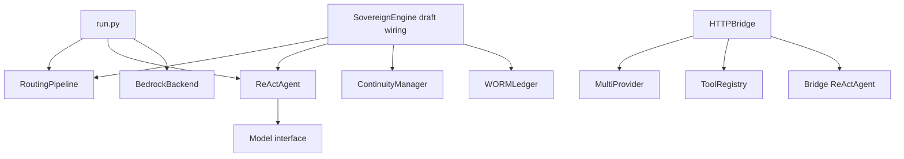

# Architecture

Sovereign Engine v2 is a multi-language repository with several execution paths. The Python research router, engine task router, provider adapters, native runtimes, and desktop clients have distinct interfaces and validation scopes.

## Python execution paths

This diagram shows construction/call relationships in the source, not a successful end-to-end run. The unified engine and bridge agent paths contain interface mismatches described in [deployment readiness](docs/PRODUCTION_HARDENING.md).

| Component | Contract |
|---|---|
| [RoutingPipeline](src/routing/pipeline.py) | Text/context to trace and expert dispatch result |
| [AgentDispatch](src/routing/dispatch.py) | Async expert callbacks returning dictionaries |
| [ReActAgent](src/agents/react.py) | Task entity and optional initial context to a reasoning/tool loop |
| [ToolRegistry](src/tools/registry.py) | Tool definitions, lookup, schemas, and policy metadata |
| [ContinuityManager](src/continuity/manager.py) | Synchronous state transitions and backend coordination |
| [WORMLedger](src/core/evidence.py) | Synchronous event append, scan, and chain checks |
| [HTTPBridge](src/bridge/http_server.py) | HTTP handlers for provider chat, tools, keys, and routing traces |

## Routing boundaries

The engine routes task text through parsing, symbolic/Jordan/Jacobian analysis, constraints, sparse activation, and dispatch. Its selected experts need real asynchronous implementations supplied by the caller.

The independent [research router](research/sparse-routing/) instead operates on a graph model. It measures synthetic edge costs and rank, proposes topology changes, verifies invariants, and commits accepted states. Its benchmark does not time the agent's LLM generation.

[MultiProvider](src/runtime/providers/multi.py) chooses a provider/model using task classification and fallback. This is distinct from the eleven-stage RoutingPipeline; `/chat` calls MultiProvider directly.

## Native and desktop layers

- [Python machine runtime](src/runtime/machine/): bytecode/IR utilities, stack VM, native interop, and x86 code generation.
- [native/](native/): NASM sources and C dispatcher.
- [ide/CMakeLists.txt](ide/CMakeLists.txt): native Windows C/C++ client.
- [ide/desktop/](ide/desktop/): Electron/TypeScript workbench sources with separate package scripts.
- [ide/beam/](ide/beam/): WebAssembly experiments.

These layers are not interchangeable implementations of one validated executable. See [IDE](docs/IDE.md) and [Machine runtime](docs/MACHINE_CODE.md).

## Models and research

[src/models/](src/models/) contains recurrent memory, BURT-IMMA, checkpoint/pruning helpers, and text output modules. [hf/](hf/) provides model packaging and corpus schema artifacts. [training/](training/) provides the Swift corpus/swarm visualization library.

[cobalt/](cobalt/), [kernels/](kernels/), [magma/](magma/), [narm/](narm/), and [catn/](catn/) use their own compiler and runtime assumptions. Formal sources and manuscripts are under [research/](research/). Source presence, formal assumptions, compilation, and measured behavior must be reported separately.

## Further reading

Use the [documentation index](docs/README.md) for starter and technical guides. [Security](docs/SECURITY.md) describes enforcement boundaries; [Validation](docs/VALIDATION.md) records the checks actually performed.
