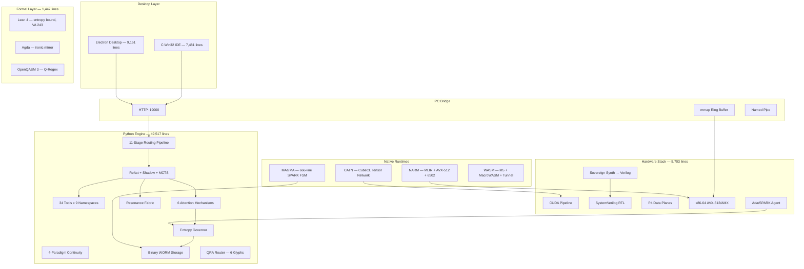

```
   ____                              _                ______            _
  / ___|  _____   _____ _ __ ___(_) __ _ _ __   | ____| _ __   __ _(_)_ __   ___
  \___ \ / _ \ \ / / _ \ '__/ _ \ |/ _` | '_ \  |  _| | '_ \ / _` | | '_ \ / _ \
   ___) | (_) \ V /  __/ | |  __/ | (_| | | | | | |___| | | | (_| | | | | |  __/
  |____/ \___/ \_/ \___|_|  \___|_|\__, |_| |_| |_____|_| |_|\__, |_|_| |_|\___|
                                    |___/                      |___/          v2.0
```


---

## What This Is

A **sovereign compute stack**: native IDE, LLM inference engine, hardware synthesis pipeline, formal verification, and silicon-to-policy integrity chain — in one repo.

**339 source files. 83,473 lines of code. 20+ languages. No frameworks. No wrappers.**

This is:

- A **C Win32 IDE** — text editor, ConPTY terminal, LSP, DAP, Direct2D, git — 59 files, 7,481 lines of C
- An **Electron desktop IDE** — Ollama/Anthropic/OpenRouter chat, tool dispatch — 30 files, 4,763 lines
- A **Python LLM engine** — 11-stage Jordan algebra routing, binary WORM, 34 tools, ReAct agents — 170 modules, 49,517 lines
- A **hardware kernel stack** — CUDA, SystemVerilog RTL, Chisel3, P4 data planes, TVM, MLIR, CUDA-Q, x86-64 ASM — 32 files, 5,670 lines
- A **MAGMA protocol** — 666-line SPARK Ada ferrite FSM, Rust/TS/Ada FFI bindings, APL Wick rotation — 14 files, 2,331 lines
- A **NARM runtime** — MLIR TableGen dialect, C arena/tensor/ops, AVX-512 + MOS 6502 kernels, Fortran — 9 files, 2,322 lines
- A **Cellular Automaton Tensor Network** — CubeCL SVD, propagate kernels, microrom VM, virtual circuit board — 9 Rust files, 1,051 lines
- **Formal proofs** — Lean 4 entropy bound (zero sorry), Agda ironic mirror, enochian root — 5 files, 1,447 lines
- An **AToKio** linear attention monad — Haskell — 299 lines

---

## Table of Contents

- [The System](#the-system)
- [Quick Start](#quick-start)
- [The IDE](#the-ide)
- [The Engine](#the-engine)
- [Hardware Kernel Stack](#hardware-kernel-stack)
- [MAGMA Protocol](#magma-protocol)
- [Attention Mechanisms](#attention-mechanisms)
- [Resonance Fabric](#resonance-fabric)
- [ISA Layer](#isa-layer)
- [Q-Regex Engine](#q-regex-engine)
- [NARM Runtime](#narm-runtime)
- [CATN — Cellular Automaton Tensor Network](#catn--cellular-automaton-tensor-network)
- [Formal Proofs](#formal-proofs)
- [Machine Code Layer](#machine-code-layer)
- [Routing Pipeline](#routing-pipeline)
- [Continuity Layer](#continuity-layer)
- [Tool System](#tool-system)
- [Security Architecture](#security-architecture)
- [The Mathematics](#the-mathematics)
- [Papers](#papers)
- [Line Count](#line-count)

---

## The System



---

## Quick Start

```bash
git clone https://github.com/SNAPKITTYWEST/sovereign-engine-v2.git
cd sovereign-engine-v2

# Run the engine (zero dependencies)
python -c "
import asyncio
from src.sovereign import SovereignEngine, EngineConfig

async def main():
    engine = SovereignEngine(EngineConfig())
    result = await engine.run('Write a fibonacci function')
    print(result)
    engine.shutdown()

asyncio.run(main())
"
```

```bash
# Build the C IDE (Windows — requires CMake + MSVC)
cd ide/native && cmake -B build -G "Visual Studio 17 2022"
cmake --build build --config Release

# Run the Electron IDE
cd ide/desktop && npm install && npm run desktop
```

---

## The IDE

### Native C IDE (`ide/native/` — 59 files, 7,481 lines)

Native Win32 application. No Electron. No web view. Direct2D GPU rendering, ConPTY terminal, Win32 message loop.

| Directory | Purpose |
|-----------|---------|
| `core/` | Memory arena, event system, strings, threading |
| `editor/` | Gap buffer text editor, code reference parser |
| `terminal/` | ConPTY + fallback gate |
| `ui/` | Layout, status bar, project tree, output panel |
| `bridge/` | HTTP client to Python :19000 |
| `chat/` | Named pipe agent interaction |
| `lsp/` | Language Server Protocol client |
| `graphics/` | Direct2D hardware-accelerated rendering |
| `fcl/` | Formal Command Language interpreter |
| `git/` | Status, diff, commit |
| `platform/windows/` | Application, window, shell |

### Electron Desktop IDE (`ide/desktop/` — 20 files, 9,151 lines)

| Component | What It Does |
|-----------|-------------|
| `backend/bob.ts` | BOB reasoning engine bridge |
| `backend/model-client.ts` | Ollama/Anthropic/OpenRouter/OpenAI adapters |
| `backend/tools.ts` | Sovereign Engine tool dispatch |
| `backend/sandbox.ts` | Code execution sandbox |
| `backend/audit.ts` | WORM audit trail |
| `backend/workspace.ts` | Project management |

---

## The Engine

**Location:** `src/` — 170 modules, 49,517 lines. 3.11+ stdlib. Zero pip dependencies.**

| Package | Lines | What It Does |
|---------|-------|-------------|
| `src/runtime/` | 15,132 | CPython bytecode assembler, .pyc marshal codec, ctypes C bridge, SOVEREIGN_IR binary, stack VM, x86-64 machine code gen |
| `src/tools/` | 8,661 | 34 tools (fs, code, git, db, docs, web, embeddings, audio, pytorch), IPC router, opcode registry, approval engine |
| `src/routing/` | 2,320 | 11-stage MoE: regex → AST → symbolic graph → Jordan transform → Jacobian → constraints → sparse → NAND → dispatch → merge → WORM |
| `src/continuity/` | 2,490 | Env bitmask, seed chain, inode flags, shared memory, unified manager |
| `src/retrieval/` | 2,201 | Semantic chunker, vector store, RAG pipeline, parallel ingest |
| `src/core/` | 1,833 | Binary WORM, evidence ledger, Ed25519 crypto, path jail, SSRF guard |
| `src/models/` | 1,619 | Pydantic entities, state machines, BURT-IMMA, text output pipeline |
| `src/attention/` | 1,620 | 6 attention mechanisms (see below) |
| `src/agents/` | 1,514 | ReAct loop, shadow observer, MCTS search |
| `src/asr/` | 1,409 | Qwen3 forced aligner, fine-tuning, compiler DAG meta-engine |
| `src/resonance/` | 1,134 | Tensor net, plugboard, fabric, sentence gen, UMO, bridge |
| `src/bridge/` | 1,105 | HTTP server :19000, stdio JSON-RPC, routing trace, key manager |
| `src/wasm/` | 1,021 | M5 WAT (4096-byte buffer, 7 registers), MacroWASM decoder, tunnel matrix |
| `src/magma/` | 863 | Macro MAGMA + springboard |
| `src/scanner/` | 876 | AST analyzer, dependency graph |
| `src/daemon/` | 866 | Asyncio TCP :19002, swarm (fan_out, map_reduce, race) |
| `src/mcp/` | 614 | Model Context Protocol server |
| `src/hardware/` | 630 | Sovereign Synth → Verilog, Ada/SPARK agent spec |
| `src/exgracy/` | 530 | Fused parser regex network propagation automaton |
| `src/bert/` | 469 | BertAgentAdapter + Nomic embedder |
| `src/qregex/` | 446 | Q-Regex simulator + Kalman filter |
| `src/isa/` | 444 | ISA-8 (15 instructions) + ISA-16 (4 addressing modes) |
| `src/inference/` | 388 | Quantum MoE (SpinFactor composition) |
| `src/entropy/` | 355 | FrustrationCoolingScheduler, governor, WORM seal |
| `src/ui/` | 302 | Sovereign OS dashboard |
| `src/mum/` | 220 | Atom, ModalityEncoder, SemanticGradientBoundary |
| `src/kernel/` | 194 | KID8B8K — SAT boot verifier, PII scrubber, topic policy |
| `src/cli/` | 195 | Command-line interface |
| `src/zk/` | 121 | Recursive Lattice-Based ZK (no_std, Q=65537, N=16) |
| `src/compositor/` | 90 | VBLANK-interlocked BAR1 dual buffer |
| `src/hypervisor/` | 72 | ARMv8-A EL2 trap loop + VirtIO-GPU stub |

---

## Hardware Kernel Stack

**Location:** `kernels/` — 32 source files, 5,670 lines

| Directory | Lang | Lines | What It Does |
|-----------|------|-------|-------------|
| `kernels/x86/` | NASM | 3,753 | AVX2 GEMM, AMX Hopper kickdown, FP8 SM90, AC VM (Σ1..10=55), SPLICE_SWIFT_GATEWAY, 8K framebuffer AVX-512 |
| `kernels/hardware/rtl/` | SystemVerilog | 427 | MAC lateral array, dual-core top, P3 SHA accumulator, P4 tensor core |
| `kernels/p4/` | P4-16 | 398 | TNA in-network forwarding, STRP ingress, sovereign data plane |
| `kernels/tvm/` | Python+PTX | 310 | TileLang flash QKT kernel, TensorIR L3, PTX fused level 2 |
| `kernels/cuda/` | CUDA C | 274 | GPU drain pipeline (1M tensor parallel filter), binary checkpoint loader |
| `kernels/rust/` | Rust | 242 | Fixed-point drain pipeline + Kani formal verification harness |
| `kernels/cudaq/` | CUDA-Q | 192 | Quantum kernels (C++ + Python + holographic wormhole) |
| `kernels/hardware/chisel/` | Scala | — | Chisel3 dual-core GDR |
| `kernels/hardware/analog/` | Verilog-A | — | Analog MAC leaf cell |
| `kernels/hardware/layout/` | SKILL | — | Cadence layout + GDSII sign-off |
| `kernels/mlir/` | MLIR | 45 | TensorIR sovereign P3 lowering |
| `kernels/p3/` | Python+Lean | 62 | P3 Merkle, state engine, Lean 4 verification |

### Synthesis Pipeline

```
microcode.json / add_instruction()
      ↓  SovereignSynth (src/hardware/sovereign_synth.py)
case-statement Verilog (single-cycle, ~150ps combinatorial)

opcode_sequences.json / add_sequence()
      ↓  SovereignSynthMulti
FSM Verilog (N-cycle, only log₂(N) flip-flops, zero ROM)

activity_profile / n_cycles / alpha_target
      ↓  EntropyBalancedDMAGen
Entropy-balanced DMA Verilog (power H=0 per cycle → DPA-resistant)
      ↓
Ada/SPARK proof: entropy(agent) ≤ 0.20 → active ⇒ trusted → sovereign eligible
```

---

## MAGMA Protocol

**Location:** `magma/` — 14 source files, 2,331 lines

Internal sovereign agent language: **§VERB:AGENT:ACTION{payload}**

| Component | Lang | What It Does |
|-----------|------|-------------|
| `magma_666.adb` | SPARK Ada | 666-line ferrite state machine — the core |
| `format.adb/ads` | Ada | LE decoders, CRC32, element sizes |
| `parser.adb/ads` | Ada | Dense SPARK state machine for tensor parsing |
| `apl/wick_rotation.apl` | APL | Hoare-verified Wick rotation operators |
| `src/lib.rs` | Rust | Biot-Savart field computation + Ed25519 certification |
| `bindings/rust/ada_ffi.rs` | Rust | CoreState ↔ C ABI, imaginary()/fold_i()/ectot() |
| `bindings/rust/magmad_client.rs` | Rust | REST client (health/verify/anchor/forge) + CoreTransition::dispatch() |
| `bindings/ts/magma_bindings.ts` | TS | coreTransitionToInstruction(), anchorSafetyCertificate(), fluxQRegexMatch(), executeMagmaPipeline() |
| `node/lib/node.js` | JS | Orphan-node graph (functor isolated from RBG) |

**12 verbs, 22 agents (clearance 1-5), 6 modifiers.** SLC (Sovereign Logic Core) — 6 immutable axioms, adversarial pattern detection, SACM mesh self-organizing execution.

---

## Attention Mechanisms

**Location:** `src/attention/` — 7 files, 1,620 lines

Six non-softmax attention replacements. None use `exp(QK^T/√d)`:

| File | Mechanism | Key Property |
|------|-----------|-------------|
| `umtcpi.py` | Boolean-Jordan-Jacobian Resonance | Σwₖ ≠ 1 — inverted Jacobian breaks simplex |
| `sgam.py` | Spatial Geometric (inverse-dist / compact / RBF / angular) | Deterministic kernel, no softmax |
| `sma.py` | Symplectic Manifold (ω, J, g=ωJ) | J²=−I, g positive definite, Poisson bracket kernel |
| `rma.py` | Riemannian (Euclidean / Sphere / Hyperbolic) | Geodesic distance + parallel transport |
| `heat_kernel.py` | Heat diffusion (∂u/∂t = Δu) | Semigroup H(s)∘H(t)=H(s+t), spectral Laplacian |
| `integrated_block.py` | RMSNorm + Hyperbolic UMTCPI + CIFG Memory | Full transformer block replacement, 60% fewer params |

The integrated block (`HyperbolicCIFGUMTCPI`) replaces the entire attention + FFN stack:
- RMSNorm drops mean subtraction — 50% fewer norm params
- HyperbolicUMTCPI uses Poincare distance — richer hierarchical separation
- CIFGMemory replaces static FFN with gated memory `C_t = f_t ⊙ C_{t-1} + (1-f_t) ⊙ z_t`

---

## Resonance Fabric

**Location:** `src/resonance/` — 8 files, 1,134 lines

| File | What It Does |
|------|-------------|
| `tensor_net.py` | Waveform → weight tensors → ResonanceNet |
| `plugboard.py` | 6×22 routing crossbar (frequency bands → operations) |
| `fabric.py` | run_fabric() / render_fabric() — the complete execution |
| `sentence.py` | render_sentence(inv) — DrainInvariants → natural language |
| `umo.py` | Python port of the SnapKitty Universal Monad Operator |
| `bridge.py` | Drain invariants → τ/ε/ρ mapping |
| `words.py` | Sovereign vocabulary ("SYSTEM COHERENT", "DEED SEALED") |

---

## ISA Layer

**Location:** `src/isa/` — 3 files, 444 lines

**ISA-8** — 8-bit sovereign instruction set. 15 instructions × 2 bytes = 30 code bytes.
Program: SET → CLEAR → TOGGLE → ROUTE → READ/WRITE → XOR/AND/OR → SHIFT → BRANCH → LOAD/STORE → HALT

**ISA-16** — 16-bit big-endian. 4 fields: opcode[15:12] mode[11:10] reg[9:8] operand[7:0].
4 addressing modes: R/R, IMM, DIRECT, INDIRECT/PLUGBOARD.
Reference program: infinite oscillator R0 toggling 0x00000010 ↔ 0xFFFFFFEF — the virtual circuit board.

---

## Q-Regex Engine

**Location:** `src/qregex/` — 4 files, 446 lines

| File | What It Does |
|------|-------------|
| `qregex.qasm` | OpenQASM 3 circuit: U_∨ ∘ U_∘ ∘ U_* (3 qubits, 10 Kleene Star iterations) |
| `qregex_sim.py` | NumPy simulator: Bloch-sphere interference, match probability → Kalman z_t |
| `kalman.py` | L3 Kalman filter: x_t = [Φ, Φ̇, f]^T, includes FPGA Q16.15 fixed-point variant |

Integration chain: Q-Regex match probability → Kalman filter → Δω_pump → pump-laser dispersion controller.

---

## NARM Runtime

**Location:** `narm/` — 9 source files, 2,322 lines

Non-Autoregressive Reconstruction Machine. NASA systems engineering spec.

| File | What It Does |
|------|-------------|
| `mlir/reconstruct.td` | 20+ op MLIR TableGen dialect |
| `runtime/memory.h` | LIFO arena allocator |
| `runtime/tensor.h` | Tensor descriptor + multi-dim indexing |
| `runtime/ops.h` | Op registry + graph executor |
| `kernels/narm_kernels_avx512.asm` | AVX-512 CUFF kernels (KERN-001..009) |
| `kernels/narm_kernels_6502.asm` | MOS 6502 GEMM / residual / norm |
| `kernels/gelu_6502.asm` | 6502 GELU cubic approximation |
| `fortran/qwen3asr_kernels.f90` | Fortran 97 subroutine bodies |
| `tests/acceptance_test.sh` | 8-stage acceptance gate |

---

## CATN — Cellular Automaton Tensor Network

**Location:** `catn/` — 9 source files, 1,051 lines of Rust

| File | What It Does |
|------|-------------|
| `src/kernels/erosion.rs` | CubeCL SVD truncation kernel (χ ≤ 64, ε = 0.001) |
| `src/kernels/propagate.rs` | Propagate + mirror-goto + ‖Ψ‖₂ = 1 normalization |
| `src/dispatcher.rs` | CatnDispatcher (erosion → recharge → propagate loop) |
| `src/state.rs` | CellularState with tensor network |
| `microrom/ca_vm.py` | VM executor + 256-node bytecode generator |
| `microrom/decode_microrom.py` | Disassembler |
| `microrom/virtual_circuit_board.py` | Self-sustaining resonance loop |

Centre-seeded `vm.state.nodes[128] = 1` gives classic Wolfram rule-16 propagation.

---

## Formal Proofs

**Location:** `formal/` — 5 files, 1,447 lines

| File | Lang | What It Proves |
|------|------|---------------|
| `sovereign_entropy/EntropyBound.lean` | Lean 4 | H(softmax_ratio(d, T(F))) < 0.20 nats for F ≥ 1, d ≥ 1. **Zero sorry.** |
| `VA_243.lean` | Lean 4 | Cylinder seal VA 243 specification |
| `enochian_root.lean` | Lean 4 | ERE root — void input blocks all instructions |
| `gdr_drain.lean` | Lean 4 | GDR drain invariant |
| `IronicMirror/XInvariant.agda` | Agda | X-invariant of the ironic mirror |

---

## Machine Code Layer

### Python Machine Code (`src/runtime/machine/` — 9 files, 15,132 lines)

| Module | Lines | What It Does |
|--------|-------|-------------|
| `bytecode_assembler.py` | 1,711 | Emits real CPython opcodes. Produces executable code objects. |
| `marshal_codec.py` | 1,435 | .pyc binary format — magic number, flags, code objects, consts table. |
| `ctypes_bridge.py` | 970 | C struct definitions from Python, MemoryArena for native allocations. |
| `binary_ir.py` | 1,492 | SOVEREIGN_IR: 32-byte fixed-width node records. Opcode + flags + operands + type tag. |
| `vm_executor.py` | 1,680 | 40+ opcodes including NAND, JORDAN_MUL, ENTROPY_CHECK. Runs SOVEREIGN_IR bytecode. |
| `machine_code_gen.py` | 1,104 | Raw x86-64 bytes. REX prefixes, ModR/M, register allocation. Executable via mmap+mprotect. |
| `dsl_validator.py` | 658 | Boolean kernel, entropy ≤ 0.20, trust axiom, glyph injectivity, DAG acyclicity. Blake2b proof. |

---

## Routing Pipeline

11 stages. Every stage has a mathematical role.

```
User Input
    │
    ├── Stage 1:  Regex Parser ────── Tokenize. Strip dangerous patterns.
    ├── Stage 2:  AST Builder ─────── INVERTED syntax tree. Payloads can't propagate up.
    ├── Stage 3:  Symbolic Graph ──── Adjacency matrix of signal flow.
    ├── Stage 4:  Jordan Transform ── SpinFactor: (α,v)∘(β,w) = (αβ+⟨v,w⟩, αw+βv)
    ├── Stage 5:  Jacobian Lens ───── ∂routing/∂signal via finite differences.
    ├── Stage 6:  Constraint Eval ─── Spectral radius < 10. Entropy ≤ 0.20 nats.
    ├── Stage 7:  Sparse Activation ─ Top-k expert selection. Rest zeroed.
    ├── Stage 8:  NAND Filter ─────── Conflict suppression between experts.
    ├── Stage 9:  Agent Dispatch ──── Concurrent asyncio execution.
    ├── Stage 10: Merge Output ────── concatenate | vote | weighted_sum | first_success
    └── Stage 11: WORM Seal ───────── Blake2b + Ed25519. Decision is immutable.
```

---

## Continuity Layer

Four independent persistence mechanisms sync on every state transition:

| # | Paradigm | Storage | What Survives |
|---|----------|---------|---------------|
| 1 | Env bitmask | `os.environ` (64-bit packed) | `os.execv` hot restart |
| 2 | Seed chain | Blake2b derivation (24 bytes) | Full history → one hash |
| 3 | Inode flags | Zero-byte files + `stat()` | OOM kill (kernel dcache) |
| 4 | Shared memory | ctypes struct (4KB mmap) | Cross-process, no serialization |

---

## Tool System

34 tools with native opcode dispatch. Two paths:
- **HTTP** (universal): IDE → JSON → handler → JSON (~5ms)
- **Native mmap** (local): IDE → ring buffer → C dispatcher → handler (~100μs)

---

## Security Architecture

| Layer | Defense |
|-------|---------|
| **PathJail** | Resolve → check against allowed roots → reject if outside |
| **SSRFGuard** | Block private IPs, link-local, metadata endpoints |
| **Inverted AST** | Payload leaves (weight=0) can NEVER propagate upward |
| **NAND Filter** | Suppress lower-weight expert when both claim same input |
| **Binary WORM** | 152-byte struct headers. No text parsing. Append-only. |
| **ERE Gates** | P1–P5: no secrets, no eval, no infinite loops, no analytics, SHA-256 seal |
| **Entropy Governor** | H(softmax_ratio(d, T(F))) < 0.20 nats — formally proved in Lean 4 |
| **SPARK Proof** | Ada ghost invariant: entropy ≤ 0.20 → active ⇒ trusted |
| **Chain Verification** | Every WORM record hashes the previous. Break one → break all downstream. |

---

## The Mathematics

### Jordan Algebra — SpinFactor J(n)

**Product:** `(α,v) ∘ (β,w) = (αβ + ⟨v,w⟩, αw + βv)`

1. **Non-associative**: Different agent grouping topologies produce different routing outcomes.
2. **Fixed-point convergence**: `x ↦ x∘x` converges to idempotents. These ARE the routing attractors.
3. **Spectral decomposition**: `x = λ₊c₊ + λ₋c₋`. Provably unique expert assignment.
4. **Spectral gap** = `2‖v‖` = separation between top experts.

### Entropy Bound — Formally Proved

For any F ≥ 1 and d ≥ 1: **H(softmax_ratio(d, T(F))) < 0.20 nats**

Proof chain: T(F) ≤ 0.2218 → s = exp(d/T) ≥ 90.75 → H(s) < H(19) < 0.20. Done. Zero sorry.

### QRA Tensor — Quantum Routing Algebra

6×6 deterministic tensor. Shannon entropy H = 0 nats.

| Glyph | Maps To | Signal |
|-------|---------|--------|
| Π | Reasoning | "explain", "why", "analyze" |
| Γ | Generation | "write", "create", "draft" |
| Δ | Domain | "sql", "medical", "legal" |
| Λ | Code | "function", "implement", "debug" |
| Ω | Orchestration | "plan", "coordinate", "multi-step" |
| Ψ | Verification | "prove", "verify", "test" |

---

## Papers

| DOI | Title |
|-----|-------|
| [10.5281/zenodo.20678420](https://doi.org/10.5281/zenodo.20678420) | Attention Exhaustion Attacks — 0% detection rate |
| [10.5281/zenodo.21144425](https://doi.org/10.5281/zenodo.21144425) | Resonance Block Trust Deeds |
| [10.5281/zenodo.21132094](https://doi.org/10.5281/zenodo.21132094) | Sovereign Compute Architecture |
| [10.5281/zenodo.21349277](https://doi.org/10.5281/zenodo.21349277) | Gates Normalization Constraint — simplex is structural |
| [10.5281/zenodo.21351461](https://doi.org/10.5281/zenodo.21351461) | NAND Decomposition — attention is NAND-complete |
| [10.5281/zenodo.21443609](https://doi.org/10.5281/zenodo.21443609) | Jordan Spectral Transformer — phi-weighted routing |
| [10.5281/zenodo.21727363](https://doi.org/10.5281/zenodo.21727363) | PAR-011 Jacobian via Jordan Algebras |
| [10.5281/zenodo.21268911](https://doi.org/10.5281/zenodo.21268911) | GKN I4 Quartic Invariant and E7 Symmetry |

Unified: [The Sovereign Stack](https://snapkittywest.github.io/hyperkitty/papers/sovereign-stack-unified.pdf) — 26 pages, Lean 4.

---

## Line Count

| Component | Language | Files | Lines |
|-----------|----------|-------|-------|
| Engine core | Python 3.11 | 170 | 49,517 |
| C Win32 IDE | C (Win32 API) | 59 | 7,481 |
| x86-64 kernels | NASM | 6 | 3,753 |
| Electron IDE | TypeScript | 30 | 4,763 |
| MAGMA protocol | Ada/SPARK + Rust + TS | 14 | 2,331 |
| NARM runtime | C + ASM + Fortran | 9 | 2,322 |
| Hardware RTL | SystemVerilog + CUDA + P4 | 19 | 1,917 |
| Formal proofs | Lean 4 + Agda | 5 | 1,447 |
| CATN tensor network | Rust | 9 | 1,051 |
| AToKio | Haskell | 1 | 299 |
| Tests | Python | 5 | 1,203 |
| **Total source** | **20+ languages** | **339** | **83,473** |

---

## License

BSL 1.1 → MIT 2029-01-01

SnapKitty / SNAPKITTYWEST / 2026
