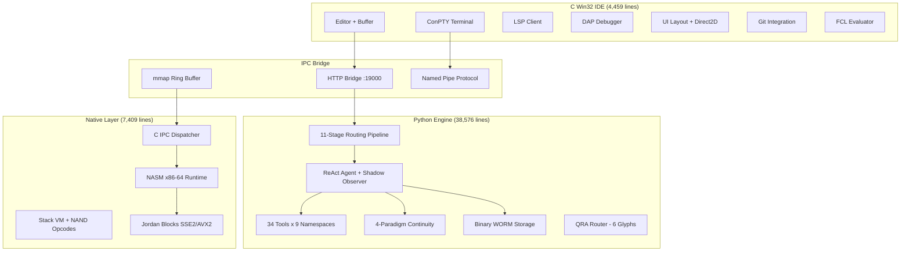

```
   ____                              _                ______            _
  / ___|  _____   _____ _ __ ___(_) __ _ _ __   | ____| _ __   __ _(_)_ __   ___
  \___ \ / _ \ \ / / _ \ '__/ _ \ |/ _` | '_ \  |  _| | '_ \ / _` | | '_ \ / _ \
   ___) | (_) \ V /  __/ | |  __/ | (_| | | | | | |___| | | | (_| | | | | |  __/
  |____/ \___/ \_/ \___|_|  \___|_|\__, |_| |_| |_____|_| |_|\__, |_|_| |_|\___|
                                    |___/                      |___/          v2.0
```


---

## What This Is

A **complete LLM agent development environment**: native C desktop IDE connected to a Python inference engine via memory-mapped IPC.

This is not a wrapper. Not a LangChain clone. Not vibe-coded. This is:

- A **C Win32 IDE** with text editor, ConPTY terminal, LSP, DAP debugging, Direct2D rendering, git integration — 47 source files, 4,459 lines of C
- A **Python LLM engine** with custom MoE routing, binary storage, four-paradigm continuity, 34 tools, ReAct agents — 87 modules, 38,576 lines
- A **NASM x86-64 assembly layer** with native runtime, QRA tensor ops, Jordan block computation, NAND kernel, IPC dispatcher — 7 files, 7,019 lines
- A **C IPC dispatcher** with mmap ring buffer, opcode jump table, 50μs polling — 390 lines

**50,444 lines of production code. 142 source files. Pure stdlib Python + raw C + NASM.**

---

## Table of Contents

- [The System](#the-system)
- [Quick Start](#quick-start)
- [The IDE](#the-ide)
- [The Engine](#the-engine)
- [Machine Code Layer](#machine-code-layer)
- [Routing Pipeline](#routing-pipeline)
- [Continuity Layer](#continuity-layer)
- [Tool System](#tool-system)
- [Security Architecture](#security-architecture)
- [Configuration](#configuration)
- [The Mathematics](#the-mathematics)
- [Origin: The DSL](#origin-the-dsl)
- [Papers](#papers)
- [Line Count](#line-count)

---

## The System



---

## Quick Start

```bash
git clone https://github.com/SNAPKITTYWEST/sovereign-engine-v2.git
cd sovereign-engine-v2

# Run the engine (zero dependencies)
python -c "
import asyncio
from src.sovereign import SovereignEngine, EngineConfig

async def main():
    engine = SovereignEngine(EngineConfig())
    result = await engine.run('Write a fibonacci function')
    print(result)
    engine.shutdown()

asyncio.run(main())
"
```

```bash
# Build the C IDE (Windows — requires CMake + MSVC)
cd ide/native
cmake -B build -G "Visual Studio 17 2022"
cmake --build build --config Release
./build/Release/sovereign-ide.exe
```

---

## The IDE

**Location:** `ide/native/` — 47 C source files, 4,459 lines

This is a native Win32 application. No Electron. No JavaScript. No web view. Direct2D GPU rendering, ConPTY pseudo-terminal, Win32 message loop.

| Directory | Purpose | Key Files |
|-----------|---------|-----------|
| `core/` | Memory arena, event system, strings | `arena.c` (pool allocator), `events.c` (pub/sub) |
| `editor/` | Gap buffer text editor | `buffer.c` (insert/delete O(1)), `document.c` (file model) |
| `terminal/` | Embedded terminal | `conpty.c` (Windows ConPTY API) |
| `ui/` | Layout engine | `layout.c` (split panes), `status_bar.h`, `project_tree.h` |
| `bridge/` | Engine connection | `bridge_http.c` (HTTP client to Python :19000) |
| `chat/` | Agent interaction | `pipe_client.c` (named pipe), `protocol.c` (message framing) |
| `lsp/` | Language intelligence | `client.c` (Language Server Protocol) |
| `dap/` | Debugging | Debug Adapter Protocol integration |
| `git/` | Version control | `repository.c` (status, diff, commit) |
| `fcl/` | Command language | `evaluator.c` (Formal Command Language interpreter) |
| `graphics/` | Rendering | `d2d_renderer.h` (Direct2D hardware-accelerated) |
| `platform/windows/` | OS layer | `application.c`, `window.c`, `shell.c` |
| `build/` | Build system | `cmake_runner.c` (invoke cmake from IDE) |

### How the IDE Talks to the Engine

```
┌────────────────┐         ┌──────────────────┐        ┌─────────────────┐
│  C IDE         │  HTTP   │  Python Bridge   │        │  Engine         │
│                │────────>│  :19000          │───────>│  Routing        │
│  bridge_http.c │  JSON   │  http_server.py  │        │  Agent          │
│                │<────────│                  │<───────│  Tools          │
└────────────────┘         └──────────────────┘        └─────────────────┘

┌────────────────┐         ┌──────────────────┐
│  C IDE         │  mmap   │  C IPC Core      │  (native tools — no HTTP, no JSON)
│                │────────>│  ipc_core.c      │  Latency: ~100μs round trip
│  (direct call) │<────────│  opcode dispatch │
└────────────────┘         └──────────────────┘

┌────────────────┐         ┌──────────────────┐
│  C IDE         │  pipe   │  Agent Chat      │  (streaming agent responses)
│  pipe_client.c │────────>│  python_daemon   │
│                │<────────│  :19002 TCP      │
└────────────────┘         └──────────────────┘
```

---

## The Engine

**Location:** `src/` — 87 Python modules, 38,576 lines

Every module is **pure Python 3.11+ stdlib**. Zero external dependencies. No pip install needed.

| Package | Lines | What It Does |
|---------|-------|-------------|
| `src/routing/` | 2,800 | 11-stage MoE pipeline: regex → AST → symbolic graph → Jordan transform → Jacobian → constraints → sparse activation → NAND filter → dispatch → merge |
| `src/runtime/machine/` | 9,251 | CPython bytecode assembler, .pyc marshal codec, ctypes C bridge, SOVEREIGN_IR binary format, stack VM with NAND opcodes, x86-64 machine code generator |
| `src/tools/` | 3,500 | 34 tools (filesystem, code, git, database, documents, web, embeddings, audio, pytorch), IPC router, opcode registry, approval engine, supervisor |
| `src/continuity/` | 1,536 | Env bitmask, seed chain, inode flags, shared memory, unified manager |
| `src/agents/` | 1,500 | ReAct loop (thought→action→observation→reflection), shadow observer, MCTS |
| `src/retrieval/` | 1,500 | Semantic chunker (6 strategies), vector store, RAG pipeline, parallel ingest |
| `src/daemon/` | 823 | Asyncio TCP daemon (:19002), swarm orchestration (fan_out, map_reduce, race) |
| `src/bridge/` | 900 | HTTP server (:19000), stdio JSON-RPC, routing trace collector, key manager |
| `src/core/` | 700 | Binary WORM storage, evidence ledger, Ed25519 crypto, path jail, SSRF guard |
| `src/runtime/providers/` | 600 | Bedrock, OpenRouter, Ollama, Anthropic, OpenAI adapters + QRA router |
| `src/models/` | 500 | Pydantic entities, state machines |
| `src/scanner/` | 400 | AST analyzer, dependency graph builder |
| `src/inference/` | 300 | Quantum MoE (SpinFactor composition) |
| `src/mcp/` | 250 | Model Context Protocol server |
| `src/cli/` | 200 | Command-line interface |

---

## Machine Code Layer

**Location:** `src/runtime/machine/` (Python) + `native/asm/` (NASM)

This is not a toy abstraction. These are real implementations:

### Python Machine Code (`src/runtime/machine/` — 9,251 lines)

| Module | Lines | What It Actually Does |
|--------|-------|----------------------|
| `bytecode_assembler.py` | 1,711 | Emits real CPython opcodes (LOAD_FAST, CALL_FUNCTION, etc). Produces executable code objects. |
| `marshal_codec.py` | 1,435 | Reads and writes actual .pyc binary format (magic number, flags, code objects, consts table). |
| `ctypes_bridge.py` | 970 | Builds C struct definitions from Python, manages MemoryArena for native allocations. |
| `binary_ir.py` | 1,492 | SOVEREIGN_IR format: 32-byte fixed-width node records. Opcode + flags + operands + type tag. Scannable without parsing. |
| `vm_executor.py` | 1,680 | Stack-based virtual machine. 40+ opcodes including custom NAND, JORDAN_MUL, ENTROPY_CHECK. Runs SOVEREIGN_IR bytecode. |
| `machine_code_gen.py` | 1,104 | Emits raw x86-64 bytes. REX prefixes, ModR/M encoding, register allocation. Produces executable buffers via mmap+mprotect. |
| `dsl_validator.py` | 658 | Validates all DSL constraints: Boolean kernel (NAND truth table), entropy ≤ 0.20, trust axiom, glyph injectivity, DAG acyclicity. Blake2b proof hash. |

### NASM x86-64 Assembly (`native/asm/` — 7,019 lines)

| File | Lines | What It Actually Does |
|------|-------|----------------------|
| `sovereign_runtime.asm` | 2,459 | Main runtime: WORM append (struct pack → write syscall), ring buffer management, signal handling, mmap allocation |
| `ipc_dispatcher.asm` | 1,071 | Polls mmap region, reads 16-bit opcode, jump table dispatch (34 entries), writes response struct back |
| `qra_tensor.asm` | 905 | 6x6 matrix multiply (packed SSE2), QLG balance check (x₀²+x₁²+x₂²=1 over ℤ), glyph classification |
| `nand_kernel.asm` | 790 | NAND gate truth table in SIMD, builds NOT→AND→OR→IMPLIES→EQUAL per DSL BooleanKernel spec |
| `jordan_blocks.asm` | 770 | SpinFactor product in SSE2/AVX2: scalar×scalar + dot product, scalar×vector + scalar×vector. Batch 4 elements. |
| `entropy_gate.asm` | 552 | Shannon entropy H=-Σp·ln(p) via x87 FPU. Compare against 0.20 threshold. Set carry flag on violation. |
| `sovereign_link.asm` | 472 | Public symbol table: exports all above as callable from C (System V ABI on Linux, MS x64 on Windows) |

---

## Routing Pipeline

11 stages. Every stage has a mathematical role. This is not a prompt chain.

```
User Input
    │
    ├─── Stage 1: Regex Parser ──────── Tokenize. Strip dangerous patterns.
    │                                    Blocklist: eval, exec, import, __,
    │                                    base64, <script, <!ENTITY, SYSTEM
    │
    ├─── Stage 2: AST Builder ───────── Build INVERTED syntax tree.
    │                                    Structural nodes: routing_weight=1.0
    │                                    Payload leaves: routing_weight=0.0
    │                                    Payloads CANNOT propagate upward.
    │
    ├─── Stage 3: Symbolic Graph ────── Adjacency matrix of signal flow.
    │                                    Nodes = intent categories.
    │                                    Edges = co-occurrence weights.
    │
    ├─── Stage 4: Jordan Transform ──── SpinFactor composition.
    │                                    (α,v) ∘ (β,w) = (αβ+⟨v,w⟩, αw+βv)
    │                                    Non-associative: topology matters.
    │                                    Gershgorin eigenvalue bounds.
    │
    ├─── Stage 5: Jacobian Lens ─────── ∂routing/∂signal via finite diffs.
    │                                    Sensitivity analysis: which input
    │                                    features drive which expert weights.
    │
    ├─── Stage 6: Constraint Eval ───── Boolean expert mask.
    │                                    Spectral radius must be < 10.
    │                                    Entropy must be ≤ 0.20 nats.
    │
    ├─── Stage 7: Sparse Activation ─── Top-k expert selection.
    │                                    Only k experts get nonzero weight.
    │                                    Rest are zeroed (not softmaxed).
    │
    ├─── Stage 8: NAND Filter ──────── Conflict suppression.
    │                                    NAND(A,B) = suppress lower-weight
    │                                    when both experts claim same input.
    │
    ├─── Stage 9: Agent Dispatch ────── Concurrent asyncio execution.
    │                                    Each active expert runs in parallel.
    │                                    Timeout per expert (configurable).
    │
    ├─── Stage 10: Merge Output ─────── 4 strategies: concatenate, vote,
    │                                    weighted_sum, first_success.
    │
    └─── Stage 11: WORM Seal ────────── Blake2b hash of routing decision.
                                         Ed25519 signature. Append to chain.
                                         Decision is now immutable.
```

---

## Continuity Layer

The agent doesn't lose state. Ever. Four independent persistence mechanisms sync on every state transition:

| # | Paradigm | Storage | Speed | What Survives |
|---|----------|---------|-------|---------------|
| 1 | **Env bitmask** | `os.environ` (64-bit packed) | Instant | `os.execv` hot restart — same PID, new binary |
| 2 | **Seed chain** | Blake2b derivation (24 bytes total) | Instant | Full history compressed to one hash. Deterministic replay from any point. |
| 3 | **Inode flags** | Zero-byte files + `stat()` | Kernel cache | Process crash. Kernel dcache survives OOM kill. |
| 4 | **Shared memory** | ctypes struct (4KB mmap block) | RAM speed | Cross-process visibility. No serialization. |

If ANY of the four has state, the agent resumes. `ContinuityManager` unifies all four behind one API:

```python
cm = ContinuityManager(base_dir=Path("~/.sovereign"), agent_id="react_1")
cm.transition("IDLE", "THINKING")       # updates all 4 backends
cm.advance_op("THINK:plan task")        # advances seed chain
cm.increment_step()                     # syncs step across all 4
snapshot = cm.snapshot()                 # reads from fastest available
```

---

## Tool System

34 tools with native opcode dispatch:

<details>
<summary><strong>All 34 tools with opcodes (click to expand)</strong></summary>

| Opcode | Namespace | Tool | Description |
|--------|-----------|------|-------------|
| `0x0001` | filesystem | read | Read file contents (PathJail enforced) |
| `0x0002` | filesystem | write | Write file (PathJail enforced) |
| `0x0003` | filesystem | list | List directory |
| `0x0004` | filesystem | delete | Remove file |
| `0x0005` | filesystem | move | Move/rename |
| `0x0006` | filesystem | search | Pattern search (ripgrep-style) |
| `0x0007` | code | execute | Run code in sandbox |
| `0x0008` | code | analyze | AST analysis + symbol extraction |
| `0x0009` | git | status | Repository status |
| `0x000A` | git | diff | Show changes |
| `0x000B` | git | commit | Create commit |
| `0x000C` | git | log | Commit history |
| `0x000D` | git | branch | Branch operations |
| `0x000E` | git | checkout | Switch branch |
| `0x000F` | git | merge | Merge branches |
| `0x0010` | git | stash | Stash changes |
| `0x0011` | git | remote | Remote operations |
| `0x0012` | git | tag | Tag management |
| `0x0013` | database | query | Execute SQL (parameterized) |
| `0x0014` | database | schema | Schema introspection |
| `0x0015` | database | migrate | Run migrations |
| `0x0016` | documents | parse_pdf | Extract PDF text |
| `0x0017` | documents | parse_docx | Extract DOCX content |
| `0x0018` | documents | render_md | Render Markdown |
| `0x0019` | documents | parse_html | Extract HTML text |
| `0x001A` | web | search | Web search (SSRFGuard enforced) |
| `0x001B` | web | fetch | HTTP fetch (SSRFGuard enforced) |
| `0x001C` | web | scrape | Page scraping |
| `0x001D` | embeddings | encode | Generate embeddings |
| `0x001E` | embeddings | search | Similarity search |
| `0x001F` | audio | transcribe | Speech-to-text |
| `0x0020` | audio | synthesize | Text-to-speech |
| `0x0021` | pytorch | inference | Model inference |
| `0x0022` | pytorch | check_cuda | GPU availability |

</details>

**Two dispatch paths:**
- **HTTP** (universal): IDE → JSON POST → parse → handler → JSON response (~5ms)
- **Native mmap** (local): IDE → write opcode to ring buffer → C dispatcher reads → handler → write response (~100μs)

The IPC ring buffer is a 64KB mmap region shared between the C IDE and the Python engine. The C dispatcher (`native/dispatcher/ipc_core.c`) polls at 50μs intervals and dispatches via a jump table indexed by the 16-bit opcode.

---

## Security Architecture

| Layer | Threat | Defense |
|-------|--------|---------|
| **PathJail** | `../../etc/passwd`, symlink escape, null bytes | Resolve path → check against allowed roots → reject if outside |
| **SSRFGuard** | `http://169.254.169.254/metadata`, `http://10.0.0.1` | Block all private IPs, link-local, metadata endpoints |
| **Inverted AST** | Payload injection into routing decisions | Structural nodes (weight=1) route. Payload leaves (weight=0) can NEVER propagate upward. |
| **NAND Filter** | Two experts both claiming same input (conflict) | NAND suppresses the lower-weight expert. Prevents split-brain. |
| **Binary WORM** | JSONL injection, newline attacks, log corruption | 152-byte struct headers. No text parsing anywhere. Append-only file mode. |
| **ERE Gates** | Secret leakage, eval injection, infinite loops, telemetry | P1: no hardcoded secrets. P2: no eval/exec/import. P3: no `while True` without break. P4: no analytics. P5: SHA-256 audit seal. |
| **Approval Engine** | Unauthorized tool execution | Risk-level classification. High-risk tools require explicit approval. |
| **Chain Verification** | Tampered ledger entries | Every WORM record hashes the previous record. Break one → break all downstream. |

---

## Configuration

```python
from src.sovereign import SovereignEngine, EngineConfig
from pathlib import Path

engine = SovereignEngine(EngineConfig(
    allowed_roots=[Path.cwd(), Path("/data")],
    ledger_path=Path("./sovereign.worm"),
    continuity_dir=Path.home() / ".sovereign" / "continuity",
    max_steps=15,
    enable_shadow=True,
    enable_ipc=True,
    agent_id="my_agent",
))
```

| Option | Type | Default | Effect |
|--------|------|---------|--------|
| `allowed_roots` | `list[Path]` | `[cwd()]` | PathJail boundaries — filesystem tools cannot access anything outside |
| `ledger_path` | `Path` | `./sovereign.worm` | Binary WORM ledger location |
| `continuity_dir` | `Path` | `~/.sovereign/continuity` | Where the 4 paradigms store state |
| `max_steps` | `int` | `15` | Hard limit on agent steps (prevents runaway) |
| `enable_shadow` | `bool` | `True` | Shadow observer watches for anomalies (cost spikes, loops, failures) |
| `enable_ipc` | `bool` | `True` | Enable native mmap dispatch (disable for pure-HTTP mode) |
| `agent_id` | `str` | `"sovereign_main"` | Identity for continuity (different IDs = separate state) |

---

## The Mathematics

### Jordan Algebra — SpinFactor J(n)

The routing gate uses Jordan algebra instead of softmax. This is the same algebra Pascual Jordan developed in 1933 to formalize quantum mechanics observables.

**Elements:** `(α, v)` where `α ∈ ℝ` (scalar confidence), `v ∈ ℝⁿ` (signal vector)

**Product:** `(α,v) ∘ (β,w) = (αβ + ⟨v,w⟩, αw + βv)`

**Why this matters for routing:**

1. **Non-associative composition**: `(A∘B)∘C ≠ A∘(B∘C)` — different agent grouping topologies produce mathematically different routing outcomes. We search over topologies.
2. **Fixed-point convergence**: Iterating `x ↦ x∘x` converges to idempotents (`e∘e = e`). These ARE the stable routing attractors.
3. **Spectral decomposition**: `x = λ₊c₊ + λ₋c₋` where `λ± = α ± ‖v‖`. Provably unique expert assignment.
4. **Spectral gap** = `2‖v‖` = separation between top experts. Bigger gap = more decisive routing.

### QRA Tensor — Quantum Routing Algebra

6×6 deterministic tensor. Shannon entropy H = 0 nats. No randomness.

| Glyph | Maps To | Signal |
|-------|---------|--------|
| Π (Pi) | Reasoning models | "explain", "why", "analyze" |
| Γ (Gamma) | Fast generation | "write", "create", "draft" |
| Δ (Delta) | Domain-specific | "sql", "medical", "legal" |
| Λ (Lambda) | Code models | "function", "implement", "debug" |
| Ω (Omega) | Orchestration | "plan", "coordinate", "multi-step" |
| Ψ (Psi) | Verification | "prove", "verify", "test" |

---

## Origin: The DSL

The Python engine (38,576 lines) + NASM assembly (7,019 lines) were generated from a single **HyperKittyConstraintDSL** prompt. Three agents coordinated by the DSL constraints. See [ARCHITECTURE.md](ARCHITECTURE.md) for the display template.

The C IDE was hand-built separately.

The DSL defines:
- Boolean kernel (all gates from NAND)
- Glyph type system (7 semantic types)
- Agent invariants (trust + entropy bounds)
- DAG structure (acyclic routing graph)
- Proof output (Blake2b hash commitment)
- Transformation engine (regex patterns + validation)

---

## Papers

| DOI | Title |
|-----|-------|
| [10.5281/zenodo.20678420](https://doi.org/10.5281/zenodo.20678420) | Attention Exhaustion Attacks — 0% detection rate |
| [10.5281/zenodo.21144425](https://doi.org/10.5281/zenodo.21144425) | Resonance Block Trust Deeds — capture spectrum |
| [10.5281/zenodo.21132094](https://doi.org/10.5281/zenodo.21132094) | Sovereign Compute Architecture |
| [10.5281/zenodo.21349277](https://doi.org/10.5281/zenodo.21349277) | Gates Normalization Constraint — simplex is structural |
| [10.5281/zenodo.21351461](https://doi.org/10.5281/zenodo.21351461) | NAND Decomposition — attention is NAND-complete |
| [10.5281/zenodo.21443609](https://doi.org/10.5281/zenodo.21443609) | Jordan Spectral Transformer — phi-weighted routing |
| [10.5281/zenodo.21727363](https://doi.org/10.5281/zenodo.21727363) | PAR-011 Jacobian via Jordan Algebras |
| [10.5281/zenodo.21268911](https://doi.org/10.5281/zenodo.21268911) | GKN I4 Quartic Invariant and E7 Symmetry |

Unified: [The Sovereign Stack](https://snapkittywest.github.io/hyperkitty/papers/sovereign-stack-unified.pdf) — 26 pages, Lean 4.

---

## Line Count

| Component | Language | Files | Lines |
|-----------|----------|-------|-------|
| Engine core | Python 3.11 | 87 | 38,576 |
| NASM runtime | x86-64 Assembly | 7 | 7,019 |
| C Win32 IDE | C (Win32 API) | 47 | 4,459 |
| C IPC dispatcher | C | 1 | 390 |
| **Total** | **3 languages** | **142** | **50,444** |

---

## Documentation

| Guide | What You Learn |
|-------|---------------|
| [Architecture](ARCHITECTURE.md) | DSL proof-of-concept, how the engine was generated |
| [Getting Started](docs/GETTING_STARTED.md) | Install, configure, first task |
| [Configuration](docs/CONFIGURATION.md) | Every option explained with examples |
| [Routing](docs/ROUTING.md) | 11-stage pipeline deep dive, tuning, custom experts |
| [Tools](docs/TOOLS.md) | All 34 tools, custom registration, IPC opcodes |
| [Continuity](docs/CONTINUITY.md) | 4 paradigms, crash recovery, replay |
| [Security](docs/SECURITY.md) | PathJail, SSRF, WORM, ERE gates |
| [Production Hardening](PRODUCTION_HARDENING.md) | Terminal IDE, accessibility, edge cases, testing, CI |

---

## License

BSL 1.1 → MIT 2029-01-01

SnapKitty / SNAPKITTYWEST / 2026
