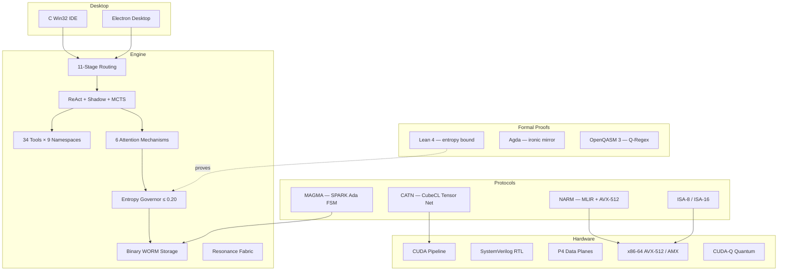

```
   ____                              _                ______            _
  / ___|  _____   _____ _ __ ___(_) __ _ _ __   | ____| _ __   __ _(_)_ __   ___
  \___ \ / _ \ \ / / _ \ '__/ _ \ |/ _` | '_ \  |  _| | '_ \ / _` | | '_ \ / _ \
   ___) | (_) \ V /  __/ | |  __/ | (_| | | | | | |___| | | | (_| | | | | |  __/
  |____/ \___/ \_/ \___|_|  \___|_|\__, |_| |_| |_____|_| |_|\__, |_|_| |_|\___|
                                    |___/                      |___/          v2.0
```


---

## What This Is

A sovereign compute stack. Silicon RTL to formal proofs to native IDE — in one repo, one author, zero frameworks.

```
┌─────────────────────────────────────────────────────────┐
│                    FORMAL LAYER                         │
│   Lean 4 entropy proof · Agda mirror · OpenQASM         │
├─────────────────────────────────────────────────────────┤
│                  DESKTOP LAYER                          │
│   C Win32 IDE (Direct2D)  ·  Electron chat shell        │
├─────────────────────────────────────────────────────────┤
│                  ENGINE LAYER                           │
│   Jordan routing · ReAct agents · 34 tools · WORM seal  │
├─────────────────────────────────────────────────────────┤
│                 PROTOCOL LAYER                          │
│   MAGMA (SPARK Ada FSM) · NARM (MLIR + AVX-512)        │
│   CATN (CubeCL Rust) · ISA-8/16 · Q-Regex (QASM)       │
├─────────────────────────────────────────────────────────┤
│                 HARDWARE LAYER                          │
│   CUDA · SystemVerilog RTL · P4 data plane · x86-64 ASM │
│   Chisel3 · TVM · MLIR · CUDA-Q quantum kernels         │
└─────────────────────────────────────────────────────────┘
```

**339 source files. 83,473 lines. 20+ languages.**

---

## Quick Start

```bash
git clone https://github.com/SNAPKITTYWEST/sovereign-engine-v2.git
cd sovereign-engine-v2

# Run the engine (zero pip dependencies)
python -c "
import asyncio
from src.sovereign import SovereignEngine, EngineConfig

async def main():
    engine = SovereignEngine(EngineConfig())
    result = await engine.run('Write a fibonacci function')
    print(result)
    engine.shutdown()

asyncio.run(main())
"

# Build the C IDE (Windows — requires CMake + MSVC)
cd ide/native && cmake -B build -G "Visual Studio 17 2022"
cmake --build build --config Release

# Run the Electron IDE
cd ide/desktop && npm install && npm run desktop
```

---

## Architecture



---

## Hardware Layer

### Kernel Stack — `kernels/`

| Directory | Language | What It Does |
|-----------|----------|-------------|
| `x86/` | NASM | AVX2 GEMM, AMX Hopper kickdown, FP8 SM90, AC VM (Σ1..10=55), 8K framebuffer AVX-512 |
| `hardware/rtl/` | SystemVerilog | MAC lateral array, dual-core top, P3 SHA accumulator, P4 tensor core |
| `p4/` | P4-16 | TNA in-network forwarding, STRP ingress, sovereign data plane |
| `tvm/` | Python+PTX | TileLang flash QKT kernel, TensorIR L3, PTX fused level 2 |
| `cuda/` | CUDA C | GPU drain pipeline (1M tensor parallel filter), binary checkpoint loader |
| `rust/` | Rust | Fixed-point drain pipeline + Kani formal verification harness |
| `cudaq/` | CUDA-Q | Quantum kernels (C++ + Python + holographic wormhole) |
| `hardware/chisel/` | Scala | Chisel3 dual-core GDR |
| `hardware/analog/` | Verilog-A | Analog MAC leaf cell |
| `hardware/layout/` | SKILL | Cadence layout + GDSII sign-off |
| `mlir/` | MLIR | TensorIR sovereign P3 lowering |
| `p3/` | Python+Lean | P3 Merkle, state engine, Lean 4 verification |

### Synthesis Pipeline

```
microcode.json / add_instruction()
      ↓  SovereignSynth
case-statement Verilog (single-cycle, ~150ps combinatorial)

opcode_sequences.json / add_sequence()
      ↓  SovereignSynthMulti
FSM Verilog (N-cycle, only log₂(N) flip-flops, zero ROM)

activity_profile / n_cycles / alpha_target
      ↓  EntropyBalancedDMAGen
Entropy-balanced DMA Verilog (power H=0 per cycle → DPA-resistant)
      ↓
Ada/SPARK proof: entropy(agent) ≤ 0.20 → active ⇒ trusted → sovereign eligible
```

---

## Protocol Layer

### MAGMA — `magma/`

Internal sovereign agent language: **§VERB:AGENT:ACTION{payload}**

12 verbs, 22 agents (clearance 1–5), 6 modifiers. SLC (Sovereign Logic Core) — 6 immutable axioms, adversarial pattern detection, SACM mesh self-organizing execution.

| Component | Language | What It Does |
|-----------|----------|-------------|
| `magma_666.adb` | SPARK Ada | 666-line ferrite state machine — the core |
| `format.adb/ads` | Ada | LE decoders, CRC32, element sizes |
| `parser.adb/ads` | Ada | Dense SPARK state machine for tensor parsing |
| `apl/wick_rotation.apl` | APL | Hoare-verified Wick rotation operators |
| `src/lib.rs` | Rust | Biot-Savart field computation + Ed25519 certification |
| `bindings/rust/ada_ffi.rs` | Rust | CoreState ↔ C ABI, imaginary()/fold_i()/ectot() |
| `bindings/rust/magmad_client.rs` | Rust | REST client (health/verify/anchor/forge) + CoreTransition::dispatch() |
| `bindings/ts/magma_bindings.ts` | TypeScript | Pipeline execution + anchor safety certificate |
| `node/lib/node.js` | JavaScript | Orphan-node graph (functor isolated from RBG) |

### NARM Runtime — `narm/`

Non-Autoregressive Reconstruction Machine. NASA systems engineering spec.

| File | Language | What It Does |
|------|----------|-------------|
| `mlir/reconstruct.td` | MLIR TableGen | 20+ op dialect definition |
| `runtime/memory.h` | C | LIFO arena allocator |
| `runtime/tensor.h` | C | Tensor descriptor + multi-dim indexing |
| `runtime/ops.h` | C | Op registry + graph executor |
| `kernels/narm_kernels_avx512.asm` | x86-64 | AVX-512 CUFF kernels (KERN-001..009) |
| `kernels/narm_kernels_6502.asm` | MOS 6502 | GEMM / residual / norm |
| `kernels/gelu_6502.asm` | MOS 6502 | GELU cubic approximation |
| `fortran/qwen3asr_kernels.f90` | Fortran | Subroutine bodies |
| `tests/acceptance_test.sh` | Bash | 8-stage acceptance gate |

### CATN — Cellular Automaton Tensor Network — `catn/`

| File | Language | What It Does |
|------|----------|-------------|
| `src/kernels/erosion.rs` | Rust/CubeCL | SVD truncation kernel (χ ≤ 64, ε = 0.001) |
| `src/kernels/propagate.rs` | Rust/CubeCL | Propagate + mirror-goto + ‖Ψ‖₂ = 1 normalization |
| `src/dispatcher.rs` | Rust | CatnDispatcher (erosion → recharge → propagate loop) |
| `src/state.rs` | Rust | CellularState with tensor network |
| `microrom/ca_vm.py` | Python | VM executor + 256-node bytecode generator |
| `microrom/decode_microrom.py` | Python | Disassembler |
| `microrom/virtual_circuit_board.py` | Python | Self-sustaining resonance loop |

Centre-seeded `vm.state.nodes[128] = 1` → classic Wolfram rule-16 propagation.

### ISA Layer — `src/isa/`

**ISA-8** — 8-bit sovereign instruction set. 15 instructions × 2 bytes = 30 code bytes.
SET → CLEAR → TOGGLE → ROUTE → READ/WRITE → XOR/AND/OR → SHIFT → BRANCH → LOAD/STORE → HALT

**ISA-16** — 16-bit big-endian. 4 fields: opcode[15:12] mode[11:10] reg[9:8] operand[7:0].
4 addressing modes: R/R, IMM, DIRECT, INDIRECT/PLUGBOARD.
Reference program: infinite oscillator R0 toggling 0x00000010 ↔ 0xFFFFFFEF.

### Q-Regex Engine — `src/qregex/`

| File | What It Does |
|------|-------------|
| `qregex.qasm` | OpenQASM 3 circuit: U_∨ ∘ U_∘ ∘ U_* (3 qubits, 10 Kleene Star iterations) |
| `qregex_sim.py` | NumPy simulator: Bloch-sphere interference, match probability → Kalman z_t |
| `kalman.py` | L3 Kalman filter: x_t = [Φ, Φ̇, f]^T, includes FPGA Q16.15 fixed-point variant |

Integration chain: Q-Regex match probability → Kalman filter → Δω_pump → pump-laser dispersion controller.

---

## Engine Layer

### Routing Pipeline — `src/routing/`

11 stages. Every stage has a mathematical role.

```
User Input
    │
    ├── 1  Regex Parser ────── Tokenize. Strip dangerous patterns.
    ├── 2  AST Builder ─────── INVERTED syntax tree. Payloads can't propagate up.
    ├── 3  Symbolic Graph ──── Adjacency matrix of signal flow.
    ├── 4  Jordan Transform ── SpinFactor: (α,v)∘(β,w) = (αβ+⟨v,w⟩, αw+βv)
    ├── 5  Jacobian Lens ───── ∂routing/∂signal via finite differences.
    ├── 6  Constraint Eval ─── Spectral radius < 10. Entropy ≤ 0.20 nats.
    ├── 7  Sparse Activation ─ Top-k expert selection. Rest zeroed.
    ├── 8  NAND Filter ─────── Conflict suppression between experts.
    ├── 9  Agent Dispatch ──── Concurrent asyncio execution.
    ├── 10 Merge Output ────── concatenate | vote | weighted_sum | first_success
    └── 11 WORM Seal ───────── Blake2b + Ed25519. Decision is immutable.
```

### Attention Mechanisms — `src/attention/`

Six non-softmax attention replacements. None use `exp(QK^T/√d)`:

| Module | Mechanism | Key Property |
|--------|-----------|-------------|
| `umtcpi.py` | Boolean-Jordan-Jacobian Resonance | Σwₖ ≠ 1 — inverted Jacobian breaks simplex |
| `sgam.py` | Spatial Geometric (inverse-dist / compact / RBF / angular) | Deterministic kernel, no softmax |
| `sma.py` | Symplectic Manifold (ω, J, g=ωJ) | J²=−I, g positive definite, Poisson bracket kernel |
| `rma.py` | Riemannian (Euclidean / Sphere / Hyperbolic) | Geodesic distance + parallel transport |
| `heat_kernel.py` | Heat diffusion (∂u/∂t = Δu) | Semigroup H(s)∘H(t)=H(s+t), spectral Laplacian |
| `integrated_block.py` | RMSNorm + Hyperbolic UMTCPI + CIFG Memory | Full transformer block replacement, 60% fewer params |

The integrated block (`HyperbolicCIFGUMTCPI`) replaces the entire attention + FFN stack:
- RMSNorm drops mean subtraction — 50% fewer norm params
- HyperbolicUMTCPI uses Poincare distance — richer hierarchical separation
- CIFGMemory replaces static FFN with gated memory `C_t = f_t ⊙ C_{t-1} + (1-f_t) ⊙ z_t`

### Resonance Fabric — `src/resonance/`

| Module | What It Does |
|--------|-------------|
| `tensor_net.py` | Waveform → weight tensors → ResonanceNet |
| `plugboard.py` | 6×22 routing crossbar (frequency bands → operations) |
| `fabric.py` | run_fabric() / render_fabric() — the complete execution |
| `sentence.py` | render_sentence(inv) — DrainInvariants → natural language |
| `umo.py` | Python port of the SnapKitty Universal Monad Operator |
| `bridge.py` | Drain invariants → τ/ε/ρ mapping |
| `words.py` | Sovereign vocabulary ("SYSTEM COHERENT", "DEED SEALED") |

### Machine Code — `src/runtime/machine/`

| Module | What It Does |
|--------|-------------|
| `bytecode_assembler.py` | Emits real CPython opcodes. Produces executable code objects. |
| `marshal_codec.py` | .pyc binary format — magic number, flags, code objects, consts table. |
| `ctypes_bridge.py` | C struct definitions from Python, MemoryArena for native allocations. |
| `binary_ir.py` | SOVEREIGN_IR: 32-byte fixed-width node records. Opcode + flags + operands + type tag. |
| `vm_executor.py` | 40+ opcodes including NAND, JORDAN_MUL, ENTROPY_CHECK. Runs SOVEREIGN_IR bytecode. |
| `machine_code_gen.py` | Raw x86-64 bytes. REX prefixes, ModR/M, register allocation. Executable via mmap+mprotect. |
| `dsl_validator.py` | Boolean kernel, entropy ≤ 0.20, trust axiom, glyph injectivity, DAG acyclicity. Blake2b proof. |

### Engine Packages — `src/`

170 modules. Pure Python 3.11+ stdlib. Zero pip dependencies.

| Package | What It Does |
|---------|-------------|
| `runtime/` | CPython bytecode assembler, .pyc marshal, ctypes bridge, SOVEREIGN_IR, stack VM, x86-64 codegen |
| `tools/` | 34 tools (fs, code, git, db, docs, web, embeddings, audio, pytorch), opcode registry, approval engine |
| `routing/` | 11-stage MoE: regex → AST → symbolic → Jordan → Jacobian → constraints → sparse → NAND → dispatch → merge → WORM |
| `continuity/` | Env bitmask, seed chain, inode flags, shared memory, unified manager |
| `retrieval/` | Semantic chunker, vector store, RAG pipeline, parallel ingest |
| `core/` | Binary WORM, evidence ledger, Ed25519 crypto, path jail, SSRF guard |
| `models/` | Pydantic entities, state machines, BURT-IMMA, text output pipeline |
| `attention/` | 6 non-softmax attention mechanisms |
| `agents/` | ReAct loop, shadow observer, MCTS search |
| `asr/` | Qwen3 forced aligner, fine-tuning, compiler DAG meta-engine |
| `resonance/` | Tensor net, plugboard, fabric, sentence gen, UMO, bridge |
| `bridge/` | HTTP server :19000, stdio JSON-RPC, routing trace, key manager |
| `wasm/` | M5 WAT (4096-byte buffer, 7 registers), MacroWASM decoder, tunnel matrix |
| `magma/` | Macro MAGMA + springboard |
| `scanner/` | AST analyzer, dependency graph |
| `daemon/` | Asyncio TCP :19002, swarm (fan_out, map_reduce, race) |
| `mcp/` | Model Context Protocol server |
| `hardware/` | Sovereign Synth → Verilog, Ada/SPARK agent spec |
| `exgracy/` | Fused parser regex network propagation automaton |
| `bert/` | BertAgentAdapter + Nomic embedder |
| `qregex/` | Q-Regex simulator + Kalman filter |
| `isa/` | ISA-8 (15 instructions) + ISA-16 (4 addressing modes) |
| `inference/` | Quantum MoE (SpinFactor composition) |
| `entropy/` | FrustrationCoolingScheduler, governor, WORM seal |
| `ui/` | Sovereign OS dashboard |
| `mum/` | Atom, ModalityEncoder, SemanticGradientBoundary |
| `kernel/` | KID8B8K — SAT boot verifier, PII scrubber, topic policy |
| `cli/` | Command-line interface |
| `zk/` | Recursive Lattice-Based ZK (no_std, Q=65537, N=16) |
| `compositor/` | VBLANK-interlocked BAR1 dual buffer |
| `hypervisor/` | ARMv8-A EL2 trap loop + VirtIO-GPU stub |

---

## Desktop Layer

### C Win32 IDE — `ide/native/`

Native Win32 application. No Electron. No web view. Direct2D GPU rendering, ConPTY terminal, Win32 message loop.

| Directory | Purpose |
|-----------|---------|
| `core/` | Memory arena, event system, strings, threading |
| `editor/` | Gap buffer text editor, code reference parser |
| `terminal/` | ConPTY + fallback gate |
| `ui/` | Layout, status bar, project tree, output panel |
| `bridge/` | HTTP client to Python :19000 |
| `chat/` | Named pipe agent interaction |
| `lsp/` | Language Server Protocol client |
| `graphics/` | Direct2D hardware-accelerated rendering |
| `fcl/` | Formal Command Language interpreter |
| `git/` | Status, diff, commit |
| `platform/windows/` | Application, window, shell |

### Electron Desktop IDE — `ide/desktop/`

| Component | What It Does |
|-----------|-------------|
| `backend/bob.ts` | BOB reasoning engine bridge |
| `backend/model-client.ts` | Ollama/Anthropic/OpenRouter/OpenAI adapters |
| `backend/tools.ts` | Sovereign Engine tool dispatch |
| `backend/sandbox.ts` | Code execution sandbox |
| `backend/audit.ts` | WORM audit trail |
| `backend/workspace.ts` | Project management |

---

## Formal Layer

| File | Language | What It Proves |
|------|----------|---------------|
| `sovereign_entropy/EntropyBound.lean` | Lean 4 | H(softmax_ratio(d, T(F))) < 0.20 nats for F ≥ 1, d ≥ 1. **Zero sorry.** |
| `VA_243.lean` | Lean 4 | Cylinder seal VA 243 specification |
| `enochian_root.lean` | Lean 4 | ERE root — void input blocks all instructions |
| `gdr_drain.lean` | Lean 4 | GDR drain invariant |
| `IronicMirror/XInvariant.agda` | Agda | X-invariant of the ironic mirror |

---

## Continuity

Four independent persistence mechanisms sync on every state transition:

| # | Paradigm | Storage | What Survives |
|---|----------|---------|---------------|
| 1 | Env bitmask | `os.environ` (64-bit packed) | `os.execv` hot restart |
| 2 | Seed chain | Blake2b derivation (24 bytes) | Full history → one hash |
| 3 | Inode flags | Zero-byte files + `stat()` | OOM kill (kernel dcache) |
| 4 | Shared memory | ctypes struct (4KB mmap) | Cross-process, no serialization |

---

## Security

| Layer | Defense |
|-------|---------|
| PathJail | Resolve → check against allowed roots → reject if outside |
| SSRFGuard | Block private IPs, link-local, metadata endpoints |
| Inverted AST | Payload leaves (weight=0) can NEVER propagate upward |
| NAND Filter | Suppress lower-weight expert when both claim same input |
| Binary WORM | 152-byte struct headers. No text parsing. Append-only. |
| ERE Gates | P1–P5: no secrets, no eval, no infinite loops, no analytics, SHA-256 seal |
| Entropy Governor | H < 0.20 nats — formally proved in Lean 4 |
| SPARK Proof | Ada ghost invariant: entropy ≤ 0.20 → active ⇒ trusted |
| Chain Verification | Every WORM record hashes the previous. Break one → break all downstream. |

---

## The Mathematics

### Jordan Algebra — SpinFactor J(n)

**Product:** `(α,v) ∘ (β,w) = (αβ + ⟨v,w⟩, αw + βv)`

1. **Non-associative**: Different agent grouping topologies produce different routing outcomes.
2. **Fixed-point convergence**: `x ↦ x∘x` converges to idempotents. These ARE the routing attractors.
3. **Spectral decomposition**: `x = λ₊c₊ + λ₋c₋`. Provably unique expert assignment.
4. **Spectral gap** = `2‖v‖` = separation between top experts.

### Entropy Bound — Formally Proved

For any F ≥ 1 and d ≥ 1: **H(softmax_ratio(d, T(F))) < 0.20 nats**

Proof chain: T(F) ≤ 0.2218 → s = exp(d/T) ≥ 90.75 → H(s) < H(19) < 0.20. Done. Zero sorry.

### QRA Tensor — Quantum Routing Algebra

6×6 deterministic tensor. Shannon entropy H = 0 nats.

| Glyph | Maps To | Signal |
|-------|---------|--------|
| Π | Reasoning | "explain", "why", "analyze" |
| Γ | Generation | "write", "create", "draft" |
| Δ | Domain | "sql", "medical", "legal" |
| Λ | Code | "function", "implement", "debug" |
| Ω | Orchestration | "plan", "coordinate", "multi-step" |
| Ψ | Verification | "prove", "verify", "test" |

---

## Papers

| DOI | Title |
|-----|-------|
| [10.5281/zenodo.20678420](https://doi.org/10.5281/zenodo.20678420) | Attention Exhaustion Attacks — 0% detection rate |
| [10.5281/zenodo.21144425](https://doi.org/10.5281/zenodo.21144425) | Resonance Block Trust Deeds |
| [10.5281/zenodo.21132094](https://doi.org/10.5281/zenodo.21132094) | Sovereign Compute Architecture |
| [10.5281/zenodo.21349277](https://doi.org/10.5281/zenodo.21349277) | Gates Normalization Constraint — simplex is structural |
| [10.5281/zenodo.21351461](https://doi.org/10.5281/zenodo.21351461) | NAND Decomposition — attention is NAND-complete |
| [10.5281/zenodo.21443609](https://doi.org/10.5281/zenodo.21443609) | Jordan Spectral Transformer — phi-weighted routing |
| [10.5281/zenodo.21727363](https://doi.org/10.5281/zenodo.21727363) | PAR-011 Jacobian via Jordan Algebras |
| [10.5281/zenodo.21268911](https://doi.org/10.5281/zenodo.21268911) | GKN I4 Quartic Invariant and E7 Symmetry |

Unified: [The Sovereign Stack](https://snapkittywest.github.io/hyperkitty/papers/sovereign-stack-unified.pdf) — 26 pages, Lean 4.

---

## Source

| Component | Language | Files | Lines |
|-----------|----------|-------|-------|
| Engine core | Python 3.11 | 170 | 49,517 |
| C Win32 IDE | C | 59 | 7,481 |
| Hardware kernels | NASM + CUDA + SV + P4 | 32 | 5,670 |
| Electron IDE | TypeScript | 30 | 4,763 |
| MAGMA protocol | Ada/SPARK + Rust | 14 | 2,331 |
| NARM runtime | C + ASM + Fortran | 9 | 2,322 |
| Hardware RTL | SystemVerilog + Scala | 19 | 1,917 |
| Formal proofs | Lean 4 + Agda | 5 | 1,447 |
| Tests | Python | 5 | 1,203 |
| CATN tensor network | Rust | 9 | 1,051 |
| AToKio | Haskell | 1 | 299 |
| **Total** | **20+ languages** | **339** | **83,473** |

---

## License

BSL 1.1 → MIT 2029-01-01

SnapKitty / SNAPKITTYWEST / 2026
