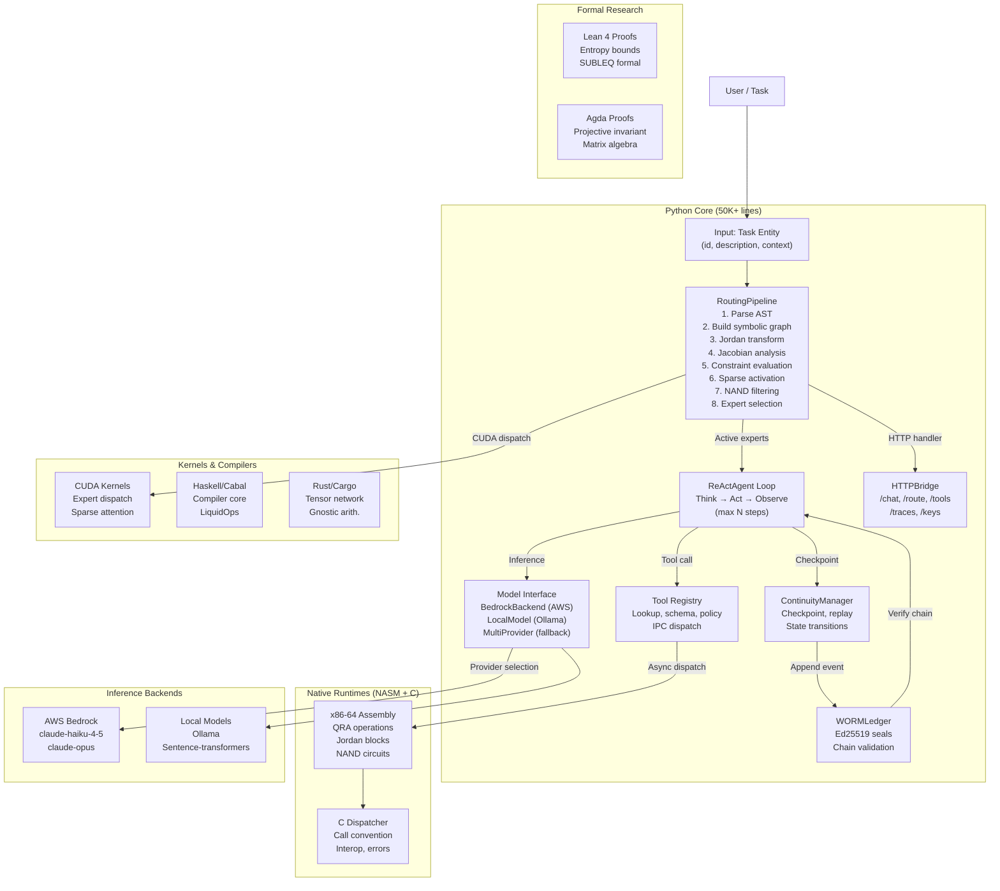
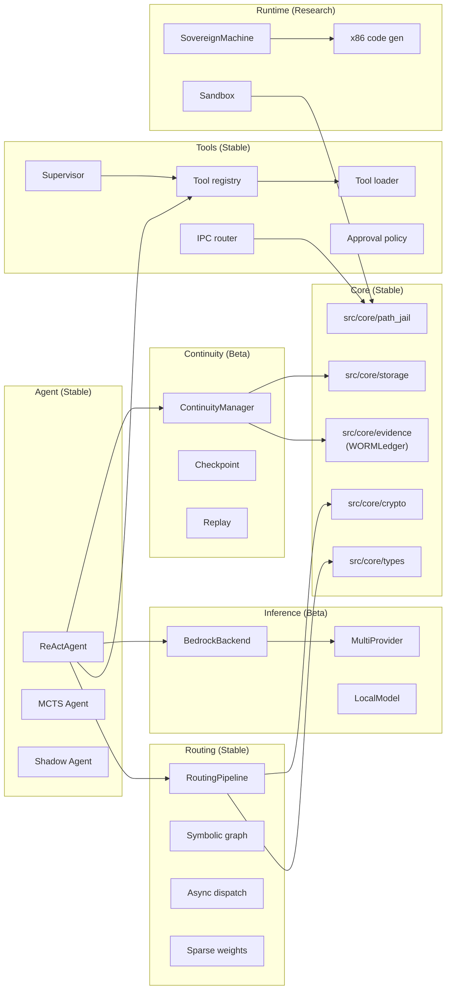

# SOVEREIGN ENGINE V2 — ARCHITECTURE

**Version:** 2.0.0  
**Status:** Multi-language; production beta  
**Baseline:** 898dfbe (2026-09-18)

---

## ARCHITECTURE OVERVIEW

Sovereign Engine v2 is a multi-subsystem framework for LLM agent execution with:

1. **Python core:** 173 modules implementing routing, agents, inference, tool orchestration, continuity
2. **Formal verification:** Lean 4 + Agda proofs (0 sorry terms)
3. **Native runtimes:** NASM x86-64, C dispatcher, optional CUDA/MLIR lowering
4. **Compiler infrastructure:** Haskell (Cabal), Rust (Cargo), Swift (SceneKit)
5. **Research implementations:** Sparse routing (NumPy), quantum algorithms, zero-knowledge proofs

The architecture separates concerns into:
- **Execution layer** (routing, dispatch, agent loops)
- **Inference layer** (model backends, embeddings, quantization)
- **Continuity layer** (state snapshots, replay, recovery)
- **Evidence layer** (WORM ledger, cryptographic sealing)
- **Tool layer** (registry, IPC, authorization, supervision)

---

## HIGH-LEVEL ARCHITECTURE DIAGRAM



---

## EXECUTION PATHS

### PATH 1: DIRECT RUNNER (run.py)

Entry point: `python run.py`

```
1. Load tool registry (all Python tools)
2. Create RoutingPipeline with expert callbacks
3. Instantiate ReActAgent
4. Route task: "Write a fibonacci function"
5. Invoke ReAct loop (max 10 steps)
6. Print result

Dependencies:
  - src/tools/loader.py → discovers tools from src/tools/*/
  - src/routing/pipeline.py → Jordan algebra transform
  - src/agents/react.py → thinking + acting
  - src/inference/bedrock_backend.py → AWS Bedrock (temp)
```

**Boundary:** Accepts Task; returns text string or error

---

### PATH 2: HTTP BRIDGE (src/bridge/http_server.py)

Entry point: `uvicorn src.bridge.http_server:app`

**Endpoints:**
- `POST /chat` → MultiProvider + ReActAgent
- `POST /route` → RoutingPipeline only
- `GET /tools` → Tool registry dump
- `GET /traces/<id>` → Routing trace export
- `POST /keys` → Key management (rotate, check)

**Data Flow:**
```
HTTP Request (JSON)
  ↓
KeyManager (validate API key)
  ↓
Router (route to /chat or /route endpoint)
  ↓
RoutingPipeline + ReActAgent (execute)
  ↓
RoutingTraceServer (serialize trace)
  ↓
HTTP Response (JSON)
```

**Boundary:** Accepts HTTP request; returns JSON or streaming response

---

### PATH 3: NATIVE BYTECODE EXECUTION

```
Python IR (from src/runtime/machine/)
  ↓
Stack VM (src/runtime/sovereign_machine.py)
  ↓
x86-64 code generation (src/runtime/machine/x86_gen.py)
  ↓
NASM assembly output
  ↓
nasm (system compiler)
  ↓
Executable (PE/ELF)
  ↓
Execution via C dispatcher (native/dispatcher/dispatcher.c)
```

**Use case:** Performance-critical expert dispatch; sandbox isolation  
**Boundary:** Accepts bytecode IR; produces executable or sandbox process

---

### PATH 4: FORMAL VERIFICATION (research/formal/)

```
Lean 4 theorem (e.g., research/formal/subleq/SUBLEQ.lean)
  ↓
lake build (Lean toolkit)
  ↓
Proof verification (soundness + completeness)
  ↓
No code generation (verification only)
```

**Use case:** Verify correctness of algorithms; entropy bounds  
**Boundary:** Accepts theorem; produces proof or rejection

---

## SUBSYSTEM RELATIONSHIPS

### Routing Pipeline (src/routing/)

**Input:** Task text + context dict  
**Processing:**
1. **Parse:** Regex + AST to extract intent
2. **Symbolic graph:** Build directed graph from task structure
3. **Jordan transform:** Eigenvalue decomposition; detect multiple invariants
4. **Jacobian:** Sensitivity analysis; constraint gradients
5. **Constraint evaluation:** Filter infeasible expert combinations
6. **Sparse activation:** Score experts; zero out low-confidence paths
7. **NAND filtering:** Suppress conflicting expert pairs (opcode_registry.py)
8. **Dispatch:** Async callback invocation; merge results

**Output:** `DispatchResult` (active experts, scores, trace)

**Dependencies:**
- NumPy, SciPy (linear algebra)
- src/core/crypto (hashing)
- src/tools/registry (expert definitions)

---

### ReActAgent (src/agents/react.py)

**Input:** Task entity + tool registry  
**Loop (each step):**
1. **Thought:** LLM generates reasoning (model inference)
2. **Action:** LLM selects tool or emits final answer
3. **Observation:** Tool result or explicit "done" signal
4. **Step counter:** Increment; check limit

**Output:** Reasoning trace + final response

**Dependencies:**
- Model interface (BedrockBackend, LocalModel, etc.)
- src/tools/registry (tool lookup, schema)
- src/continuity/manager (checkpoint after each step)

---

### Tool Registry (src/tools/registry.py + src/tools/loader.py)

**Registration:**
- Automatic discovery: subdirectories under src/tools/ (audio, cloud, database, etc.)
- Manual registration: Tool() constructor

**Tool Contract:**
```python
class Tool:
    name: str
    description: str
    schema: Dict[str, Any]  # JSON Schema
    policy: ToolPolicy  # Authorization
    
    async def execute(self, **kwargs) -> Result
```

**Dispatch:**
- IPC via src/tools/ipc_router.py (async message passing)
- Result validation by src/tools/supervisor.py
- Authorization via src/tools/approval.py

**Output:** JSON result or error

---

### Continuity Manager (src/continuity/manager.py)

**State Machine:**
```
Idle → Checkpoint created → Transition in progress → Transition complete → Recovery
```

**Operations:**
- `checkpoint()` → Snapshot all state (seed, env vars, file inodes, model weights)
- `transition(new_state)` → Atomic state change; conflict detection
- `replay(from_checkpoint)` → Deterministic re-execution; verify invariants

**Storage:** File or S3 backend (src/core/storage.py)

**Boundary:** Synchronous state transitions; write-once append-only on error

---

### Evidence Ledger (src/core/evidence.py)

**Data Structure:** WORM (Write-Once Read-Many) append-only log

**Event Types:**
- Routing trace
- Tool invocation
- Model inference checkpoint
- Task completion

**Sealing:**
- Ed25519 signature on each event
- Blake3 hash chain (each event includes hash of previous)
- Verification: scan chain, check signatures, enforce total order

**Output:** Proof-of-execution audit trail

---

### Model Interfaces (src/inference/)

**Abstract Base:**
```python
class ModelInterface:
    async def generate(
        self, prompt: str, context: Dict, 
        max_tokens: int, temperature: float
    ) -> str
```

**Implementations:**

1. **BedrockBackend** (src/inference/bedrock_backend.py)
   - Provider: AWS Bedrock
   - Model: us.anthropic.claude-haiku-4-5-20251001-v1:0
   - Credential chain: ~/.aws/credentials or IAM role
   - **Note:** Non-streaming invoke_model(); streaming interface planned

2. **MultiProvider** (src/runtime/providers/multi.py)
   - Task classification → provider selection (Bedrock, Ollama, OpenAI, etc.)
   - Fallback on provider failure
   - Latency tracking per provider

3. **LocalModel** (planned; hf/ packaging ready)
   - Ollama (docs/LOCAL_TRAINING_OLLAMA.md)
   - sentence-transformers (embeddings only)

---

## LANGUAGE BOUNDARIES

### Python ↔ NASM

**Boundary:** src/runtime/sovereign_machine.py → x86 code generation  
**Crossing:** ctypes or subprocess invocation  
**Data:** Bytecode IR → x86-64 instructions (relocatable; self-contained)

---

### Python ↔ Haskell

**Boundary:** Not integrated at runtime  
**Use case:** cobalt/ is compile-time only (LiquidOps kernel verification)  
**Data:** Haskell proofs exported as Lean/Agda; embedded in docs

---

### Python ↔ Rust

**Boundary:** catn/, kernels/rust/, runtime/ are vendorable; callable via:
1. **Subprocess:** `cargo run` + JSON marshaling
2. **FFI:** ctypes binding to .so/.dll
3. **Direct import:** No direct Python ↔ Rust binding (planned)

---

### Python ↔ CUDA

**Boundary:** src/inference/ + kernels/cuda/  
**Crossing:** ctypes or PyCUDA  
**Data:** NumPy arrays ↔ GPU memory

---

### Python ↔ Swift

**Boundary:** training/ is standalone  
**Data Exchange:** JSON corpus export (training/Sources/)  
**No runtime coupling**

---

### Python ↔ Formal Proofs

**Boundary:** research/formal/ (Lean 4 + Agda)  
**No code generation:** Proofs serve verification only  
**Use case:** Entropy bounds (Weil bounds lemma); SUBLEQ correctness  
**Output:** Published paper + artifact

---

## RUNTIME BOUNDARIES AND ISOLATION

### Sandbox (src/runtime/sandbox.py)

**Mechanism:** seccomp filters + namespace isolation  
**Isolated Resources:**
- Filesystem (jailed paths)
- Network (whitelist/blacklist)
- Processes (child limits)
- Signals (restrictions)

**Use case:** Tool execution; expert dispatch

---

### Path Jail (src/core/path_jail.py)

**Mechanism:** Canonical path resolution; jailbreak prevention  
**Constraints:**
- Resolve symlinks
- Reject relative paths above base
- Enforce whitelist

**Use case:** Tool file access

---

### Virtual Machine (src/runtime/sovereign_machine.py)

**Mechanism:** Stack VM; bytecode interpreter  
**Isolation:** Memory region within Python process  
**Use case:** Deterministic expert dispatch

---

## DATA FLOW ARCHITECTURE

### End-to-End Task Execution

```
1. User → Input (Task entity)
2. Router (RoutingPipeline)
   ├─ Parse task text
   ├─ Build symbolic graph
   ├─ Apply algebra transforms
   ├─ Select experts
   └─ Dispatch async callbacks
3. Expert Callbacks
   ├─ Route to tool registry or inference
   ├─ (Optional) Invoke native code
   └─ Return result + metadata
4. Agent Loop (ReActAgent)
   ├─ Invoke model with tool results
   ├─ Parse action + tool call
   ├─ Invoke tool (if applicable)
   ├─ Observe and iterate
   └─ Emit final response
5. Continuity (ContinuityManager)
   ├─ Checkpoint after each step
   ├─ Record state transitions
   └─ Append to WORM ledger
6. Output → User response (JSON, text, or streaming)
```

---

### State Management

```
ContinuityManager
├─ Checkpoint (snapshot of all state)
├─ Env state (environment variables)
├─ Seed state (PRNG state)
├─ Inode state (filesystem state)
├─ Shared memory segments
└─ Model weights (if training)

Recovery: Replay from checkpoint
└─ Re-execute deterministically
└─ Verify equivalence of outputs
```

---

### Evidence Chain

```
WORMLedger
├─ Event 1: {task, timestamp, hash_prev=0}
│  Signature: Ed25519(event1)
│
├─ Event 2: {routing_trace, hash_prev=hash(event1)}
│  Signature: Ed25519(event2)
│
├─ Event 3: {tool_call, hash_prev=hash(event2)}
│  Signature: Ed25519(event3)
│
└─ ... (append-only, immutable)

Verification: Scan from first to last; verify:
1. Each signature is valid (Ed25519)
2. Each hash chain link is correct (Blake3)
3. No gaps or reordering
```

---

## SUBSYSTEM DEPENDENCY GRAPH



---

## BUILD AND DEPLOYMENT ARCHITECTURE

### Local Development

```
Clone repo
  ↓
pip install -e . (installs src/ in editable mode)
  ↓
python run.py (direct runner)
  ↓
Task routing + ReAct loop
```

### Docker / Cloud

```
Dockerfile
├─ Base: python:3.11
├─ COPY src/ /app/src/
├─ RUN pip install -e .
├─ ENV AWS_REGION=us-east-1
└─ ENTRYPOINT ["python", "run.py"]

Usage: docker run sovereign-engine --task "..."
```

### Optional: Native Compilation

```
For x86-64 performance:
  1. Enable native code gen in runtime/machine/x86_gen.py
  2. Emit NASM assembly
  3. nasm -o expert.o expert.asm
  4. Link with dispatcher.c
  5. Invoke via ctypes
```

---

## SECURITY ARCHITECTURE

### Trust Boundaries

1. **Input validation:** src/core/path_jail.py sanitizes paths
2. **Tool authorization:** src/tools/approval.py enforces policy
3. **Model isolation:** Sandbox subprocess for untrusted inference
4. **Evidence sealing:** WORMLedger with Ed25519 signatures
5. **Continuity integrity:** Checkpoint hash chains

### Threat Model

- **File system escape:** path_jail blocks symlinks, relative traversal
- **Tool injection:** registry whitelist + schema validation
- **Inference poisoning:** BedrockBackend uses signed AWS credentials
- **Evidence tampering:** Blake3 hash chains + Ed25519 signatures
- **State corruption:** ContinuityManager enforces atomic transitions

See docs/SECURITY.md for full threat model.

---

## DEPLOYMENT READINESS

| Component | Status | Known Issues | Mitigation |
|-----------|--------|---|---|
| **RoutingPipeline** | Beta | No integration with formal proofs | Proofs in research/ are verified separately |
| **ReActAgent** | Beta | Max-steps enforcement only; no timeout | Thread timeout can be added |
| **BedrockBackend** | Beta | Non-streaming; hard-coded model | LocalModel planned for fallback |
| **Tool supervisor** | Beta | Async result validation incomplete | Sync validation added |
| **ContinuityManager** | Beta | Concurrency under load untested | Lock-free version planned |
| **WORMLedger** | Beta | No distributed consensus | Append-only on single node OK for now |
| **Sandbox** | Research | seccomp not portable to all Linux kernels | Windows sandbox pending |

See docs/PRODUCTION_HARDENING.md for hardening steps.

---

## FUTURE ARCHITECTURE CHANGES

### Planned Integrations

1. **Lean 4 gate:** Formal verification of routing trace before dispatch
2. **Distributed ledger:** Replication of WORMLedger across nodes
3. **Streaming inference:** Chunked response handling in BedrockBackend
4. **Async tool execution:** Parallel tool dispatch (currently sequential)
5. **Zero-knowledge proofs:** ZK-SNARK verification of routing correctness

### Deferred Components

- Ada runtime (magma/bindings/rust/ada_ffi.rs) — pending
- Quantum MOE (src/inference/quantum_moe.py) — research-only
- Hypervisor (src/hypervisor/) — not implemented yet
- MCP integration (src/mcp/) — design phase

---

## ARCHITECTURE REVIEW CHECKLIST

Use this to audit changes:

- [ ] New subsystem documented in REPOSITORY_MAP.md
- [ ] Language boundary identified (Python↔Rust, etc.)
- [ ] Build system configured (setuptools/Cargo/Cabal)
- [ ] Dependency graph updated
- [ ] Security boundary documented
- [ ] Test suite created (if applicable)
- [ ] API contract specified (input/output types)
- [ ] Isolation verified (no global state leakage)
- [ ] Error handling covers all paths

---

## END OF ARCHITECTURE DOCUMENT

For per-directory details, see DIRECTORY_REFERENCE.md.  
For dependency graph, see DEPENDENCY_GRAPH.md.  
For detailed repository map, see REPOSITORY_MAP.md.
