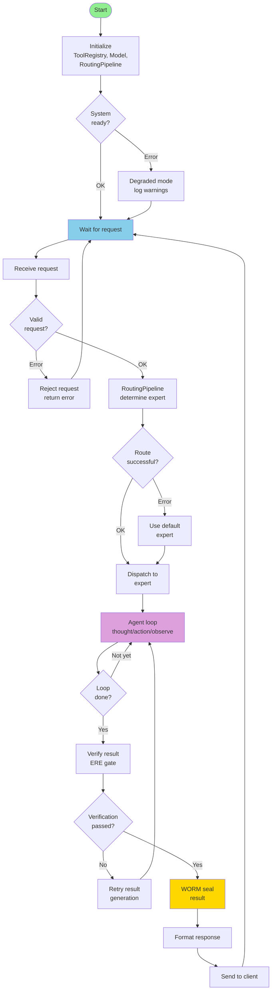

# Control Flow Documentation

Decision points, branches, and state transitions throughout Sovereign Engine v2. Maps how control passes between subsystems based on conditions and errors.

---

## 1. High-Level Control Flow



---

## 2. Request Validation Decision Tree

```mermaid
flowchart TD
    Req["Incoming request"] --> ParseOK{"JSON valid?"}
    
    ParseOK -->|No| ParseErr["→ 400 Bad Request<br/>JSON syntax error"]
    ParseOK -->|Yes| HasMsg{"Has<br/>messages?"}
    
    HasMsg -->|No| MsgErr["→ 400 Bad Request<br/>Missing messages field"]
    HasMsg -->|Yes| MsgNonEmpty{"Messages<br/>non-empty?"}
    
    MsgNonEmpty -->|Empty| EmptyErr["→ 400 Bad Request<br/>Empty messages array"]
    MsgNonEmpty -->|Yes| HasDesc{"Has<br/>description?"]
    
    HasDesc -->|No| DescErr["→ 400 Bad Request<br/>Missing description"]
    HasDesc -->|Yes| DescLen{"Description<br/>< 10KB?"]
    
    DescLen -->|No| LenErr["→ 413 Payload Too Large"]
    DescLen -->|Yes| MaxSteps{"max_steps<br/>in [1,100]?"]
    
    MaxSteps -->|No| StepsErr["→ 400 Bad Request<br/>max_steps out of range"]
    MaxSteps -->|Yes| Model{"Model<br/>supported?"]
    
    Model -->|No| ModelErr["→ 400 Bad Request<br/>Unknown model"]
    Model -->|Yes| Valid["✓ Valid request<br/>continue"]
    
    ParseErr -.-> ErrorResp["Return error<br/>response"]
    MsgErr -.-> ErrorResp
    EmptyErr -.-> ErrorResp
    DescErr -.-> ErrorResp
    LenErr -.-> ErrorResp
    StepsErr -.-> ErrorResp
    ModelErr -.-> ErrorResp
    
    ErrorResp --> Done1([Send error<br/>to client])
    Valid --> Done2([Continue<br/>to routing])
    
    style Valid fill:#90EE90
    style Done1 fill:#FFB6C6
    style Done2 fill:#90EE90
```

---

## 3. Routing Pipeline Decision Points

The 11-stage routing pipeline makes sequential decisions:

```mermaid
flowchart TD
    Stage1["Stage 1-2<br/>Parse + AST"]
    Stage1 --> Intent{"Intent<br/>clear?"}
    
    Intent -->|Ambiguous| LowConf["Low confidence<br/>< 0.5"]
    Intent -->|Clear| HighConf["High confidence<br/>≥ 0.5"]
    
    LowConf --> Default1["Use default<br/>expert"]
    HighConf --> Stage3["Stage 3-4<br/>Graph + Jordan"]
    
    Stage3 --> Stable{"Stable<br/>eigenvalues?"]
    Stable -->|No| Unstable["Unstable routing<br/>use conservative expert"]
    Stable -->|Yes| Stage5["Stage 5-6<br/>Jacobian + Constraints"]
    
    Unstable --> Stage8
    
    Stage5 --> Constraints{"Constraints<br/>satisfied?"]
    Constraints -->|No| Blocked["Experts blocked<br/>by constraints"]
    Constraints -->|Yes| Active["Experts active"]
    
    Blocked --> Stage8["Stage 8-9<br/>Routing nodes + NAND"]
    Active --> Stage8
    
    Stage8 --> Conflicts{"NAND<br/>conflicts?"]
    Conflicts -->|Yes| Suppress["Suppress<br/>conflicting experts"]
    Conflicts -->|No| NoConflict["No conflicts"]
    
    Suppress --> Stage10
    NoConflict --> Stage10["Stage 10-11<br/>Dispatch + Merge"]
    
    Stage10 --> Done["DispatchResult"]
    Default1 --> Done
    
    style Done fill:#90EE90
    style Blocked fill:#FFE4B5
    style Suppress fill:#FFE4B5
    style Unstable fill:#FFE4B5
```

---

## 4. Agent Loop Control

```mermaid
stateDiagram-v2
    [*] --> Thought: Step 0
    Thought --> ModelCall: Generate thought
    ModelCall --> ResponseParsed: Parse response
    
    ResponseParsed --> CheckDecision: What did model say?
    
    CheckDecision --> ToolCall: Tool call detected
    CheckDecision --> FinalAnswer: Final answer detected
    
    ToolCall --> CheckApproval: Risky tool?
    CheckApproval --> ApprovalRequired: Yes → Ask user
    CheckApproval --> ApprovalNotRequired: No → Execute
    
    ApprovalRequired --> Approved{User<br/>approved?}
    Approved --> ApprovalRejected: No
    Approved --> Execute: Yes
    
    ApprovalRejected --> ToolError: Tool rejected
    Execute --> ToolExec: Run tool
    ToolExec --> ToolSuccess: Tool succeeds
    ToolExec --> ToolFailed: Tool fails
    
    ToolError --> Observation: Record error
    ToolSuccess --> Observation: Record result
    ToolFailed --> Reflection: Reflect on error
    
    Reflection --> Thought: Think about failure
    
    Observation --> WormAppend: Seal step
    WormAppend --> StepCountCheck: steps < max?
    
    StepCountCheck --> MoreSteps: Yes
    MoreSteps --> Thought: Next step
    
    StepCountCheck --> MaxSteps: No
    MaxSteps --> FinalAnswer: Force final answer
    
    FinalAnswer --> BuildTrajectory: Gather all steps
    BuildTrajectory --> VerifyResult: ERE check
    
    VerifyResult --> VerifyPassed: Passed
    VerifyResult --> VerifyFailed: Failed
    
    VerifyFailed --> RetryGenerate: Ask model to fix
    RetryGenerate --> Thought
    
    VerifyPassed --> SealTrajectory: WORM seal
    SealTrajectory --> [*]: Return result
    
    style SealTrajectory fill:#FFD700
    style ToolFailed fill:#FFE4B5
    style ApprovalRejected fill:#FFE4B5
    style VerifyPassed fill:#90EE90
```

---

## 5. Error Recovery Paths

### 5.1 Tool Execution Error Recovery

```mermaid
flowchart TD
    Call["Call tool"] --> Exec["Execute"]
    
    Exec --> ExecOK{"Tool<br/>success?"}
    ExecOK -->|Yes| Result["Return result<br/>to agent"]
    ExecOK -->|No| Error["Tool error"]
    
    Error --> ErrorType{"Error<br/>type?"}
    
    ErrorType -->|Timeout| Timeout["Tool took >30s<br/>kill subprocess"]
    ErrorType -->|Exception| Exception["Python exception<br/>capture stderr"]
    ErrorType -->|PermissionDenied| PermErr["File permission<br/>cannot access path"]
    ErrorType -->|FileNotFound| NotFound["File does not exist"]
    
    Timeout --> Suggest["Suggest faster<br/>alternative tool"]
    Exception --> Suggest
    PermErr --> Suggest
    NotFound --> Suggest
    
    Suggest --> Reflection["Agent reflects:<br/>why did it fail?"]
    Reflection --> RetryDecision{"Agent decides:<br/>retry or move on?"]
    
    RetryDecision -->|Retry| CallAlt["Call alternative<br/>tool"]
    RetryDecision -->|Move on| FinalAns["Provide final answer<br/>without tool"]
    
    CallAlt --> Exec
    FinalAns --> Result
    
    Result --> Done([Tool step complete])
    
    style Done fill:#90EE90
    style Timeout fill:#FFE4B5
    style Exception fill:#FFE4B5
    style PermErr fill:#FFE4B5
    style NotFound fill:#FFE4B5
```

### 5.2 Model Inference Error Recovery

```mermaid
flowchart TD
    Invoke["Invoke model<br/>via BedrockBackend"] --> InvokeOK{"Inference<br/>success?"}
    
    InvokeOK -->|Yes| Response["Model response"]
    InvokeOK -->|No| Error["Inference error"]
    
    Error --> ErrorType{"Error<br/>type?"}
    
    ErrorType -->|Timeout| Timeout["Request > 60s timeout"]
    ErrorType -->|RateLimit| RateLimit["429 Too Many Requests"]
    ErrorType -->|AuthError| Auth["403 Unauthorized<br/>bad credentials"]
    ErrorType -->|ServerError| Server["500 Service error<br/>Bedrock down"]
    
    Timeout --> RetryDecision{"Retry<br/>strategy?"]
    RateLimit --> RetryDecision
    Auth --> RetryDecision
    Server --> RetryDecision
    
    RetryDecision -->|Retry| Backoff["Exponential backoff<br/>wait 1/2/4s"]
    RetryDecision -->|Fallback| FallbackModel["Switch to fallback<br/>model or mock"]
    
    Backoff --> MaxRetries{"Retries<br/>exhausted?"]
    MaxRetries -->|Yes| FallbackModel
    MaxRetries -->|No| Invoke
    
    FallbackModel --> MockResp["Generate mock<br/>response"]
    MockResp --> Response
    
    Response --> Done([Inference complete])
    
    style Done fill:#90EE90
    style Timeout fill:#FFE4B5
    style RateLimit fill:#FFE4B5
    style Auth fill:#FFB6C6
    style Server fill:#FFE4B5
```

### 5.3 Result Verification Error Recovery

```mermaid
flowchart TD
    Trajectory["Generated trajectory"] --> Verify["Run ERE gate<br/>verification"]
    
    Verify --> VerifyResult{"Verification<br/>passed?"}
    
    VerifyResult -->|Passed| Accept["✓ Accept result"]
    VerifyResult -->|Failed| Reject["✗ Reject result"]
    
    Reject --> FailType{"Failure<br/>reason?"]
    
    FailType -->|Empty response| Empty["Response is empty<br/>or null"]
    FailType -->|Bad format| Format["Response doesn't match<br/>expected schema"]
    FailType -->|Incoherent| Incoherent["Response incoherent<br/>or contradicts input"]
    FailType -->|Unsafe| Unsafe["Response contains<br/>unsafe content"]
    
    Empty --> Retry["Ask model to<br/>provide substantive<br/>response"]
    Format --> Retry
    Incoherent --> Retry
    Unsafe --> Retry
    
    Retry --> ReAttempts{"Retries<br/>exhausted?"]
    ReAttempts -->|No| Regenerate["Re-invoke model<br/>with corrective prompt"]
    ReAttempts -->|Yes| GiveUp["Give up on this<br/>task"]
    
    Regenerate --> Verify
    GiveUp --> Error["Return error<br/>to user"]
    
    Accept --> Seal["WORM seal<br/>result"]
    Seal --> Done([Result finalized])
    
    Error --> Done
    
    style Done fill:#90EE90
    style Accept fill:#90EE90
    style Error fill:#FFB6C6
```

---

## 6. Continuity Manager State Transitions

```mermaid
stateDiagram-v2
    [*] --> CheckState: On initialization
    
    CheckState --> NoState: No prior state exists
    CheckState --> HasState: State dir exists
    
    NoState --> Fresh: Fresh execution
    Fresh --> Running: Execute normally
    
    HasState --> LoadState: Load state from disk
    LoadState --> ValidState{State<br/>valid?}
    
    ValidState --> Resumed: State valid
    ValidState --> Stale: State corrupted/stale
    
    Stale --> Fresh
    
    Resumed --> HotRestart: Hot-restart mode
    HotRestart --> Resume: Resume from checkpoint
    Resume --> Running: Continue execution
    
    Running --> Checkpoint{Checkpoint<br/>needed?}
    Checkpoint --> NoCheckpoint: No
    Checkpoint --> DoCheckpoint: Yes
    
    NoCheckpoint --> Running
    DoCheckpoint --> SaveState: Write state to disk
    SaveState --> Running
    
    Running --> Complete: Execution complete
    Complete --> CleanupState: Cleanup state dir
    CleanupState --> [*]: Done
    
    Running --> Crash: Crash/exception
    Crash --> SaveErrorState: Save error state for debugging
    SaveErrorState --> [*]: Exit with error
```

---

## 7. WORM Ledger Append Decision

```mermaid
flowchart TD
    Event["Event to log<br/>routing, tool, step, seal"] --> EventType{"Event<br/>type?"]
    
    EventType -->|Routing decision| Route["Routing event"]
    EventType -->|Tool call| Tool["Tool event"]
    EventType -->|Step complete| Step["Step event"]
    EventType -->|Final seal| Seal["Seal event"]
    
    Route --> Priority["Set priority<br/>based on event"]
    Tool --> Priority
    Step --> Priority
    Seal --> Priority
    
    Priority --> Digest["Compute Blake3<br/>digest of entry"]
    Digest --> PrevHash["Get previous<br/>entry hash"]
    
    PrevHash --> Chain["Chain: hash = Blake3(entry || prev_hash)"]
    Chain --> Serialize["Serialize entry<br/>to JSONL"]
    
    Serialize --> Write["Append to WORM file"]
    Write --> WriteOK{"Write<br/>success?"}
    
    WriteOK -->|Yes| Success["✓ Entry sealed<br/>sequence number assigned"]
    WriteOK -->|No| Retry{"Retry<br/>possible?"]
    
    Retry -->|Yes| RetryWait["Wait 100ms"]
    RetryWait --> Write
    Retry -->|No| Fatal["✗ Fatal: WORM write failed<br/>result validation skipped"]
    
    Success --> Return["Return entry seq<br/>+ seal hash"]
    Fatal --> Return
    
    Return --> Done([Entry logged])
    
    style Success fill:#90EE90
    style Fatal fill:#FFB6C6
    style Return fill:#FFD700
```

---

## 8. Constraint Evaluation Decision Points

```mermaid
flowchart TD
    InputText["Input text +<br/>context"] --> DSLParse["Parse DSL<br/>constraints"]
    
    DSLParse --> EntropyCheck["Check entropy<br/>H ≤ 0.20?"]
    EntropyCheck -->|Violated| EntropyFail["Entropy constraint<br/>FAILED"]
    EntropyCheck -->|OK| DeterminismCheck["Check determinism<br/>same input →<br/>same output?"]
    
    DeterminismCheck -->|Violated| DetFail["Determinism<br/>FAILED"]
    DeterminismCheck -->|OK| TypeCheck["Check type safety<br/>args match schema?"]
    
    TypeCheck -->|Violated| TypeFail["Type safety<br/>FAILED"]
    TypeCheck -->|OK| RangeCheck["Check value ranges<br/>within bounds?"]
    
    RangeCheck -->|Violated| RangeFail["Range check<br/>FAILED"]
    RangeCheck -->|OK| ProofCheck{"Formal proof<br/>available?"]
    
    ProofCheck -->|Yes| Prove["Verify proof"]
    ProofCheck -->|No| NoCacheFormal["Skip formal<br/>verification"]
    
    Prove --> ProveOK{"Proof<br/>valid?"]
    ProveOK -->|No| ProofFail["Proof check<br/>FAILED"]
    ProveOK -->|Yes| AllPass["All constraints<br/>PASSED"]
    
    NoCacheFormal --> AllPass
    
    EntropyFail --> Blocked["Expert blocked"]
    DetFail --> Blocked
    TypeFail --> Blocked
    RangeFail --> Blocked
    ProofFail --> Blocked
    
    AllPass --> Allowed["Expert allowed"]
    
    Blocked --> Decision["Report constraint<br/>violation to pipeline"]
    Allowed --> Decision
    
    Decision --> Done([Continue routing])
    
    style AllPass fill:#90EE90
    style Blocked fill:#FFE4B5
    style Decision fill:#FFD700
```

---

## 9. Exception Handling Flow

```mermaid
flowchart TD
    Code["Executing code<br/>in try-except"] --> Exception{"Exception<br/>raised?"]
    
    Exception -->|No| Success["Continue normally"]
    Exception -->|Yes| CatchType{"Exception<br/>type?"]
    
    CatchType -->|KeyboardInterrupt| Interrupt["User interrupt<br/>Ctrl+C"]
    CatchType -->|SystemExit| Exit["System exit"]
    CatchType -->|ValueError| Value["Invalid value<br/>user error"]
    CatchType -->|TypeError| Type["Type mismatch<br/>programmer error"]
    CatchType -->|FileNotFoundError| FileErr["File not found"]
    CatchType -->|PermissionError| PermErr["Permission denied"]
    CatchType -->|TimeoutError| Timeout["Operation timeout"]
    CatchType -->|Exception| Generic["Generic exception<br/>unknown"]
    
    Value --> RecoveryDecision{"Fatal or<br/>recoverable?"]
    Type --> RecoveryDecision
    FileErr --> RecoveryDecision
    PermErr --> RecoveryDecision
    Timeout --> RecoveryDecision
    Generic --> RecoveryDecision
    
    Interrupt --> Fatal["Fatal: user exit"]
    Exit --> Fatal
    
    RecoveryDecision -->|Recoverable| Log["Log warning"]
    RecoveryDecision -->|Fatal| LogFatal["Log error"]
    
    Log --> Retry{"Retry?"]
    LogFatal --> Cleanup["Cleanup resources"]
    
    Retry -->|Yes| Retry2["Attempt recovery"]
    Retry -->|No| Fallback["Use fallback<br/>implementation"]
    
    Retry2 --> Code
    Fallback --> Success
    
    Fatal --> Cleanup
    Cleanup --> Return["Return error<br/>to caller"]
    
    Success --> Done([Continue])
    Return --> Done
    
    style Success fill:#90EE90
    style Fatal fill:#FFB6C6
    style Return fill:#FFB6C6
    style Done fill:#FFE4B5
```

---

## 10. Model Selection Decision Tree

The `MultiProvider` component selects which model to use:

```mermaid
flowchart TD
    Request["Incoming request<br/>with optional model hint"] --> HasHint{"Model<br/>specified?"]
    
    HasHint -->|Yes| ValidateModel{"Model<br/>available?"]
    ValidateModel -->|No| Warn["Warn: unknown model<br/>use default"]
    ValidateModel -->|Yes| UseRequested["Use requested<br/>model"]
    
    HasHint -->|No| Classify["Classify task<br/>into category"]
    Warn --> Classify
    
    Classify --> Category{"Task<br/>category?"]
    
    Category -->|Coding| Coder["→ Model for<br/>code generation"]
    Category -->|Reasoning| Reasoner["→ Model for<br/>logical reasoning"]
    Category -->|Creative| Creative["→ Model for<br/>creative writing"]
    Category -->|Domain-specific| Domain["→ Model for<br/>domain knowledge"]
    
    Coder --> CheckCapacity["Check model<br/>availability + load"]
    Reasoner --> CheckCapacity
    Creative --> CheckCapacity
    Domain --> CheckCapacity
    
    CheckCapacity --> Avail{"Model<br/>ready?"]
    
    Avail -->|Yes| Selected["Model selected"]
    Avail -->|No| Fallback["Fall back to<br/>default model"]
    
    UseRequested --> CheckCapacity
    Fallback --> Selected
    
    Selected --> Return["Return model<br/>identifier"]
    Return --> Done([Model selection complete])
    
    style Selected fill:#90EE90
    style Done fill:#90EE90
```

---

## 11. Authorization & Approval Decision

```mermaid
flowchart TD
    ToolCall["Tool call requested<br/>tool_name + args"] --> Lookup["Look up tool<br/>in ToolRegistry"]
    
    Lookup --> Policy["Get tool policy<br/>require_approval flag"]
    Policy --> PolicyCheck{"Approval<br/>required?"]
    
    PolicyCheck -->|No| Execute["Execute tool<br/>no approval"]
    PolicyCheck -->|Yes| ClassifyRisk["Classify risk level<br/>based on tool"]
    
    ClassifyRisk --> RiskLevel{"Risk<br/>level?"]
    
    RiskLevel -->|Low| LowRisk["Low risk: local read"]
    RiskLevel -->|Medium| MedRisk["Medium risk: file write"]
    RiskLevel -->|High| HighRisk["High risk: delete, network"]
    
    LowRisk --> Decision{"User<br/>approved?"]
    MedRisk --> AskUser["Ask user:<br/>approve tool call?"]
    HighRisk --> AskUser
    
    AskUser --> UserResp{"User<br/>response?"]
    UserResp -->|Approve| Approve["Approval granted"]
    UserResp -->|Deny| Deny["Approval denied"]
    UserResp -->|Timeout| Deny
    
    Approve --> Execute
    Deny --> Reject["Reject tool call<br/>return error"]
    
    Decision -->|Yes| Execute
    Decision -->|No| Reject
    
    Execute --> Done1([Tool executed])
    Reject --> Done2([Tool rejected])
    
    style Execute fill:#90EE90
    style Reject fill:#FFB6C6
```

---

## 12. Control Flow State Diagram

```mermaid
stateDiagram-v2
    [*] --> Starting: Initialize system
    
    Starting --> Ready: Initialization complete
    Ready --> Idle: Waiting for requests
    
    Idle --> RequestReceived: Request arrives
    RequestReceived --> Validating: Validate request
    
    Validating --> ValidationOK: Request valid
    ValidationOK --> Routing: Run routing pipeline
    
    Validating --> ValidationFailed: Request invalid
    ValidationFailed --> Idle: Send error response
    
    Routing --> Dispatching: Routing complete
    Dispatching --> ExpertProcessing: Expert processes task
    
    ExpertProcessing --> ThinkingOrDoingAction: Agent step
    
    ThinkingOrDoingAction --> LoopCheck{Max steps?}
    LoopCheck --> MoreSteps: No → continue
    LoopCheck --> VerifyingResult: Yes → finalize
    
    MoreSteps --> ThinkingOrDoingAction
    
    VerifyingResult --> VerificationOK: Result valid
    VerificationOK --> Sealing: Add WORM seal
    
    VerifyingResult --> VerificationFailed: Result invalid
    VerificationFailed --> MoreSteps: Retry
    
    Sealing --> Responding: Format response
    Responding --> Idle: Send response + log
    
    ExpertProcessing --> Error: Exception
    Error --> Recovering: Attempt recovery
    Recovering --> Recovered: Recovery OK
    Recovering --> NotRecovered: Recovery failed
    
    Recovered --> MoreSteps
    NotRecovered --> Idle
    
    Idle --> Shutdown: Shutdown signal
    Shutdown --> [*]: Cleaned up
```

---

## Summary

Control flow in Sovereign Engine:

1. **Initialization**: System startup with fallback on errors
2. **Request validation**: Early rejection of invalid inputs
3. **Routing decisions**: 11-stage pipeline makes expert selection
4. **Agent loop**: Iterative thought/action/observation with reflection
5. **Error recovery**: Graceful fallbacks and retry strategies
6. **Verification**: Result validation before returning
7. **Sealing**: All critical steps logged to immutable WORM ledger
8. **Continuity**: Hot-restart capability at any step
9. **Exception handling**: Structured try-except with recovery paths
10. **State machines**: Agent, continuity, and overall engine state

All decision points enforce constraints (DSL, authorization, type safety) and maintain audit trails.
