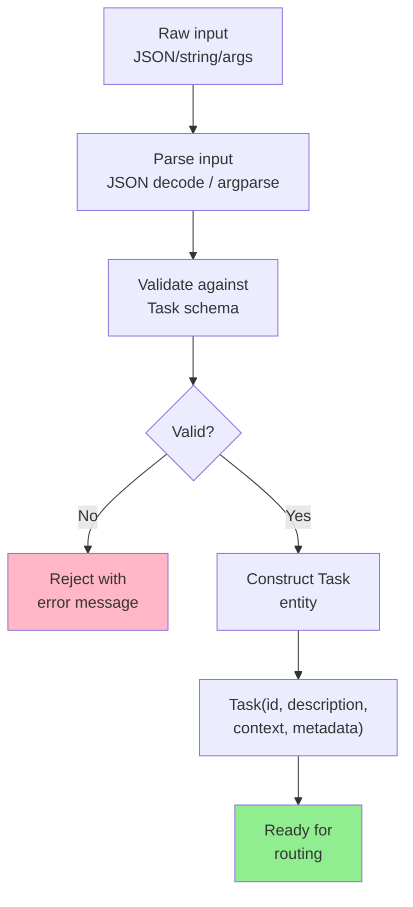
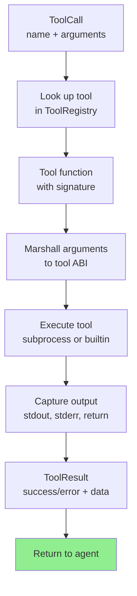
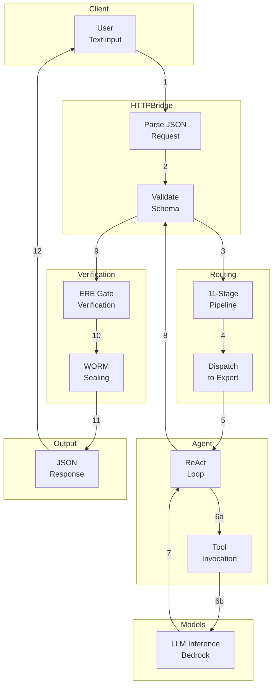

# Data Flow Documentation

Complete mapping of data movement across Sovereign Engine subsystems. Traces input sources through processing stages to output targets, including cross-language transformations and serialization boundaries.

---

## 1. High-Level Data Movement

```mermaid
flowchart LR
    User["User Request<br/>text + metadata"] --> Bridge["HTTP/CLI Bridge<br/>JSON/Protocol"]
    Bridge --> Parse["Parse & Validate<br/>Task entity"]
    
    Parse --> Task["Task(id, description,<br/>context, metadata)"]
    Task --> Router["RoutingPipeline<br/>11-stage analysis"]
    
    Router --> Route["DispatchResult<br/>expert assignment"]
    Route --> Agent["ReActAgent<br/>Thought loop"]
    
    Agent --> Tools["Tool Invocation<br/>args marshalled"]
    Tools --> ToolResult["ToolResult<br/>output + return"]
    
    ToolResult --> Model["Model Inference<br/>via BedrockBackend"]
    Model --> Response["Model Response<br/>text + tokens"]
    
    Response --> Trajectory["AgentTrajectory<br/>all steps sealed"]
    Trajectory --> Output["Output Result<br/>JSON/text"]
    Output --> Return["Return to User"]
    
    Trajectory --> WORM["WORMLedger<br/>Persist"]
    Response --> Evidence["Evidence Artifact<br/>ProofResult"]
    
    style WORM fill:#FFD700
    style Evidence fill:#FFD700
    style Return fill:#90EE90
```



---

## 2. Input Sources

### 2.1 HTTP Bridge Input

**Endpoint:** `POST /chat`
**Content-Type:** `application/json`

**Schema:**
```json
{
  "messages": [
    {
      "role": "user",
      "content": "Write a fibonacci function"
    }
  ],
  "temperature": 0.7,
  "max_tokens": 500,
  "provider": "bedrock",
  "tools_enabled": true
}
```

**Data Flow:**
```
HTTP POST request
    ↓ (parse JSON)
    ↓
ChatRequest dataclass
    ↓ (extract fields)
    ↓
Task entity + context dict
    ↓ (validate schema)
    ↓
Ready for routing
```

### 2.2 CLI Input

**Entry:** `src/cli/main.py`
**Command-line args parsed by argparse**

```bash
sovereign route --task "explain X" --model haiku --verbose
```

**Data Flow:**
```
CLI arguments
    ↓ (parse argparse)
    ↓
Namespace object
    ↓ (extract values)
    ↓
Task entity
    ↓
Routing pipeline
```

### 2.3 File-Based Input

**Source:** `research/sparse-routing/`, `training/datasets/`
**Format:** CSV, JSONL, Parquet

**Data Flow:**
```
File (CSV/JSONL)
    ↓ (read with Pandas/PyArrow)
    ↓
DataFrame / PyArrow Table
    ↓ (convert to records)
    ↓
Task[] list
    ↓
Batch processing
```

---

## 3. Processing Stages

### 3.1 Parsing & Validation



**Data Structures:**
- Input: `str` or `dict` or CLI args
- Output: `Task` entity

**Validation Checks:**
- Required fields present (description, etc.)
- Type correctness (strings are strings, dicts are dicts)
- Size limits (max 10KB task description)
- No malicious payloads (basic sanitization)

### 3.2 Routing Pipeline (11 Stages)

```
Task (text + metadata)
    ↓ [Stage 1: Tokenization]
    ↓ tokens: List[str]
    ↓ [Stage 2: AST Parsing]
    ↓ ast: ParseTree
    ↓ [Stage 3: Symbolic Graph]
    ↓ adjacency_matrix: np.ndarray
    ↓ [Stage 4: Jordan Eigendecomposition]
    ↓ eigenvalues: np.ndarray, eigenvectors: np.ndarray
    ↓ [Stage 5: Jacobian Sensitivity]
    ↓ condition_number: float
    ↓ [Stage 6: Constraint Evaluation]
    ↓ constraints_met: bool
    ↓ [Stage 7: Sparse Activation]
    ↓ active_experts: List[str], weights: Dict[str, float]
    ↓ [Stage 8: Routing Nodes]
    ↓ routing_scores: Dict[str, float]
    ↓ [Stage 9: NAND Filter]
    ↓ nand_cleared: bool
    ↓ [Stage 10: Dispatch]
    ↓ dispatch_result: DispatchResult
    ↓ [Stage 11: Merge Output]
    ↓ merged_output: str
```

**Data Structure Transformations:**
- Tokens: Python `list[str]`
- Parse tree: Custom `ParseTree` class
- Matrices: `np.ndarray` (float32)
- Jordan result: Dict with `eigenvalues`, `eigenvectors`, `stability_score`
- Jacobian: Float + boolean flags
- Routing: Dict[expert_name → float weight]
- Dispatch: `DispatchResult` with counts and results

### 3.3 Agent Loop Processing

```
Task + routing decision
    ↓
Thought generation prompt formatting
    ↓ Task.description + prior_observations + available_tools
    ↓ str (prompt)
    ↓
Model inference call
    ↓ BedrockBackend.invoke(prompt, max_tokens=500)
    ↓ str (model response)
    ↓
Response parsing
    ↓ Extract <thought>, <action>, <tool_call>, <final_answer> XML tags
    ↓ Thought (str) | ToolCall (dict) | FinalAnswer (str)
    ↓
[If ToolCall]
    ↓ Tool execution
    ↓ result: str or dict
    ↓ Step appended to trajectory
    ↓
[If FinalAnswer]
    ↓ AgentTrajectory construction
    ↓ All steps sealed
```

**Data Type Progression:**
- Input: Task
- Prompt: str
- Response: str
- Parsed: Union[Thought, ToolCall, FinalAnswer]
- Result: AgentTrajectory

### 3.4 Tool Execution



**Argument Marshalling:**
- JSON arguments → Python types
- Type checking against tool schema
- Validation against tool whitelist (path, network, etc.)

**Output Capture:**
- stdout → str
- stderr → str
- return value → JSON
- Exception → error message

**Return Format:**
```python
ToolResult(
    tool_name="file_read",
    status="success",
    output="file contents...",
    duration_ms=42,
    error=None
)
```

---

## 4. Cross-Language Data Movement

### 4.1 Python → Rust (via ctypes)

**Scenario:** Python calls Rust function for performance-critical code

```
Python dict
    ↓ (JSON serialize)
    ↓
JSON string
    ↓ (pass to ctypes.CDLL)
    ↓
Rust function receives *const u8 pointer
    ↓ (deserialize serde_json)
    ↓
Rust struct
    ↓ (process)
    ↓
Rust result struct
    ↓ (serialize serde_json)
    ↓
JSON string in return buffer
    ↓ (ctypes reads from pointer)
    ↓
Python (JSON deserialize)
    ↓
Python dict
```

**Serialization boundary:**
- Python: dict/list/str → JSON string
- Transfer: pointer to JSON string
- Rust: JSON → serde structs
- Return: pointer to result JSON
- Python: deserialize JSON → dict

### 4.2 Python → C (via subprocess)

**Scenario:** Native x86 assembly computation

```
Python data structures
    ↓ (convert to binary format)
    ↓
Binary buffer (in memory)
    ↓ (write to /tmp/input.bin)
    ↓
File on disk
    ↓ (spawn subprocess)
    ↓
C program reads stdin/files
    ↓ (C parsing + computation)
    ↓
C writes results to stdout/files
    ↓ (subprocess captures output)
    ↓
Bytes object in Python
    ↓ (parse binary)
    ↓
Python data structures
```

**Encoding Details:**
- Integers: 64-bit little-endian
- Floats: IEEE 754 double precision
- Strings: UTF-8 with length prefix
- Arrays: item count + items

### 4.3 Python → JavaScript (WebAssembly)

**Scenario:** Browser-based IDE execution

```
Python task
    ↓ (JSON serialize)
    ↓
JSON in HTTP response body
    ↓ (HTTP transfer)
    ↓
JavaScript receives JSON
    ↓ (JSON.parse)
    ↓
JavaScript object
    ↓ (pass to WASM module)
    ↓
WASM receives data via shared memory
    ↓ (WASM computation)
    ↓
WASM writes result to shared memory
    ↓ (JavaScript reads shared memory)
    ↓
JavaScript constructs response
    ↓ (JSON.stringify)
    ↓
HTTP response to client
```

**Memory Sharing:**
- Linear memory (shared)
- Offset pointers to data
- Length prefixes for arrays
- Magic headers for validation

---

## 5. Output Targets

### 5.1 HTTP Response

**Format:** JSON

```json
{
  "task_id": "task-001",
  "result": {
    "final_answer": "Here is a fibonacci function...",
    "trajectory": {
      "steps": 3,
      "reasoning": "I need to implement...",
      "tool_calls": [
        {
          "name": "file_write",
          "args": {"path": "fib.py", "content": "def fib..."},
          "result": "success"
        }
      ]
    },
    "metadata": {
      "routing_decision": "Lambda expert",
      "latency_ms": 1234,
      "tokens_used": 456,
      "worm_seal": "0x123abc..."
    }
  },
  "status": "success"
}
```

### 5.2 CLI Output

**Format:** Structured text/ANSI colors

```
━━━━━━━━━━━━━━━━━━━━━━━━━━━━━━━━━━━━━━━━━━━━━
   SOVEREIGN ENGINE v2 — EXECUTION RESULT
━━━━━━━━━━━━━━━━━━━━━━━━━━━━━━━━━━━━━━━━━━━━━

Task ID:    task-001
Routing:    Lambda expert
Latency:    1234 ms
Status:     SUCCESS

Final Answer:
─────────────────────────────────────────────
Here is a fibonacci function...
─────────────────────────────────────────────

Evidence:
  WORM Seal: 0x123abc...
  Proof:     complete
  Tools:     1 invoked, 1 success
```

### 5.3 WORMLedger Persistence

**Format:** JSONL (JSON Lines)

Each line is a complete JSON event:

```json
{"seq":1,"timestamp":"2026-09-19T12:34:56Z","type":"routing","event":{"task_id":"task-001","route":"Lambda","entropy":0.12}}
{"seq":2,"timestamp":"2026-09-19T12:34:57Z","type":"tool_call","event":{"tool":"file_write","status":"success"}}
{"seq":3,"timestamp":"2026-09-19T12:34:58Z","type":"final_seal","event":{"trajectory_hash":"0x123abc...","seal":"0x456def..."}}
```

**Storage:**
- File: `~/.sovereign/worm/{agent_id}.jsonl`
- Appended mode (no overwrites)
- Immutable once written

### 5.4 Evidence Artifacts

**Format:** Structured types (ProofResult, DispatchResult, etc.)

```python
ProofResult(
    theorem_name="jordan_stability",
    complete=True,
    proof_term="λ x => ...",
    seal="0xabcdef...",
    verified_timestamp="2026-09-19T12:34:56Z"
)
```

**Stored in:**
- WORM ledger (sealed)
- Evidence cache (for fast lookup)
- Optional: GitHub Pages documentation

---

## 6. Data Structure Schemas

### 6.1 Task Entity

```python
@dataclass
class Task:
    id: str                              # unique task ID
    description: str                     # task text (required)
    context: dict[str, Any] = field(default_factory=dict)  # extra context
    metadata: dict[str, Any] = field(default_factory=dict) # routing hints
    created_at: datetime = field(default_factory=datetime.now)
    
    # Optional routing hint
    preferred_expert: str | None = None
    
    # Continuation
    prior_steps: list["AgentStep"] = field(default_factory=list)
```

### 6.2 DispatchResult

```python
@dataclass
class DispatchResult:
    active_count: int              # experts called
    success_count: int             # experts succeeded
    failed_experts: list[str]      # which experts failed
    results: dict[str, Any]        # expert outputs
    merged_output: str             # combined result
    latency_ms: float
```

### 6.3 AgentStep

```python
@dataclass
class AgentStep:
    step_num: int
    thought: str                   # agent's reasoning
    action_type: ActionType        # tool_call or final_answer
    tool_call: ToolCall | None     # if action_type == tool_call
    observation: str | None        # tool result
    timestamp: datetime
    worm_seal: str | None          # evidence hash
```

### 6.4 AgentTrajectory

```python
@dataclass
class AgentTrajectory:
    task_id: str
    steps: list[AgentStep]
    final_answer: str
    
    # Verification
    ere_passed: bool               # ERE gate verification
    ere_seal: str | None
    
    # Sealing
    trajectory_hash: str           # Blake3 hash of all steps
    master_seal: str               # Final WORM seal
    
    created_at: datetime
    duration_ms: float
    tokens_used: int
```

---

## 7. Memory Layout & Alignment

### VM Stack Layout

```
[High Memory]
    stack[99]  ← SP (stack pointer, grows downward)
    stack[98]
    ...
    stack[2]
    stack[1]
    stack[0]
[Low Memory]
```

### x86-64 Calling Convention (System V AMD64 ABI)

```
Caller frame:
    [RBP + 16]  ← return address
    [RBP + 8]   ← caller's RBP
    [RBP]       ← callee's RBP

Argument passing (first 6 args):
    RDI ← arg0
    RSI ← arg1
    RDX ← arg2
    RCX ← arg3
    R8  ← arg4
    R9  ← arg5
    stack (after RBP) ← arg6+

Return value:
    RAX ← integer return
    XMM0 ← floating-point return
```

---

## 8. Serialization Boundaries

### JSON Serialization

Used for:
- HTTP payloads
- WORM ledger entries
- Configuration files

```python
import json

# Encode
data = {"task": "...", "result": {...}}
json_str = json.dumps(data)

# Decode
parsed = json.loads(json_str)
```

### Binary Serialization (ctypes)

Used for:
- Python ↔ C/Rust IPC
- Machine code arguments

```python
import struct

# Encode integers to bytes
bytes_data = struct.pack('<QQQ', arg0, arg1, arg2)  # 3 x 64-bit LE

# Decode
arg0, arg1, arg2 = struct.unpack('<QQQ', bytes_data)
```

### Protocol Buffers (optional)

Used for:
- Efficient serialization (if perf critical)
- Language-agnostic schema

### WASM Shared Memory

Used for:
- WebAssembly ↔ JavaScript IPC
- Browser-IDE data transfer

```javascript
// JavaScript creates shared memory
const sharedBuffer = new SharedArrayBuffer(1024 * 1024);
const wasmModule = new WebAssembly.Instance(wasmCode, {
  env: { memory: new WebAssembly.Memory({ shared: true, initial: 16 }) }
});

// Write data
const view = new Uint32Array(sharedBuffer);
view[0] = 42;  // shared with WASM

// WASM reads/writes same memory
```

---

## 9. Caching & Optimization

### Tool Result Cache

```
Before cache:
    tool_call("file_read", "path.txt") → 100ms

After cache:
    tool_call("file_read", "path.txt") → <1ms (cache hit)
```

**Cache key:** SHA256(tool_name + serialized_args)

**Invalidation:** File modification time check

### Model Response Cache

```
Before cache:
    model.invoke("explain X") → 500ms

After cache:
    model.invoke("explain X") → <1ms (cache hit)
```

**Cache key:** SHA256(system_prompt + user_prompt)

**Invalidation:** Manual or time-based (1 hour)

### Routing Decision Cache

```
Before cache:
    pipeline.route("write function") → 50ms

After cache:
    pipeline.route("write function") → 1ms
```

**Cache key:** SHA256(task_description)

**Invalidation:** Pipeline version change

---

## 10. Data Flow Diagram — Full Request



---

## 11. Performance Impact: Data Movement

| Operation | Size | Latency | Serialization | Network |
|-----------|------|---------|---------------|---------|
| Parse request | 1-10KB | <1ms | JSON → Task | N/A |
| Routing stage 1-5 | 10-100MB | 5-10ms | np.ndarray | N/A |
| Agent step | 1-5KB | 1ms | str → Task | N/A |
| Tool args | 100B-1MB | <1ms | dict → JSON/binary | N/A |
| Model request | 5-50KB | 500-1000ms | str | HTTP |
| Model response | 1-10KB | 0ms (async) | str → dict | HTTP |
| Trajectory seal | 5-50KB | <1ms | AgentTrajectory → Blake3 | Disk |
| WORM append | 100B-1KB | <1ms | JSONL entry | Disk |

---

## Summary

Data flows through Sovereign Engine via:

1. **Entry:** HTTP, CLI, or file sources
2. **Parsing:** JSON/string → Task entities
3. **Routing:** Text → 11-stage pipeline → expert assignment
4. **Processing:** Agent loop with model, tools, verification
5. **Exit:** JSON response, WORM ledger, evidence artifacts
6. **Cross-language:** JSON, ctypes, subprocess, WebAssembly boundaries
7. **Caching:** Transparent optimization at tool, model, routing levels
8. **Verification:** ERE gates, formal proofs, WORM seals

All data movements preserve integrity via hashing, sealing, and immutable audit trails.
