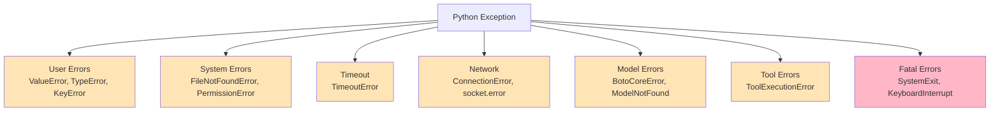
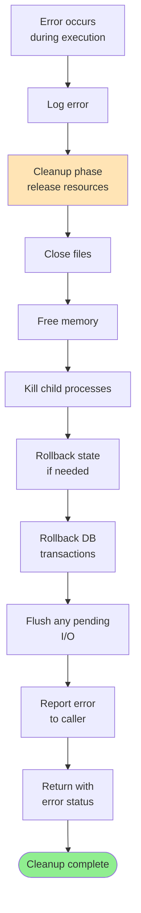

# Error Paths Documentation

Error detection, handling, recovery strategies, and cleanup procedures across all subsystems. Includes exception types, logging, and recovery flows.

---

## 1. Error Detection & Handling Architecture

```mermaid
flowchart TD
    Code["Code execution<br/>in try-except block"] --> Exception{"Exception<br/>raised?"}
    
    Exception -->|No| Success["Continue normally<br/>return result"]
    Exception -->|Yes| Catch["Catch block<br/>executes"]
    
    Catch --> Classify["Classify exception<br/>type"]
    Classify --> Category{"Exception<br/>category?"}
    
    Category -->|User error| User["Log as WARNING<br/>suggest fix"]
    Category -->|System error| System["Log as ERROR<br/>attempt recovery"]
    Category -->|Fatal| Fatal["Log as CRITICAL<br/>prepare shutdown"]
    
    User --> Handle["Handle error"]
    System --> Handle
    Fatal --> Handle
    
    Handle --> Recover{"Recoverable?"]
    Recover -->|Yes| DoRecover["Execute recovery<br/>cleanup + retry"]
    Recover -->|No| PropagateUp["Propagate error<br/>up stack"]
    
    DoRecover --> Return1["Return result<br/>or fallback"]
    PropagateUp --> Return2["Return error<br/>to caller"]
    
    Success --> Done
    Return1 --> Done
    Return2 --> Done
    Done([Continue or exit])
```

---

## 2. Exception Type Classification



---

## 3. Logging Strategy

### 3.1 Log Levels

| Level | Color | Example | Action |
|-------|-------|---------|--------|
| DEBUG | Blue | "Stack: [0, 1, 2]" | Dev info only |
| INFO | Green | "Routing to expert: Lambda" | Normal operations |
| WARNING | Yellow | "Tool timed out, retrying" | Recoverable issue |
| ERROR | Red | "Database connection failed" | Significant issue |
| CRITICAL | Bold Red | "System shutting down" | Unrecoverable |

### 3.2 Logging Points

```python
import logging

logger = logging.getLogger("sovereign")

# DEBUG: detailed execution trace
logger.debug(f"Stack: {vm.stack}, PC: {vm.pc}")

# INFO: normal operations
logger.info(f"Routing {task.id} to expert: {expert_name}")

# WARNING: recoverable errors
logger.warning(f"Tool {tool_name} timed out, using fallback")

# ERROR: significant failures
logger.error(f"Model inference failed: {error_type}")

# CRITICAL: system-level failures
logger.critical(f"WORM ledger corrupt, cannot continue")
```

### 3.3 Log Configuration

```python
import logging.config

LOGGING_CONFIG = {
    'version': 1,
    'disable_existing_loggers': False,
    'formatters': {
        'verbose': {
            'format': '[%(asctime)s] %(levelname)-8s [%(name)s:%(lineno)d] %(message)s'
        },
        'simple': {
            'format': '%(levelname)-8s %(message)s'
        }
    },
    'handlers': {
        'console': {
            'class': 'logging.StreamHandler',
            'formatter': 'simple',
            'level': 'INFO'
        },
        'file': {
            'class': 'logging.FileHandler',
            'filename': '~/.sovereign/logs/engine.log',
            'formatter': 'verbose',
            'level': 'DEBUG'
        }
    },
    'root': {
        'handlers': ['console', 'file'],
        'level': 'DEBUG'
    }
}

logging.config.dictConfig(LOGGING_CONFIG)
```

---

## 4. Per-Subsystem Error Flows

### 4.1 Routing Pipeline Errors

```mermaid
flowchart TD
    Input["Input task"] --> Parse["Parse stage 1-2"]
    
    Parse --> ParseErr{"Parse<br/>error?"]
    ParseErr -->|Yes| Log1["Log WARNING:<br/>malformed input"]
    ParseErr -->|Yes| Default1["Use default<br/>expert"]
    ParseErr -->|No| Graph["Graph stage 3-4"]
    
    Graph --> GraphErr{"Graph<br/>computation?"]
    GraphErr -->|Yes| Log2["Log ERROR:<br/>matrix singular"]
    GraphErr -->|Yes| Default2["Use default<br/>expert"]
    GraphErr -->|No| Jordan["Jordan stage 5-6"]
    
    Jordan --> JordanErr{"Eigen<br/>decomposition?"]
    JordanErr -->|Yes| Log3["Log WARNING:<br/>unstable eigenvalues"]
    JordanErr -->|Yes| Conservative["Use conservative<br/>expert"]
    JordanErr -->|No| Constraint["Constraint stage 7-8"]
    
    Constraint --> ConstrErr{"Constraint<br/>violated?"]
    ConstrErr -->|Yes| Log4["Log INFO:<br/>experts blocked"]
    ConstrErr -->|No| Success["Routing success"]
    
    Log1 --> Default1
    Log2 --> Default2
    Log3 --> Conservative
    Log4 --> Success
    
    Default1 --> Return
    Default2 --> Return
    Conservative --> Return
    Success --> Return["Return result<br/>DispatchResult"]
    
    Return --> Done([Routing complete])
    
    style Done fill:#90EE90
    style Log1 fill:#FFE4B5
    style Log2 fill:#FFE4B5
    style Log3 fill:#FFE4B5
```

### 4.2 Tool Execution Errors

```mermaid
flowchart TD
    Call["Tool call"] --> Validate["Validate args<br/>against schema"]
    
    Validate --> ValidErr{"Validation<br/>error?"]
    ValidErr -->|Yes| ArgErr["Return error:<br/>invalid arguments"]
    ValidErr -->|No| Execute["Execute tool"]
    
    Execute --> Exec1{"Execution<br/>success?"]
    
    Exec1 -->|Timeout| Timeout["Tool > 30s<br/>kill subprocess"]
    Exec1 -->|Exception| Exception["Tool raised<br/>exception"]
    Exec1 -->|Permission| PermErr["Permission denied<br/>cannot access"]
    Exec1 -->|Success| Return1["Tool result"]
    
    Timeout --> LogTimeout["Log WARNING"]
    Exception --> LogExc["Log ERROR<br/>capture stderr"]
    PermErr --> LogPerm["Log ERROR"]
    
    LogTimeout --> Suggest["Suggest alternative<br/>tool"]
    LogExc --> Suggest
    LogPerm --> Suggest
    
    Suggest --> Retry{"Agent decides<br/>retry?"]
    Retry -->|Yes| NewCall["Call alternative<br/>tool"]
    Retry -->|No| Final["Final answer<br/>without tool"]
    
    NewCall --> Call
    Final --> Return2["Return to agent"]
    Return1 --> Return2
    ArgErr --> Return2
    
    Return2 --> Done([Tool step complete])
    
    style Done fill:#90EE90
    style Timeout fill:#FFE4B5
    style Exception fill:#FFE4B5
```

### 4.3 Model Inference Errors

```mermaid
flowchart TD
    Invoke["Invoke Bedrock<br/>send prompt"] --> InvokeRes{"Response<br/>OK?"]
    
    InvokeRes -->|Success| Response["Model response"]
    InvokeRes -->|Timeout| Timeout["Request >60s"]
    InvokeRes -->|RateLimit| RateLimit["429 Too Many<br/>Requests"]
    InvokeRes -->|Auth| Auth["403 Unauthorized<br/>bad credentials"]
    InvokeRes -->|Server| Server["500 Service Error<br/>Bedrock down"]
    
    Timeout --> LogTimeout["Log WARNING:<br/>model timeout"]
    RateLimit --> LogRate["Log WARNING:<br/>rate limit"]
    Auth --> LogAuth["Log ERROR:<br/>auth failed"]
    Server --> LogServer["Log ERROR:<br/>service unavailable"]
    
    LogTimeout --> Backoff["Exponential backoff<br/>wait 1s"]
    LogRate --> Backoff
    LogAuth --> NoRetry["Don't retry<br/>auth issue"]
    LogServer --> Backoff
    
    Backoff --> MaxRetries{"Retries<br/>exhausted?"]
    MaxRetries -->|No| Invoke
    MaxRetries -->|Yes| Fallback["Use fallback<br/>model or mock"]
    
    NoRetry --> Fallback
    
    Fallback --> MockResp["Generate mock<br/>response"]
    MockResp --> Return["Return response"]
    Response --> Return
    
    Return --> Done([Inference complete])
    
    style Done fill:#90EE90
    style Timeout fill:#FFE4B5
    style RateLimit fill:#FFE4B5
    style Auth fill:#FFB6C6
```

### 4.4 WORM Ledger Errors

```mermaid
flowchart TD
    Event["Event to log"] --> Serialize["Serialize to JSON"]
    
    Serialize --> SerErr{"Serialization<br/>error?"]
    SerErr -->|Yes| LogSerErr["Log ERROR:<br/>cannot serialize"]
    SerErr -->|No| Compute["Compute Blake3<br/>hash"]
    
    Compute --> HashErr{"Hash<br/>error?"]
    HashErr -->|Yes| LogHashErr["Log CRITICAL:<br/>hash failed"]
    HashErr -->|No| Write["Write to WORM file"]
    
    Write --> WriteErr{"Write<br/>success?"]
    WriteErr -->|Yes| Success["Entry sealed"]
    WriteErr -->|No| Retry{"Retry<br/>possible?"]
    
    Retry -->|Yes| RetryWait["Wait 100ms"]
    RetryWait --> Write
    Retry -->|No| Fatal["Log CRITICAL:<br/>WORM write failed"]
    
    LogSerErr --> Fallback["Fallback: skip WORM<br/>continue without seal"]
    LogHashErr --> Fallback
    Fatal --> Fallback
    
    Fallback --> Return["Return error<br/>without seal"]
    Success --> Return
    
    Return --> Done([Event processed])
    
    style Success fill:#90EE90
    style Fatal fill:#FFB6C6
    style Fallback fill:#FFE4B5
```

### 4.5 Continuity Manager Errors

```mermaid
flowchart TD
    Init["Initialize<br/>ContinuityManager"] --> CheckState["Check for<br/>prior state"]
    
    CheckState --> NoState{"State<br/>exists?"]
    NoState -->|No| Fresh["Fresh execution"]
    NoState -->|Yes| Load["Load state from<br/>disk"]
    
    Load --> LoadErr{"Load<br/>success?"]
    LoadErr -->|Yes| Validate["Validate state<br/>integrity"]
    LoadErr -->|No| LoadFail["Log ERROR:<br/>cannot read state"]
    
    Validate --> ValidErr{"State<br/>valid?"]
    ValidErr -->|No| Corrupt["Log WARNING:<br/>state corrupted"]
    ValidErr -->|Yes| Resume["Resume execution"]
    
    LoadFail --> Fresh
    Corrupt --> Fresh
    
    Fresh --> Done1["Fresh execution"]
    Resume --> Done2["Hot restart"]
    
    Done1 --> Done([Ready])
    Done2 --> Done
    
    style Done fill:#90EE90
    style LoadFail fill:#FFE4B5
    style Corrupt fill:#FFE4B5
```

---

## 5. Recovery Strategies

### 5.1 Retry with Backoff

```python
import time

async def retry_with_backoff(
    fn,
    max_retries: int = 3,
    initial_delay: float = 1.0,
    exponential_base: float = 2.0
):
    """Retry with exponential backoff"""
    delay = initial_delay
    
    for attempt in range(max_retries):
        try:
            return await fn()
        except Exception as e:
            if attempt == max_retries - 1:
                raise
            
            logger.warning(f"Attempt {attempt+1} failed: {e}, retrying in {delay}s")
            await asyncio.sleep(delay)
            delay *= exponential_base
```

### 5.2 Fallback Implementation

```python
async def call_with_fallback(primary_fn, fallback_fn):
    """Call primary, fall back if it fails"""
    try:
        return await primary_fn()
    except Exception as e:
        logger.warning(f"Primary failed: {e}, using fallback")
        try:
            return await fallback_fn()
        except Exception as e2:
            logger.error(f"Fallback also failed: {e2}")
            raise
```

### 5.3 Partial Result

```python
def execute_with_partial_result(tasks):
    """Execute tasks, keep successful results even if some fail"""
    results = []
    
    for task in tasks:
        try:
            result = execute_task(task)
            results.append({
                "task": task,
                "status": "success",
                "result": result
            })
        except Exception as e:
            logger.warning(f"Task {task} failed: {e}")
            results.append({
                "task": task,
                "status": "failed",
                "error": str(e)
            })
    
    return results  # Mix of successes and failures
```

---

## 6. Cleanup on Error



### 6.1 Context Manager Pattern

```python
class ManagedResource:
    def __enter__(self):
        self.resource = allocate_expensive_resource()
        return self.resource
    
    def __exit__(self, exc_type, exc_val, exc_tb):
        # Always runs, even if exception
        self.resource.cleanup()
        
        if exc_type:
            logger.error(f"Exception in context: {exc_val}")
            # Don't suppress exception
            return False
        
        return True

# Usage
with ManagedResource() as res:
    try:
        use_resource(res)
    except Exception:
        # Cleanup always happens
        pass
```

### 6.2 Finally Block

```python
try:
    result = execute_risky_operation()
finally:
    # Cleanup ALWAYS happens
    close_database_connection()
    flush_pending_writes()
    release_locks()
```

---

## 7. Error Recovery Patterns

### 7.1 Circuit Breaker

```python
class CircuitBreaker:
    """Stop calling failing service, reduce cascade"""
    
    def __init__(self, failure_threshold: int = 5, timeout_s: int = 60):
        self.failure_count = 0
        self.failure_threshold = failure_threshold
        self.timeout_s = timeout_s
        self.last_failure_time = None
        self.state = "CLOSED"  # CLOSED, OPEN, HALF_OPEN
    
    async def call(self, fn, *args, **kwargs):
        if self.state == "OPEN":
            if time.time() - self.last_failure_time > self.timeout_s:
                self.state = "HALF_OPEN"
            else:
                raise RuntimeError("Circuit breaker OPEN")
        
        try:
            result = await fn(*args, **kwargs)
            self.failure_count = 0
            self.state = "CLOSED"
            return result
        except Exception as e:
            self.failure_count += 1
            self.last_failure_time = time.time()
            
            if self.failure_count >= self.failure_threshold:
                self.state = "OPEN"
                logger.critical("Circuit breaker OPEN")
            
            raise
```

### 7.2 Bulkhead Pattern

```python
import concurrent.futures

class Bulkhead:
    """Isolate failing task type from affecting others"""
    
    def __init__(self, max_concurrent: int = 10):
        self.executor = concurrent.futures.ThreadPoolExecutor(
            max_workers=max_concurrent
        )
    
    def execute(self, fn, timeout_s: int = 30):
        """Execute with thread isolation + timeout"""
        future = self.executor.submit(fn)
        try:
            return future.result(timeout=timeout_s)
        except concurrent.futures.TimeoutError:
            logger.error(f"Task timeout after {timeout_s}s")
            future.cancel()
            raise
```

---

## 8. Exception Hierarchy

```
Exception (base)
├── ValueError
│   ├── DSLConstraintViolation
│   ├── InvalidTaskDescription
│   └── RoutingException
├── TypeError
│   └── TypeMismatchError
├── RuntimeError
│   ├── ToolExecutionError
│   ├── ModelInferenceError
│   └── WORMLedgerError
├── TimeoutError
│   ├── ToolTimeoutError
│   └── ModelTimeoutError
├── ConnectionError
│   └── BedrocClientError
└── SystemError
    ├── WORMLedgerCorruptError
    └── ContinuityStateError
```

---

## 9. Error State Artifacts

Errors are logged to WORMLedger as evidence:

```json
{
  "seq": 42,
  "timestamp": "2026-09-19T12:34:56Z",
  "type": "error",
  "event": {
    "subsystem": "routing",
    "error_type": "MatrixSingularError",
    "message": "Adjacency matrix singular, cannot decompose",
    "stack_trace": "...",
    "recovery_action": "use_default_expert",
    "recovery_status": "success"
  }
}
```

---

## 10. Error Path Diagram: Complete Flow

```mermaid
flowchart TD
    subgraph NormalPath
        N1["Execute operation"] --> N2["Success"]
        N2 --> N3["Return result"]
    end
    
    subgraph ErrorPath
        E1["Execute operation"] --> E2{"Error?"]
        E2 -->|Yes| E3["Detect error type"]
        E3 --> E4["Log error"]
        E4 --> E5{"Recoverable?"]
        E5 -->|Yes| E6["Attempt recovery"]
        E6 --> E7{"Recovery OK?"]
        E7 -->|Yes| E8["Return fallback<br/>result"]
        E7 -->|No| E9["Give up"]
        E5 -->|No| E9
        E9 --> E10["Cleanup resources"]
        E10 --> E11["Return error<br/>to caller"]
    end
    
    E8 --> Output["Final result"]
    E11 --> Output
    N3 --> Output
    
    style Output fill:#FFD700
    style E11 fill:#FFB6C6
```

---

## 11. Post-Error Analysis

After errors, perform analysis:

```python
class ErrorAnalyzer:
    def analyze(self, error: Exception) -> dict:
        """Analyze error for root cause"""
        return {
            "error_type": type(error).__name__,
            "message": str(error),
            "severity": self._classify_severity(error),
            "likely_cause": self._infer_cause(error),
            "recommended_action": self._suggest_recovery(error),
            "tracking_id": self._generate_tracking_id()
        }
```

---

## Summary

Error handling in Sovereign Engine:

1. **Detection:** Try-except blocks with exception type classification
2. **Logging:** Structured logging with severity levels
3. **Recovery:** Retry with backoff, fallback implementations, circuit breaker
4. **Cleanup:** Always-run finally blocks, context managers
5. **Artifacts:** Errors recorded to immutable WORM ledger
6. **Resilience:** Partial results, bulkheads, graceful degradation
7. **Analysis:** Root-cause analysis for debugging

All errors maintain audit trails and enable system resilience.
