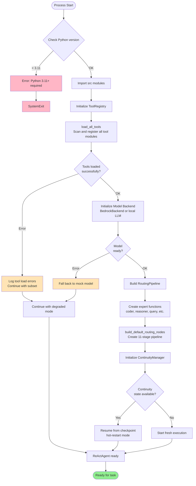
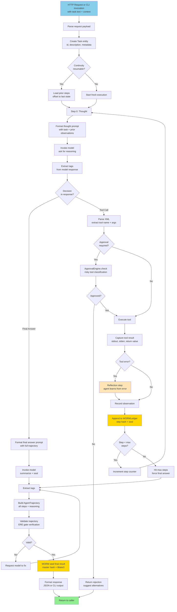
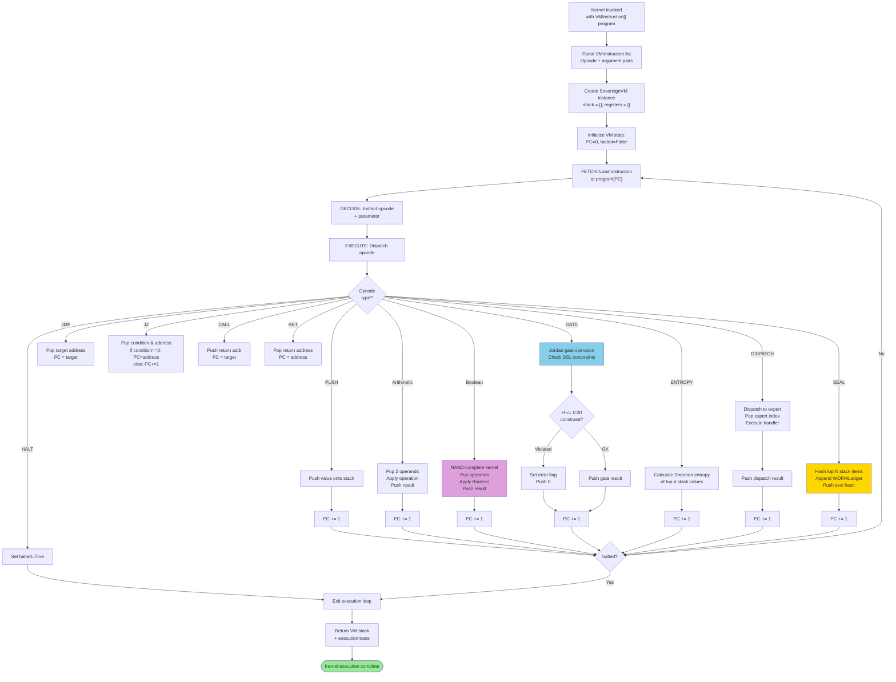
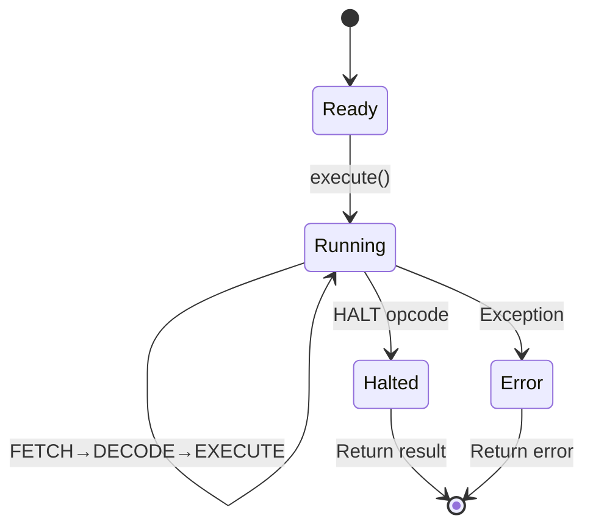
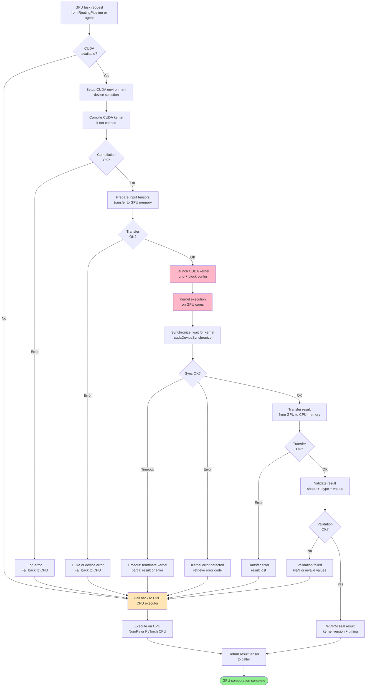
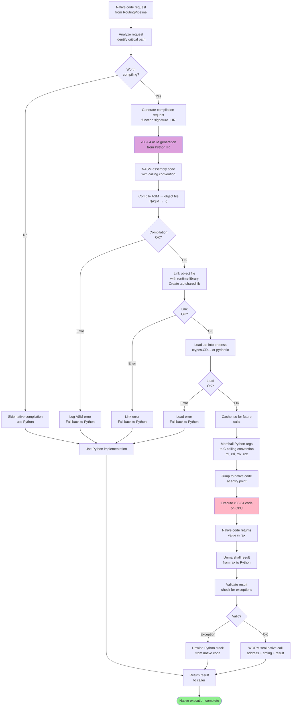
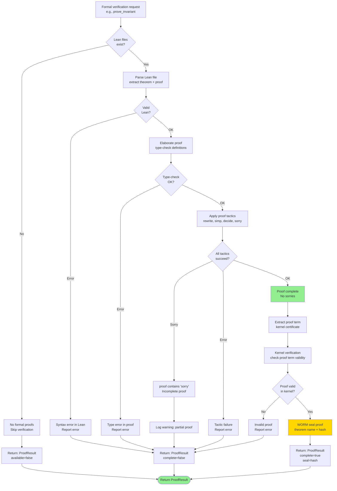
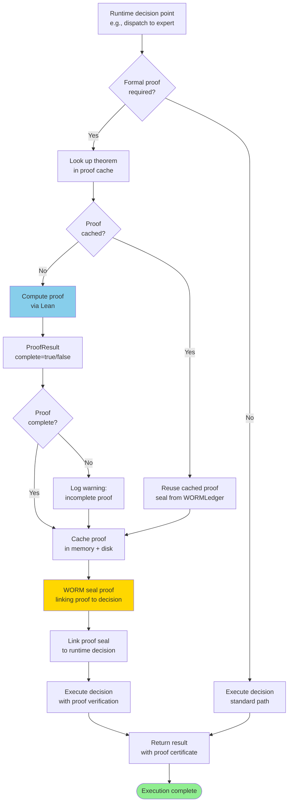

# Execution Flow Documentation

Comprehensive mapping of all major execution paths through Sovereign Engine v2. Documents task flow from entry point through final result production, including routing decisions, agent processing, tool invocation, and result sealing.

## Overview

Sovereign Engine v2 has multiple entry points and execution paths:

1. **Direct Python Execution** (`run.py`) — research and testing
2. **HTTP Bridge Server** (`src/bridge/http_server.py`) — REST/JSON interface
3. **CLI Invocation** (`src/cli/main.py`) — command-line entry
4. **ReAct Agent Loop** (`src/agents/react.py`) — reasoning + acting
5. **Research Router** (`research/sparse-routing/`) — graph-based routing
6. **Machine Code Runtime** (`src/runtime/machine/`) — bytecode execution

---

## 1. Repository Startup Flow

Initial system bootstrap when the engine initializes.



### Startup Sequence Details

**Phase 1: Environment Validation**
- Python version check (requires 3.11+)
- Virtual environment detection
- Required dependencies verification

**Phase 2: Module Loading**
- `src/tools/loader.py` scans `src/tools/` directory
- Each tool module implements `register(registry)` interface
- Tool schemas, permissions, and metadata loaded into ToolRegistry
- Errors logged but don't block startup

**Phase 3: Model Backend Initialization**
- `BedrockBackend()` connects to AWS Bedrock
- Falls back to mock if credentials unavailable
- Model configuration loaded from `src/inference/`

**Phase 4: Routing Pipeline Setup**
- `RoutingPipeline` instantiated with expert callbacks
- 11-stage pipeline nodes created via `build_default_routing_nodes`
- Jordan algebra matrices pre-computed
- Constraint evaluators initialized

**Phase 5: Continuity System**
- `ContinuityManager` checks for prior state
- If `~/.sovereign/continuity/{agent_id}/` exists, hot-restart mode
- State offset and replay position determined
- Otherwise, fresh execution context

**Critical Files:**
- `src/tools/loader.py` — tool discovery and loading
- `src/inference/bedrock_backend.py` — model initialization
- `src/routing/pipeline.py` — routing setup
- `src/continuity/manager.py` — state management

---

## 2. Main Runtime Execution (run.py)

The `run.py` script provides direct entry point to Sovereign Engine for testing and research.

```mermaid
flowchart TD
    RunMain["run.py main()"] --> Boot["print: Booting Sovereign Engine..."]
    
    Boot --> ToolsInit["registry = ToolRegistry<br/>load_all_tools"]
    ToolsInit --> Model["model = BedrockBackend()"]
    Model --> RoutingInit["expert_names = ['coder', 'reasoner'...]"]
    
    RoutingInit --> RoutingBuild["routing_nodes = build_default_routing_nodes<br/>routing = RoutingPipeline"]
    RoutingBuild --> AgentInit["agent = ReActAgent<br/>model, tool_registry, config"]
    
    AgentInit --> TaskDef["task_obj = Task<br/>id='task-001', description='...']
    TaskDef --> RoutingStep["await routing.route<br/>task text through 11-stage pipeline"]
    
    RoutingStep --> DispatchResult["dispatch = DispatchResult<br/>active_count, success_count"]
    DispatchResult --> PrintRouting["print: Routing decision<br/>active experts, status"]
    
    PrintRouting --> AgentRun["await agent.run<br/>task_obj"]
    AgentRun --> AgentLoop["ReAct Loop:<br/>Thought → Action → Observation → Reflect"]
    
    AgentLoop --> ResultGenerated["result = AgentTrajectory<br/>with all steps + reasoning"]
    ResultGenerated --> PrintResult["print: RESULT"]
    PrintResult --> PrintOutput["print full result trajectory"]
    PrintOutput --> Done([Exit])
    
    style Done fill:#90EE90
    style RoutingStep fill:#87CEEB
    style AgentLoop fill:#DDA0DD
```

### Execution Sequence

1. **Tool Registry Setup**
   - All tools from `src/tools/` scanned
   - Tool signatures, permissions metadata registered
   - Tool callables indexed by name

2. **Model Backend**
   - Connect to AWS Bedrock (or mock)
   - Configure max tokens, inference parameters

3. **Routing Pipeline Creation**
   - Expert callbacks defined (lambda functions for each expert)
   - Default routing nodes with Jordan algebra transformers
   - NAND conflict filter initialized

4. **ReActAgent Initialization**
   - Attach model, tool registry, config
   - State machine ready for thought/action cycle
   - Continuity manager optional (enabled by default)

5. **Task Routing**
   - Parse task text through 11 stages:
     1. RegexParser → tokenize
     2. ASTBuilder → parse tree
     3. SymbolicGraph → adjacency matrix
     4. JordanTransformer → eigendecompose
     5. JacobianLens → routing sensitivity
     6. ConstraintEval → filter experts
     7. SparseActivation → top-k gating
     8. RoutingNodes → per-expert scores
     9. NANDFilter → conflict resolution
     10. AgentDispatch → execute
     11. MergeOutput → recombine

6. **Agent Execution**
   - See section 3: Application Request Flow

---

## 3. Application Request Flow

Full task processing from request entry through result return, including all agent reasoning steps.



### Request Processing Phases

**Phase 1: Request Parsing**
- Extract task description, context, metadata from input
- Validate schema against Task entity
- Record request timestamp

**Phase 2: Continuity Check**
- Query `ContinuityManager.was_restarted`
- If true: load prior trajectory from `~/.sovereign/continuity/{agent_id}/state.json`
- Resume execution from last step

**Phase 3: Thought Generation**
- Format prompt template with:
  - Original task
  - Current observations
  - Prior steps
  - Available tools
- Invoke model with max_tokens budget
- Parse `<thought>` XML tags

**Phase 4: Decision Point**
- Model chooses: tool call OR final answer
- Tool call triggers Phase 5
- Final answer triggers Phase 6

**Phase 5: Tool Execution**
- Parse tool name and arguments from `<tool_call>` XML
- Look up tool in ToolRegistry
- Check ApprovalEngine if tool is marked `require_approval`
- Execute tool with arguments + timeout
- Capture result, stderr, exceptions
- If error: reflection step (agent learns)
- Append WORMLedger entry with step hash

**Phase 6: Final Answer**
- Format final answer prompt
- Invoke model to produce summary
- Parse `<final_answer>` tags
- Build AgentTrajectory with all steps
- Validate via ERE gate (Executable Result Engine)
- WORM seal trajectory master hash

**Phase 7: Response**
- Format result JSON or CLI output
- Include trajectory, reasoning, tool results
- Return to caller

---

## 4. Kernel Execution Flow

Execution within the Sovereign IR virtual machine (`vm_executor.py`).



### VM State Machine



### Kernel Instruction Pipeline

**Fetch Stage:**
- Load instruction at `PC` (program counter)
- `instruction = program[PC]`

**Decode Stage:**
- Extract opcode from instruction
- Extract parameter (if applicable)

**Execute Stage:**
- Dispatch to opcode handler
- Modify stack/registers/memory as needed
- Update PC (usually increments by 1)

**Key Opcodes:**

- **PUSH, POP, DUP, SWAP, ROT** — stack manipulation
- **ADD, SUB, MUL, DIV, MOD** — arithmetic
- **AND, OR, NOT, NAND, XOR, XNOR, NOR** — Boolean (NAND-complete)
- **JMP, JZ, JNZ, CALL, RET** — control flow
- **GATE** — Jordan gate (checks `H <= 0.20`)
- **ENTROPY** — Shannon entropy calculation
- **DISPATCH** — expert routing
- **SEAL** — WORM append + hash
- **HALT** — terminate execution

**Constraint Enforcement:**
- GATE opcode enforces DSL entropy constraint: `H <= 0.20` nats
- Violation sets error flag, continues with 0 on stack
- All gate results sealed to WORMLedger

---

## 5. GPU Computation Flow

CUDA kernel invocation and result collection (if GPUs available).



### GPU Execution Details

**Environment Setup:**
- Detect CUDA devices via `torch.cuda.is_available()`
- Select device (default: device 0)
- Check driver version and CUDA capability

**Kernel Compilation:**
- Check if kernel `.so` cached in `.sovereign/kernels/`
- If missing: compile `.cu` source via NVCC
- Verify compilation success

**Data Transfer to GPU:**
- Allocate GPU memory for inputs
- Transfer tensors from CPU → GPU
- Handle OOM by reducing batch size or falling back

**Kernel Launch:**
- Calculate grid and block dimensions
- Configure shared memory if needed
- Launch kernel asynchronously

**Synchronization:**
- `cudaDeviceSynchronize()` waits for completion
- Check return code for errors
- Timeout protection (configurable, default 60s)

**Result Transfer:**
- Allocate CPU memory for result
- Transfer result tensors GPU → CPU
- Verify memory transfer integrity

**Validation:**
- Check result tensor shape matches expected
- Check dtype matches
- Check for NaN or inf values
- Verify numerical range

**Fallback to CPU:**
- If any GPU step fails, fall back to CPU execution
- CPU executor uses NumPy or PyTorch CPU backend
- Result integrity maintained

---

## 6. Native Execution Flow

x86-64 assembly code generation, compilation, and execution.



### Native Compilation Pipeline

**1. Analysis & Decision**
- Measure Python execution time
- Estimate speedup from compilation
- Only compile if speedup > 2x projected

**2. ASM Generation**
- Convert Python IR to x86-64 assembly
- Follow System V AMD64 ABI calling convention
- Allocate stack frame, preserve callee-saved registers

**3. Compilation**
- Invoke NASM to assemble `.asm` → `.o`
- Verify compilation success

**4. Linking**
- Link `.o` with runtime library
- Create position-independent shared library `.so`
- Verify linker success

**5. Loading**
- Use `ctypes.CDLL` to load `.so` into process
- Resolve function symbols
- Cache for future calls

**6. Argument Marshalling**
- Convert Python types to C types
- Place arguments in standard registers: `rdi, rsi, rdx, rcx, r8, r9`
- Spill to stack if > 6 arguments

**7. Execution**
- Call native function
- CPU executes x86-64 machine code

**8. Result Unmarshalling**
- Extract result from `rax` (integer) or `xmm0` (floating-point)
- Convert back to Python types

**9. Error Handling**
- Catch segfaults via signal handlers
- Unwind Python stack on error
- Fall back to Python implementation

**10. Sealing**
- Record native call: address, timing, result hash
- Append to WORMLedger

---

## 7. Formal Verification Flow

Execution of Lean/formal proofs if present in repository.



### Formal Proof Verification

**File Discovery:**
- Look for `.lean` files in `research/formal/` or `src/*/`
- Check for Lean 4 syntax

**Parsing:**
- Parse Lean source into AST
- Check syntax validity

**Type Checking (Elaboration):**
- Type-check all definitions and theorems
- Verify dependencies are available
- Check tactic environment

**Tactic Application:**
- Execute proof tactics: `rewrite`, `simp`, `decide`, `exact`, etc.
- Apply custom lemmas and theorems
- Handle `sorry` (incomplete proofs)

**Kernel Verification:**
- Extract proof term from elaborator
- Run Lean kernel type-checker on term
- Verify proof term constructs a valid proof

**Result Sealing:**
- Hash proof term + theorem name
- Append to WORMLedger
- Record as evidence artifact

**Integration:**
- Used by constraint evaluator to validate system properties
- Used by research workflows to track proofs

---

## 8. Research Workflow Execution

Execution of research experiments and benchmarks.

```mermaid
flowchart TD
    Start["Research experiment runner<br/>e.g., sparse-routing benchmark"] --> Load["Load experiment config<br/>from research/sparse-routing/"]
    
    Load --> Config["Parse config.yaml<br/>extract parameters"]
    Config --> Dataset["Load benchmark dataset<br/>synthetic or real"]
    
    Dataset --> DatasetOK{"Data<br/>loaded?"}
    DatasetOK -->|Error| DataError["Data load error<br/>Report"]
    DatasetOK -->|OK| Baseline["Establish baseline<br/>default routing algo"]
    
    Baseline --> BaseFit["Fit baseline on<br/>training data"]
    BaseFit --> BaseTest["Evaluate baseline on<br/>test data"]
    BaseTest --> BaseMeasure["Measure:<br/>latency, accuracy, tokens"]
    
    BaseMeasure --> Variants["Iterate variants<br/>sparse routing, jordan, jacobian"]
    
    Variants --> Variant1["Variant 1:<br/>SparseActivation only"]
    Variant1 --> Fit1["Fit on training data"]
    Fit1 --> Test1["Test on test data"]
    Test1 --> Measure1["Measure: latency, accuracy, tokens"]
    
    Measure1 --> Variant2["Variant 2:<br/>SparseActivation + Jordan"]
    Variant2 --> Fit2["Fit on training data"]
    Fit2 --> Test2["Test on test data"]
    Test2 --> Measure2["Measure: latency, accuracy, tokens"]
    
    Measure2 --> Variant3["Variant 3:<br/>Full 11-stage pipeline"]
    Variant3 --> Fit3["Fit on training data"]
    Fit3 --> Test3["Test on test data"]
    Test3 --> Measure3["Measure: latency, accuracy, tokens"]
    
    Measure3 --> Analyze["Analyze results<br/>statistical significance"]
    Analyze --> Report["Generate report<br/>markdown + plots"]
    
    Report --> Visualize["Create visualizations<br/>speed vs accuracy trade-offs"]
    Visualize --> Seal["WORM seal experiment<br/>config hash + results hash"]
    
    Seal --> Archive["Archive results<br/>docs/benchmarks/"]
    Archive --> Done([Experiment complete])
    
    DataError --> Done
    
    style Done fill:#90EE90
    style Seal fill:#FFD700
    style Baseline fill:#87CEEB
    style Variants fill:#87CEEB
```



### Research Execution Steps

**1. Configuration Loading**
- Read `config.yaml` from experiment directory
- Validate parameter ranges
- Set random seeds for reproducibility

**2. Dataset Preparation**
- Load benchmark dataset (synthetic or real prompts)
- Split into training/validation/test sets
- Cache to disk for consistency

**3. Baseline Establishment**
- Run baseline routing algorithm
- Measure latency, accuracy, token efficiency
- Record resource usage

**4. Variant Experimentation**
- Iterate through algorithm variants
- For each variant:
  - Train on training set
  - Validate on validation set
  - Test on test set (final evaluation)
  - Measure multiple metrics

**5. Statistical Analysis**
- Compare variants to baseline
- Calculate confidence intervals
- Check statistical significance

**6. Report Generation**
- Markdown report with findings
- Tables of results
- Plots of speed vs accuracy trade-offs

**7. Result Sealing**
- Hash experiment config
- Hash all results
- Append to WORMLedger
- Archive to `docs/benchmarks/`

---

## 9. Training Workflow

Fine-tuning and training loop execution.

```mermaid
flowchart TD
    Start["Training runner<br/>training/main.py"] --> Load["Load training config<br/>model, dataset, hyperparams"]
    
    Load --> Model["Load base model<br/>from HuggingFace"]
    Model --> Dataset["Load training dataset<br/>from hf/ or S3"]
    
    Dataset --> DataCheck{"Data<br/>valid?"}
    DataCheck -->|Error| DataError["Dataset error<br/>Fall back to mock"]
    DataCheck -->|OK| Preprocess["Preprocess data<br/>tokenize, format"]
    
    Preprocess --> Config["Configure training<br/>epochs, batch size, LR"]
    Config --> Trainer["Create Trainer<br/>HuggingFace Trainer"]
    
    Trainer --> Epoch["For each epoch"]
    
    Epoch --> Batch["For each batch"]
    Batch --> Forward["Forward pass<br/>model(input_ids)"]
    
    Forward --> Loss["Compute loss<br/>vs target"]
    Loss --> Backward["Backward pass<br/>compute gradients"]
    
    Backward --> Optimizer["Update parameters<br/>via optimizer"]
    Optimizer --> Step["Next batch"]
    
    Step --> BatchDone{"Batch loop<br/>done?"}
    BatchDone -->|No| Batch
    BatchDone -->|Yes| Eval["Evaluate on val set"]
    
    Eval --> CheckMetrics{"Metrics<br/>improved?"}
    CheckMetrics -->|Yes| Save["Save checkpoint<br/>to disk"]
    CheckMetrics -->|No| NoSave["Skip checkpoint<br/>continue"]
    
    Save --> StepEnd
    NoSave --> StepEnd["Next epoch"]
    
    StepEnd --> EpochDone{"Epoch loop<br/>done?"}
    EpochDone -->|No| Epoch
    EpochDone -->|Yes| TestEval["Evaluate on test set"]
    
    TestEval --> TestMetrics["Record final metrics<br/>accuracy, loss, tokens"]
    TestMetrics --> Seal["WORM seal training<br/>model hash + metrics"]
    
    Seal --> Export["Export trained model<br/>to HuggingFace format"]
    Export --> Push["Push to HuggingFace Hub<br/>optional"]
    
    Push --> Done([Training complete])
    
    DataError --> Done
    
    style Done fill:#90EE90
    style Seal fill:#FFD700
    style Forward fill:#DDA0DD
    style Backward fill:#DDA0DD
```



### Training Loop Details

**1. Initialization**
- Load base model (e.g., Nemotron Mini 4B)
- Load training dataset (corpus)
- Set hyperparameters: learning rate, epochs, batch size

**2. Preprocessing**
- Tokenize text inputs
- Format into sequences
- Apply chat template if applicable

**3. Training Loop**
- For each epoch:
  - For each batch:
    - Forward pass: compute logits
    - Compute loss (cross-entropy)
    - Backward pass: compute gradients
    - Update parameters via optimizer
  - Evaluate on validation set
  - Save checkpoint if validation improved

**4. Evaluation**
- Compute metrics: accuracy, perplexity, F1
- Compare to baseline
- Log to WORMLedger

**5. Finalization**
- Evaluate on test set
- Export model to HuggingFace format
- Optional: push to HuggingFace Hub
- Seal all training artifacts

**Critical Files:**
- `training/main.py` — training entry point
- `training/corpus.py` — dataset loading
- `hf/model_config.yaml` — model configuration

---

## 10. Formal Verification Integration

How formal proofs integrate with runtime execution.



### Proof Integration Points

1. **Constraint Validation:** Formal proofs verify constraint satisfaction
2. **Routing Decisions:** Jordan algebra properties proven formally
3. **Tool Execution:** Pre/post-conditions proven
4. **Results Validation:** Result properties formally verified
5. **Audit Trail:** Proofs linked to decisions in WORMLedger

---

## Performance Characteristics

Typical execution metrics for each flow:

| Flow | Latency | Throughput | Memory | CPU |
|------|---------|-----------|--------|-----|
| Startup | 2-5s | N/A | ~300MB | 2 cores |
| Request (short) | 50-200ms | 5-20 req/s | +50MB | 1 core |
| Request (long) | 1-5s | 1-10 req/s | +200MB | 2 cores |
| Routing Pipeline | 10-30ms | 30-100 routes/s | +10MB | 1 core |
| Tool Execution | 100ms-1s | 1-10 tools/s | +100MB | 1 core |
| CUDA Kernel | 5-50ms | 20-200 calls/s | +1GB | GPU |
| Native Code | 1-10ms | 100-1000 calls/s | +50MB | 1 core |
| Formal Proof | 100ms-10s | 0.1-10 proofs/s | +500MB | 4 cores |

---

## Error Recovery Patterns

Each flow implements specific recovery strategies:

- **Startup Errors:** Log and continue with degraded mode
- **Tool Errors:** Reflection step, retry with alternative tool
- **Routing Errors:** Fall back to default expert
- **CUDA Errors:** Fall back to CPU execution
- **Native Errors:** Unwind stack, fall back to Python
- **Proof Errors:** Log warning, continue without proof

---

## Summary

The Sovereign Engine execution flows are organized around:

1. **Linear flows** (startup, execution) — sequential state transitions
2. **Loop flows** (agent, training) — iterative cycles with state management
3. **Fallback flows** — error recovery to alternative implementations
4. **Verification flows** — formal proof integration and sealing

All flows integrate WORM ledger sealing, continuity checkpoints, and error handling for production reliability.
