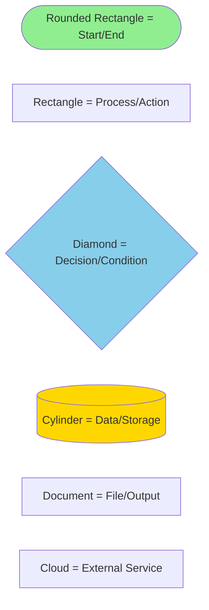
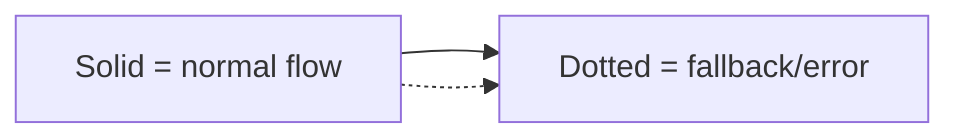
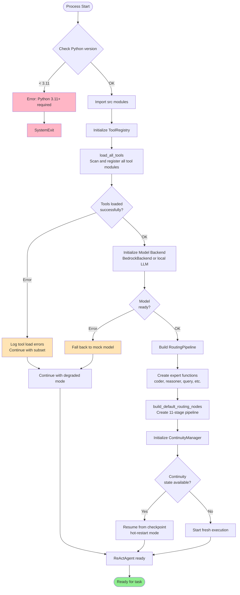
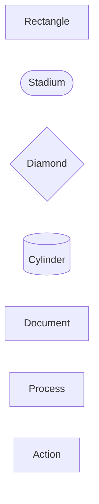
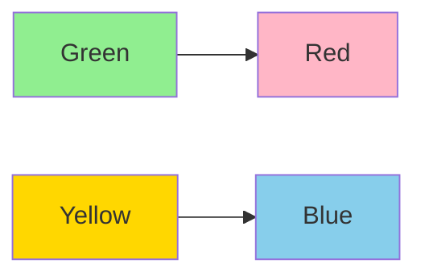

# Flowcharts Gallery

Complete index of all Mermaid flowcharts used throughout Sovereign Engine documentation. Includes flowchart legend, best practices, and quick reference.

---

## Flowchart Legend

### Shapes



### Connections



### Colors

| Color | Meaning | Context |
|-------|---------|---------|
| Green (#90EE90) | Success, completion | Final states, successful paths |
| Blue (#87CEEB) | Processing, computation | Main execution paths |
| Yellow (#FFD700) | Critical action, sealing | WORM, hashing, verification |
| Orange (#FFE4B5) | Warning, degradation | Fallback, retry, error recovery |
| Red (#FFB6C6) | Error, failure | Error states, fatal conditions |
| Purple (#DDA0DD) | Agent/ML operations | Model calls, reasoning |

---

## 1. Repository Startup Flow

**File:** EXECUTION_FLOW.md, Section 1



**When to use:** System initialization, understanding startup sequence

---

## 2. Main Runtime Execution

**File:** EXECUTION_FLOW.md, Section 2

Used by `run.py` to orchestrate task processing.

**Key decision points:**
- Tool registry loading succeeds?
- Model backend ready?
- Routing pipeline created?

---

## 3. Application Request Flow

**File:** EXECUTION_FLOW.md, Section 3

Complete task processing from HTTP request to final result.

**Key stages:**
1. Parse and validate request
2. Check continuity (hot-restart?)
3. Thought generation
4. Tool selection and execution
5. Reflection on errors
6. Final answer generation
7. Verification via ERE gate
8. WORM sealing

---

## 4. Routing Pipeline Decision Points

**File:** CONTROL_FLOW.md, Section 3

11-stage pipeline with decision gates at each stage:

```
Stage 1-2: Parse & Intent
  ↓ confidence high?
Stage 3-4: Graph & Jordan
  ↓ stable eigenvalues?
Stage 5-6: Jacobian & Constraints
  ↓ constraints satisfied?
Stage 8-9: Routing + NAND
  ↓ conflicts resolved?
Stage 10-11: Dispatch & Merge
  ↓ Result
```

---

## 5. Agent Loop Control

**File:** CONTROL_FLOW.md, Section 4

Thought → Action → Observation → Reflection cycle with state machine.

**States:**
- Thought: Generate reasoning
- ToolCall: Execute external tool
- FinalAnswer: Produce result
- Reflection: Learn from errors

---

## 6. Error Recovery Paths

**File:** ERROR_PATHS.md, Sections 4-5

Multiple error recovery patterns:
- Tool execution errors
- Model inference errors
- Result verification failures
- WORM ledger errors

---

## 7. Data Flow Diagram

**File:** DATA_FLOW.md, Section 1

High-level data movement through all subsystems:
```
User Input → Parse → Route → Agent → Tools → Model → Verify → Output
```

---

## 8. Control Flow State Diagram

**File:** CONTROL_FLOW.md, Section 12

Main state machine for engine execution:
- Starting → Ready → Idle
- Idle → RequestReceived → Validating
- Validating → Routing → Dispatching
- Dispatching → ExpertProcessing
- ExpertProcessing → VerifyingResult → Sealing
- Sealing → Responding → Idle

---

## 9. Kernel Execution Flow

**File:** KERNEL_EXECUTION.md, Section 6

Virtual machine main loop:
```
Initialize state
  ↓
FETCH instruction
  ↓
DECODE opcode
  ↓
EXECUTE handler
  ↓
UPDATE PC
  ↓
CHECK halted?
  ↓ (loop or exit)
FINALIZE & RETURN
```

---

## 10. Test Execution Flow

**File:** TEST_REFERENCE.md, Section 6

Pytest execution sequence:
```
Parse CLI args
  ↓
Discover tests
  ↓
Session setup
  ↓
Module setup
  ↓
Class setup
  ↓
Function setup (fixtures)
  ↓
Execute test
  ↓
Function teardown
  ↓
(Repeat for each test)
  ↓
Session teardown
  ↓
Print summary & exit
```

---

## 11. Continuity Manager State Transitions

**File:** CONTROL_FLOW.md, Section 6

Hot-restart capability state machine:
```
CheckState
  ↓
NoState → Fresh → Running
  OR
HasState → LoadState → ValidState → HotRestart → Resume → Running
  OR
  (corrupted) → Fresh
```

---

## 12. WORM Ledger Append Decision

**File:** CONTROL_FLOW.md, Section 7

Critical event sealing flow:
```
Event
  ↓
Priority
  ↓
Compute Blake3 hash
  ↓
Chain with previous
  ↓
Serialize to JSONL
  ↓
Append to file
  ↓
(retry on failure)
  ↓
Success or Fatal
```

---

## 13. Model Selection Decision Tree

**File:** CONTROL_FLOW.md, Section 10

Provider/model selection logic:
```
Request specifies model?
  ↓ Yes: Validate → Use requested
  ↓ No: Classify task
  ↓
  Task category?
  ↓ Coding → Code model
  ↓ Reasoning → Reasoning model
  ↓ Creative → Creative model
  ↓
  Check availability
  ↓
  Available? → Select
  ↓ No: Fallback
```

---

## 14. Authorization & Approval Decision

**File:** CONTROL_FLOW.md, Section 11

Tool execution approval flow:
```
Tool call
  ↓
Look up policy
  ↓
Approval required?
  ↓ No: Execute
  ↓ Yes: Classify risk
  ↓ High risk: Ask user
  ↓ User approved? → Execute or Reject
```

---

## 15. HTTP Request Validation

**File:** CONTROL_FLOW.md, Section 2

Input schema validation decision tree:
```
JSON valid?
  ↓ No: 400 Bad Request
  ↓ Yes
Has messages?
  ↓ No: 400 Bad Request
  ↓ Yes
Has description?
  ↓ No: 400 Bad Request
  ↓ Yes
Description < 10KB?
  ↓ No: 413 Payload Too Large
  ↓ Yes
max_steps in [1,100]?
  ↓ No: 400 Bad Request
  ↓ Yes
Model supported?
  ↓ No: 400 Bad Request
  ↓ Yes: ✓ Valid
```

---

## Best Practices for Reading Flowcharts

1. **Start from top/left** — Follow direction of arrows
2. **Diamond = decision** — Follow appropriate branch
3. **Colored boxes** — Different meanings (see legend)
4. **Dotted lines** — Error paths, fallbacks
5. **Document reference** — Each flowchart has source file

---

## Flowchart Quick Reference

| Document | Flowcharts | Purpose |
|----------|-----------|---------|
| EXECUTION_FLOW.md | 9 | How code executes |
| CONTROL_FLOW.md | 9 | Decision points, branches |
| ERROR_PATHS.md | 7 | Error detection, recovery |
| DATA_FLOW.md | 1 | Data movement |
| KERNEL_EXECUTION.md | 3 | VM execution, validation |
| TEST_REFERENCE.md | 2 | Test discovery, execution |
| OPERATIONS.md | 0 | Operational procedures |
| **Total** | **31+** | Complete system |

---

## Mermaid Syntax Reference

### Basic Shapes



### Connection Types

```mermaid
flowchart LR
    A --> B
    B --> |label| C
    C -.-> D
    D -. |dotted with label| E
    E == |thick| F
```

### Styling



---

## Searching for a Specific Flowchart

**By process:**
- Startup → Section 1 (Repository Startup Flow)
- Request → Section 3 (Application Request Flow)
- Routing → Section 4 (Routing Pipeline)
- Agent loop → Section 5 (Agent Loop Control)
- Errors → Section 6 (Error Recovery)
- Data → Section 7 (Data Flow)
- Kernel → Section 9 (Kernel Execution)
- Tests → Section 10 (Test Execution)

**By file:**
- EXECUTION_FLOW.md — Sections 1-3, 9-11
- CONTROL_FLOW.md — Sections 4-8, 12-14
- ERROR_PATHS.md — Sections 6-7
- DATA_FLOW.md — Section 7
- KERNEL_EXECUTION.md — Section 9
- TEST_REFERENCE.md — Section 10

---

## Summary

**31+ flowcharts** covering:
- System startup and initialization
- Request routing and processing
- Agent reasoning loop
- Error detection and recovery
- Data flow across subsystems
- VM kernel execution
- Test discovery and execution
- State transitions and decisions
- Authorization and approval
- Model selection

All flowcharts follow consistent legend and best practices for clarity.

Use **CTRL+F** to search for specific subsystem or process name in this document.
