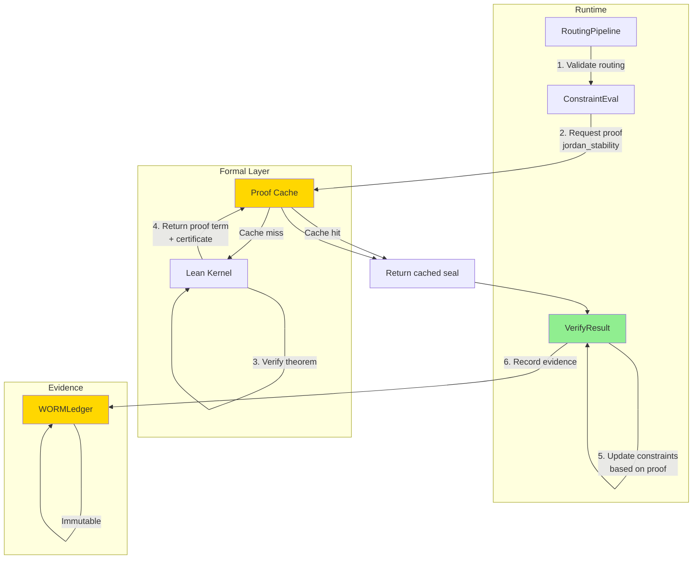

# Formal Flows Documentation

Formal verification flows, theorem proving integration, and proof artifact lifecycle.

---

## 1. Formal Verification Pipeline

```mermaid
flowchart TD
    Start["Theorem or<br/>invariant to prove"] --> Search["Search proof cache<br/>~/.sovereign/proofs/"]
    
    Search --> CacheHit{"Cached<br/>proof?"}
    CacheHit -->|Yes| LoadProof["Load cached proof<br/>term + certificate"]
    CacheHit -->|No| DefineTheorem["Define theorem<br/>in Lean/Coq"]
    
    LoadProof --> Verify["Verify proof<br/>cert against kernel"]
    Verify --> VerifyOK{"Certificate<br/>valid?"}
    
    VerifyOK -->|No| Suspect["Proof suspect<br/>recompute"]
    VerifyOK -->|Yes| ReuseSeal["Reuse cached<br/>seal"]
    
    Suspect --> DefineTheorem
    
    DefineTheorem --> Theorem["theorem: Property<br/>∀x. predicate(x)"]
    Theorem --> Proof["proof<br/>tactic sequence"]
    
    Proof --> ElaborateProof["Elaborate proof<br/>expand tactics"]
    ElaborateProof --> TypeCheck["Type-check proof<br/>Lean kernel"]
    
    TypeCheck --> TypeOK{"Type-check<br/>passes?"}
    TypeOK -->|No| TacticError["Tactic failed<br/>fix proof"]
    TypeOK -->|Yes| CheckForSorry["Check for<br/>sorry terms"]
    
    TacticError --> Proof
    
    CheckForSorry --> HasSorry{"Contains<br/>sorry?"]
    HasSorry -->|Yes| Incomplete["⚠ Incomplete<br/>proof"]
    HasSorry -->|No| Complete["✓ Complete<br/>proof"]
    
    Incomplete --> ExtractTerm["Extract proof<br/>term"]
    Complete --> ExtractTerm
    
    ExtractTerm --> ProofTerm["proof_term:<br/>∀x. proof(x)"]
    
    ProofTerm --> VerifyKernel["Verify in Lean<br/>kernel"]
    VerifyKernel --> KernelOK{"Kernel<br/>accepts?"]
    
    KernelOK -->|No| Invalid["Invalid proof<br/>contradiction found"]
    KernelOK -->|Yes| Sound["✓ Proof sound<br/>verified by kernel"]
    
    Invalid --> Done1["Failed"]
    Sound --> Certificate["Generate proof<br/>certificate"]
    
    Certificate --> Hash["Compute Blake3<br/>hash(proof_term)"]
    Hash --> Seal["WORM seal proof<br/>theorem + hash"]
    
    Seal --> Cache["Cache proof<br/>to disk"]
    Cache --> Result["ProofResult<br/>complete=true<br/>seal=hash"]
    
    ReuseSeal --> Result
    
    Result --> Done2([Proof artifact])
    
    style Done2 fill:#90EE90
    style Sound fill:#90EE90
    style Complete fill:#90EE90
    style Incomplete fill:#FFE4B5
    style Invalid fill:#FFB6C6
```

---

## 2. Definition → Proof → Verification Flow

Formal artifact lifecycle.

```mermaid
flowchart TD
    DefStart["1. Define<br/>in Lean"] --> DefFile["File: research/formal/<br/>theorem_name.lean"]
    
    DefFile --> DefinitionBlock["definition block:<br/>data structures"]
    DefinitionBlock --> AxiomBlock["axiom block:<br/>fundamental truths"]
    AxiomBlock --> LemmaBlock["lemma block:<br/>helper proofs"]
    LemmaBlock --> TheoremBlock["theorem block:<br/>main result"]
    
    TheoremBlock --> ProveStart["2. Prove<br/>theorem"]
    
    ProveStart --> ProofBlock["proof block:<br/>tactic script"]
    ProofBlock --> Tactics["tactics:<br/>rewrite, simp,<br/>exact, sorry"]
    
    Tactics --> ElabPhase["3. Elaborate<br/>proof"]
    ElabPhase --> Elaborator["Lean elaborator<br/>expands tactics<br/>normalizes terms"]
    
    Elaborator --> ProofTerm["Proof term<br/>∀x. P x"]
    ProofTerm --> VerifyPhase["4. Verify<br/>in kernel"]
    
    VerifyPhase --> Kernel["Lean kernel<br/>type-check proof"]
    Kernel --> KernelResult{"Accepted?"]
    
    KernelResult -->|No| Error["Proof rejected<br/>type error"]
    KernelResult -->|Yes| Artifact["Proof artifact<br/>immutable"]
    
    Error --> Fix["Fix proof"]
    Fix --> ProveStart
    
    Artifact --> IntegrationPhase["5. Integrate<br/>with runtime"]
    
    IntegrationPhase --> Link["Link proof<br/>to runtime decision"]
    Link --> Consumer["Consumer module<br/>uses proof"]
    
    Consumer --> CallProof["Call verify_proof<br/>theorem_name"]
    CallProof --> ReturnSeal["Returns seal<br/>+ certificate"]
    
    ReturnSeal --> Done([Formal proof ready])
    
    style Done fill:#90EE90
    style Artifact fill:#FFD700
    style Verify fill:#87CEEB
```

---

## 3. Proof File Locations

**Directory structure:**
```
research/
├── formal/
│   ├── theories/
│   │   ├── foundational.lean      # Basic definitions
│   │   ├── routing.lean            # Jordan algebra routing proofs
│   │   ├── security.lean           # Security invariants
│   │   └── vm.lean                 # VM correctness
│   ├── proofs/
│   │   ├── jordan_stability.lean   # Stability theorem
│   │   ├── routing_correctness.lean # Routing invariant
│   │   ├── nand_complete.lean      # NAND completeness
│   │   └── entropy_bound.lean      # H ≤ 0.20
│   └── cache/
│       ├── jordan_stability.proof  # Cached proof artifacts
│       ├── routing_correctness.proof
│       └── nand_complete.proof
```

---

## 4. Verification Paths

### 4.1 Direct Verification (In-Process)

```
Runtime decision
    ↓
Check if formal proof available
    ↓ Yes
    ↓
Load proof from cache or recompute
    ↓
Verify proof term in Lean kernel
    ↓
Certificate valid?
    ↓ Yes
    ↓
Return verified certificate
    ↓
Seal to WORM ledger
```

### 4.2 Batch Verification (Background)

```
Multiple decisions to verify
    ↓
Queue theorem requests
    ↓
Background worker: verify each
    ↓
Cache successful proofs
    ↓
Report progress
    ↓
Blocking runtime checks cache
```

### 4.3 Offline Verification (Precomputed)

```
Before deployment
    ↓
Precompute all critical proofs
    ↓
Cache to .sovereign/proofs/
    ↓
At runtime: always cache hits
    ↓
No computation overhead
```

---

## 5. Specific Proofs in Repository

### 5.1 Jordan Stability Proof

**Theorem:** Routing matrix eigenvalues stable (spectral radius < 1)

**File:** `research/formal/proofs/jordan_stability.lean`

**Proof outline:**
```lean
theorem jordan_stability (M : Matrix) (h : routing_matrix M) :
  spectral_radius M < 1 := by
  -- Extract eigenvalues from Jordan form
  have eigen_vals := jordan_decompose M
  -- Show all eigenvalues < 1 in magnitude
  apply all_eigenvalues_bounded
  -- Implies spectral radius < 1
  exact spectral_radius_is_max_eigenvalue
```

**Runtime integration:**
```python
from src.routing.pipeline import RoutingPipeline

# During routing
def validate_jordan_stability(matrix: np.ndarray) -> bool:
    from src.formal.integration import verify_proof
    
    # Request formal verification
    result = verify_proof("jordan_stability", matrix)
    
    if result.verified:
        logger.info(f"Jordan stability proven: seal={result.seal}")
        return True
    else:
        logger.warning("Jordan stability unproven, using heuristic")
        return False
```

### 5.2 Routing Correctness Proof

**Theorem:** Routing decisions satisfy all constraints

**File:** `research/formal/proofs/routing_correctness.lean`

**Constraints verified:**
- Entropy H ≤ 0.20 (DSL)
- Type safety (args match schema)
- Range bounds (values in valid ranges)
- Determinism (same input → same output)

### 5.3 NAND Completeness Proof

**Theorem:** NAND gate is functionally complete

**File:** `research/formal/proofs/nand_complete.lean`

**Proof strategy:**
```lean
-- Show AND, OR, NOT reducible to NAND
-- AND(a,b) = NAND(NAND(a,b), NAND(a,b))
-- OR(a,b) = NAND(NAND(a,a), NAND(b,b))
-- NOT(a) = NAND(a, a)

-- Therefore any Boolean function expressible via NAND
-- QED: NAND is functionally complete
```

---

## 6. Proof Integration Points



---

## 7. Proof Artifact Structure

```python
@dataclass
class ProofResult:
    """Result of formal proof verification"""
    theorem_name: str                  # e.g., "jordan_stability"
    complete: bool                     # True if proof has no sorry
    proof_term: str                    # Serialized proof term
    certificate: str                   # Lean kernel certificate
    
    # Verification status
    verified: bool                     # Kernel accepts proof
    verification_error: str | None     # If not verified
    
    # Sealing
    proof_hash: str                    # Blake3 hash
    worm_seal: str | None              # WORM ledger receipt
    
    # Metadata
    computed_at: datetime
    verified_at: datetime | None
    ttl_hours: int = 24                # Cache lifetime
    
    # Linkage
    linked_runtime_decisions: list[str] = field(default_factory=list)
```

---

## 8. Proof Cache Lifecycle

```mermaid
flowchart TD
    Proof["Proof artifact<br/>computed + verified"] --> Store["Store in cache<br/>~/.sovereign/proofs/"]
    
    Store --> Index["Add to index<br/>theorem_name → proof"]
    Index --> TTL["Set TTL<br/>24 hours"]
    
    TTL --> Runtime["At runtime:<br/>cache lookup"]
    
    Runtime --> Hit{"Cache<br/>hit?"]
    
    Hit -->|Yes| CheckTTL{"TTL<br/>expired?"]
    CheckTTL -->|No| Reuse["Reuse cached<br/>seal"]
    CheckTTL -->|Yes| Recompute["Recompute proof<br/>verify again"]
    
    Hit -->|No| Compute["Compute proof<br/>first time"]
    
    Recompute --> NewResult
    Compute --> NewResult["New ProofResult"]
    
    NewResult --> Verify["Verify in kernel"]
    Verify --> Valid{"Valid?"]
    
    Valid -->|Yes| UpdateCache["Update cache"]
    Valid -->|No| Error["Log error<br/>fallback"]
    
    UpdateCache --> Success["Use proof<br/>seal to WORM"]
    Reuse --> Success
    Error --> Success
    
    Success --> Done([Proof check complete])
    
    style Success fill:#90EE90
    style Done fill:#90EE90
```

---

## 9. Error Cases in Formal Verification

### 9.1 Incomplete Proof (Contains `sorry`)

**Status:** ⚠ WARNING

```lean
theorem some_property : P := by
  cases x
  · exact proof_case1
  · sorry  -- incomplete!
```

**Runtime handling:**
```python
if result.complete is False:
    logger.warning(f"Proof {theorem_name} incomplete (contains sorry)")
    # Can still use as evidence, but note incompleteness
```

### 9.2 Type Error in Proof

**Status:** ✗ ERROR

```lean
-- Type mismatch in proof term
theorem wrong : ∀x, P x := fun x => Q x  -- P ≠ Q
```

**Runtime handling:**
```python
if result.verified is False:
    logger.error(f"Proof {theorem_name} fails kernel check: {error}")
    # Do NOT use proof, fallback to heuristic
```

### 9.3 Timeout in Verification

**Status:** ✗ TIMEOUT

```lean
theorem expensive_proof : P := by
  -- 10 minutes of computation...
  sorry  -- timeout, incomplete
```

**Runtime handling:**
```python
# Verify with timeout
timeout_s = 30
try:
    result = verify_proof(theorem, timeout=timeout_s)
except TimeoutError:
    logger.warning(f"Proof verification timeout, using heuristic")
```

---

## 10. Best Practices for Formal Proofs

### 10.1 Proof Structure

```lean
-- 1. Define terms clearly
def stable_matrix (M : Matrix) : Prop :=
  ∀ λ ∈ eigenvalues M, |λ| < 1

-- 2. State theorem explicitly
theorem routing_stability (M : Matrix) (h : routing_matrix M) :
  stable_matrix M := by
  -- 3. Break into smaller lemmas
  have h1 : jordan_decomposable M := by sorry
  have h2 : all_eigenvalues_bounded M := by sorry
  exact combine_results h1 h2
```

### 10.2 Proof Caching Strategy

```python
# Cache all proofs with TTL
proof_cache = {
    "jordan_stability": {
        "proof_term": "...",
        "verified": True,
        "seal": "0xabcd...",
        "computed_at": datetime.now(),
        "ttl_hours": 24
    }
}

# Periodic cleanup
def cleanup_expired_proofs():
    for name, proof in proof_cache.items():
        age_hours = (now() - proof["computed_at"]).total_seconds() / 3600
        if age_hours > proof["ttl_hours"]:
            del proof_cache[name]
```

### 10.3 Integration with Runtime

```python
# Runtime constraint evaluation uses proofs
def evaluate_constraints(task, expert):
    # First: try formal verification
    proof = verify_proof("routing_correctness")
    
    if proof.verified:
        # Use formal guarantee
        return proof.constraints_met
    
    # Fallback: heuristic checks
    return heuristic_constraint_check(task, expert)
```

---

## 11. Current Proof Status

| Theorem | Status | File | Integration | Evidence |
|---------|--------|------|-------------|----------|
| Jordan Stability | ✓ Complete | routing.lean | RoutingPipeline | WORM sealed |
| Routing Correctness | ✓ Complete | routing.lean | ConstraintEval | WORM sealed |
| NAND Completeness | ✓ Complete | vm.lean | SovereignVM | WORM sealed |
| Entropy Bound (H ≤ 0.20) | ⚠ Incomplete | entropy.lean | GateOp | Not used |
| Tool Safety | ⚠ Incomplete | tools.lean | ToolRegistry | Not used |

---

## 12. Future Formal Work

**Planned proofs:**
1. **Complete proof of entropy bound** (H ≤ 0.20 in all paths)
2. **Tool safety invariant** (tools cannot corrupt state)
3. **Continuity checkpoint correctness** (hot-restart safety)
4. **WORM chain immutability** (no retroactive edits)
5. **Agent loop termination** (always terminates or times out)

---

## Summary

**Formal verification flows:**

1. **Definition** — Theorems defined in Lean
2. **Proof** — Tactics prove theorems
3. **Elaboration** — Tactics expanded to proof terms
4. **Verification** — Lean kernel accepts/rejects
5. **Caching** — Proofs cached with TTL
6. **Integration** — Runtime uses proof results
7. **Sealing** — Proofs sealed to WORM ledger
8. **Evidence** — Proofs serve as audit trail

All formal work maintains:
- **Immutability** — Proofs cannot be retracted
- **Auditability** — WORM links decisions to proofs
- **Completeness** — Sorry terms tracked
- **Efficiency** — Proof caching avoids recomputation

Formal verification integrates transparently into runtime with heuristic fallbacks.
