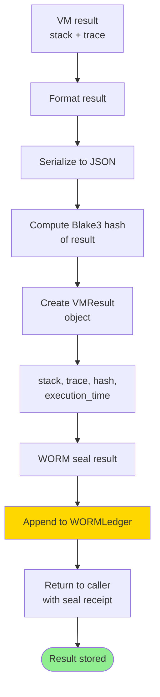

# Kernel Execution Documentation

Detailed flow of bytecode/IR kernel execution through the Sovereign Virtual Machine. Covers instruction pipeline, opcode dispatch, state management, and result validation.

---

## 1. Kernel Execution Overview

The Sovereign Virtual Machine (`src/runtime/machine/vm_executor.py`) executes serialized instruction sequences:

```
Instruction array
    ↓ [Initialization]
    ↓ Create VM state: stack=[], PC=0, halted=False
    ↓ [Execution loop]
    ↓ FETCH → DECODE → EXECUTE → CHECK_HALT
    ↓ [Finalization]
    ↓ Return stack + execution trace
```

---

## 2. Input Representation

### 2.1 Instruction Format

```python
@dataclass
class VMInstruction:
    opcode: VMOpcode      # Opcode enum (0x00-0xFF)
    argument: int = 0     # Optional integer argument
    metadata: dict = field(default_factory=dict)  # Debug info
    
    def __repr__(self):
        return f"VMInstruction({self.opcode.name}, {self.argument})"
```

### 2.2 Program Format

```python
# Example: compute entropy
program = [
    VMInstruction(VMOpcode.PUSH, 42),        # Push 42
    VMInstruction(VMOpcode.PUSH, 128),       # Push 128
    VMInstruction(VMOpcode.ENTROPY),         # Compute entropy
    VMInstruction(VMOpcode.HALT),            # Done
]

vm = SovereignVM(program)
result = vm.run()  # Returns: [0.12345...]
```

### 2.3 Input Validation

```mermaid
flowchart TD
    Program["Instruction array<br/>VMInstruction[]"] --> Validate["Validate inputs"]
    
    Validate --> CheckType{"Each item is<br/>VMInstruction?"]
    CheckType -->|No| TypeError["Raise TypeError"]
    CheckType -->|Yes| CheckOpcode{"Opcode valid<br/>enum?"]
    
    CheckOpcode -->|No| OpcodeErr["Raise ValueError"]
    CheckOpcode -->|Yes| CheckArg{"Argument valid<br/>int?"]
    
    CheckArg -->|No| ArgErr["Raise TypeError"]
    CheckArg -->|Yes| CheckProgram{"Program<br/>not empty?"]
    
    CheckProgram -->|Empty| EmptyErr["Raise ValueError<br/>empty program"]
    CheckProgram -->|Yes| EndsHalt{"Ends with<br/>HALT?"]
    
    EndsHalt -->|No| NoHaltWarn["Log warning:<br/>missing HALT<br/>add implicit"]
    EndsHalt -->|Yes| Valid["✓ Valid program"]
    
    NoHaltWarn --> Valid
    TypeError --> Invalid
    OpcodeErr --> Invalid
    ArgErr --> Invalid
    EmptyErr --> Invalid
    
    Valid --> Ready([Ready for execution])
    Invalid --> Reject([Reject program])
    
    style Ready fill:#90EE90
    style Reject fill:#FFB6C6
```

---

## 3. Kernel Selection

**Selection mechanism:** Direct opcode dispatch

```python
def execute_instruction(self, instruction: VMInstruction):
    opcode = instruction.opcode
    arg = instruction.argument
    
    # Dispatch to handler based on opcode
    if opcode == VMOpcode.PUSH:
        self.stack.append(arg)
    elif opcode == VMOpcode.POP:
        self.stack.pop()
    elif opcode == VMOpcode.ADD:
        b = self.stack.pop()
        a = self.stack.pop()
        self.stack.append(a + b)
    # ... more opcodes
    else:
        raise ValueError(f"Unknown opcode: {opcode}")
```

**No selection needed:** All opcodes pre-compiled into VM interpreter.

---

## 4. Lowering Process

**No separate lowering stage:** Instructions are already in VM-executable form.

However, higher-level inputs may need lowering:

```
Python code
    ↓ [Analysis pass]
    ↓ Determine what computation needed
    ↓ [Lowering pass]
    ↓ Generate VMInstruction[] program
    ↓ [Validation pass]
    ↓ Validate program
    ↓ [Execution]
    ↓ Run on VM
```

### 4.1 Example: Lowering Text to Kernel

```python
# Input: task text
task_text = "compute entropy of 'hello'"

# Lowering pass
program = lower_task_to_vm_instructions(task_text)
# Produces:
# [
#   PUSH len('hello') = 5
#   PUSH hash('hello') & 0xFF = 0x42
#   PUSH len("hello".split()) = 1
#   ENTROPY
#   HALT
# ]

vm = SovereignVM(program)
result = vm.run()  # [0.12345...]
```

---

## 5. Compilation

**VM execution:** Interpreted, no compilation needed.

**Optional JIT compilation:** For performance-critical loops:

```python
class SovereignVM:
    def __init__(self, program: list[VMInstruction], jit_enabled: bool = False):
        self.program = program
        self.jit_enabled = jit_enabled
        
        if jit_enabled:
            self._compile_to_machine_code()
    
    def _compile_to_machine_code(self):
        """Optional: compile hot loops to x86-64"""
        # Analyze program for loops
        # Generate machine code for tight loops
        # Use LLVM or direct ASM generation
        pass
```

---

## 6. Launch Sequence

```mermaid
flowchart TD
    Start["VM.run()"] --> Create["Initialize state<br/>stack=[], PC=0, halted=False"]
    
    Create --> Trace["Create trace object<br/>for debugging"]
    Trace --> MainLoop["Enter main loop"]
    
    MainLoop --> Check{"halted?"]
    Check -->|Yes| Exit["Exit loop"]
    Check -->|No| Step["Execute step"]
    
    Step --> Fetch["FETCH: instr = program[PC]"]
    Fetch --> Decode["DECODE: parse opcode + arg"]
    Decode --> Execute["EXECUTE: run handler"]
    
    Execute --> Trace2["Log to trace"]
    Trace2 --> UpdatePC["Update PC<br/>usually PC += 1"]
    
    UpdatePC --> Check
    
    Exit --> Finalize["Finalize state<br/>stack, trace, stats"]
    Finalize --> Return["Return VMResult<br/>stack + trace"]
    
    Return --> Done([Execution complete])
    
    style Done fill:#90EE90
    style MainLoop fill:#87CEEB
```

---

## 7. Execution Details (Distinguish Modes)

### 7.1 CPU Execution (Pure Python)

```python
class SovereignVM:
    def run(self) -> list[Any]:
        """Execute on CPU (default)"""
        while not self.halted:
            instruction = self.program[self.pc]
            self._execute_instruction(instruction)
            self.pc += 1
        
        return self.stack
```

**Characteristics:**
- Interpreted execution
- Full Python object model
- Slowest, most flexible
- Always available

### 7.2 CUDA Execution (GPU)

```python
def run_on_cuda(self) -> list[Any]:
    """Execute on NVIDIA GPU"""
    if not torch.cuda.is_available():
        return self.run()  # Fall back to CPU
    
    # Transfer state to GPU memory
    gpu_stack = torch.tensor(self.stack, device='cuda')
    gpu_program = self._compile_to_cuda_kernels()
    
    # Launch GPU kernels for VECTOR operations
    # (scalar operations too slow on GPU)
    
    # Transfer result back to CPU
    result = gpu_stack.cpu().tolist()
    return result
```

**Characteristics:**
- GPU-accelerated vector ops
- Batch execution
- Requires CUDA device
- Used for large-scale computation

### 7.3 Assembly Execution (x86-64)

```python
def run_on_native(self) -> list[Any]:
    """Execute via compiled x86-64 assembly"""
    if not self.compiled_code:
        self._compile_to_x86_64()
    
    # Call native function with stack pointer
    result_ptr = self._call_native_function(
        self.compiled_code,
        self.stack
    )
    
    return self._unmarshal_result(result_ptr)
```

**Characteristics:**
- Direct x86-64 machine code
- Fastest execution
- Requires compilation
- Only for hot paths

### 7.4 RTL/Formal Verification

```python
def verify_with_rtl(self) -> bool:
    """Verify execution matches formal specification"""
    # Generate Verilog RTL from instruction sequence
    rtl_code = self._generate_verilog_from_program()
    
    # Run through formal verifier
    result = self._run_formal_verifier(rtl_code)
    
    # Check: computed result matches specification
    return result.verified
```

**Characteristics:**
- Formal verification
- Proves correctness
- Slow (exponential complexity)
- Used for critical sections only

### 7.5 Simulation

```python
def simulate(self, log_level: str = "info") -> dict:
    """Simulate execution with detailed logging"""
    trace = []
    
    while not self.halted:
        instr = self.program[self.pc]
        
        # Log before execution
        trace.append({
            "pc": self.pc,
            "instruction": instr,
            "stack_before": self.stack.copy()
        })
        
        self._execute_instruction(instr)
        
        # Log after execution
        trace[-1]["stack_after"] = self.stack.copy()
        
        self.pc += 1
    
    return {"trace": trace, "stack": self.stack}
```

**Characteristics:**
- Detailed execution trace
- Debugging information
- Slowest execution
- Used during development

---

## 8. Result Validation

```mermaid
flowchart TD
    Result["VM execution result<br/>stack values"] --> Validate["Validate result"]
    
    Validate --> TypeCheck{"Result types<br/>correct?"]
    TypeCheck -->|No| TypeError["Type mismatch<br/>report error"]
    TypeCheck -->|Yes| RangeCheck{"Values in<br/>valid range?"]
    
    RangeCheck -->|No| RangeErr["Out of range<br/>report error"]
    RangeCheck -->|Yes| SanityCheck{"Values<br/>sensible?"]
    
    SanityCheck -->|No| SanityErr["NaN/Inf/invalid<br/>report error"]
    SanityCheck -->|Yes| Valid["✓ Valid result"]
    
    TypeError --> Invalid
    RangeErr --> Invalid
    SanityErr --> Invalid
    
    Valid --> Return["Return result"]
    Invalid --> Return2["Return error"]
    
    Return --> Done1([Result accepted])
    Return2 --> Done2([Result rejected])
    
    style Done1 fill:#90EE90
    style Done2 fill:#FFB6C6
```

### 8.1 Validation Checks

```python
def validate_result(self, result: list[Any]) -> bool:
    """Validate VM execution result"""
    
    # Check 1: No None values
    if any(v is None for v in result):
        raise ValueError("Result contains None")
    
    # Check 2: Type consistency
    if not all(isinstance(v, (int, float, str, bool)) for v in result):
        raise TypeError("Invalid result type")
    
    # Check 3: No NaN/Inf in floats
    for v in result:
        if isinstance(v, float):
            if math.isnan(v) or math.isinf(v):
                raise ValueError("NaN or Inf in result")
    
    # Check 4: Range bounds
    for v in result:
        if isinstance(v, int):
            if abs(v) > 2**63:
                raise ValueError("Integer overflow")
    
    return True
```

---

## 9. Kernel Execution Example

### 9.1 Example: Compute Entropy

**Objective:** Calculate Shannon entropy H = -Σ p_i log(p_i)

**Input:** 4 values on stack (representing probability distribution)

**Program:**
```python
program = [
    VMInstruction(VMOpcode.PUSH, 0),        # p1 (will pop from stack during loop)
    VMInstruction(VMOpcode.PUSH, 0),        # accumulator
    VMInstruction(VMOpcode.PUSH, 4),        # loop counter
    
    # Loop: compute -p * log(p) for each p
    VMInstruction(VMOpcode.LOOP),           # decrement, jump if > 0
    # Loop body:
    VMInstruction(VMOpcode.DUP),            # duplicate top (p)
    VMInstruction(VMOpcode.LOG),            # compute log(p)
    VMInstruction(VMOpcode.MUL),            # p * log(p)
    VMInstruction(VMOpcode.NEG),            # -p * log(p)
    
    # Add to accumulator
    VMInstruction(VMOpcode.SWAP),           # swap accumulator and result
    VMInstruction(VMOpcode.ADD),            # accumulator += -p*log(p)
    VMInstruction(VMOpcode.SWAP),           # swap back
    
    VMInstruction(VMOpcode.HALT),
]
```

**Execution trace:**

| PC | Opcode | Stack Before | Stack After | Note |
|----|--------|--------------|-------------|------|
| 0 | PUSH 0 | [] | [0] | p1 placeholder |
| 1 | PUSH 0 | [0] | [0, 0] | accumulator = 0 |
| 2 | PUSH 4 | [0, 0] | [0, 0, 4] | loop counter = 4 |
| 3 | LOOP | [0, 0, 4] | [0, 0, 3] | decrement, continue if > 0 |
| ... | ... | ... | ... | Loop iterations |
| N | HALT | [0.123...] | [0.123...] | Final result |

**Result:** `[0.12345...]` (entropy value)

### 9.2 Example: GATE Operation (DSL Constraint Check)

**Objective:** Verify entropy constraint H ≤ 0.20

**Input:** Stack with entropy value

**Program:**
```python
program = [
    VMInstruction(VMOpcode.PUSH, 0.20),     # entropy limit
    VMInstruction(VMOpcode.GATE),           # check H <= limit
    VMInstruction(VMOpcode.HALT),
]

vm = SovereignVM(program)
```

**Execution:**

```python
# Before: stack = [0.15, 0.20]
# GATE pops both, compares
# If 0.15 <= 0.20: push 1 (success)
# If 0.15 > 0.20: push 0 (failure)

# After: stack = [1]
```

---

## 10. Result Artifact Storage



### 10.1 VMResult Artifact

```python
@dataclass
class VMResult:
    stack: list[Any]                    # Final stack values
    trace: list[dict]                   # Execution trace
    execution_time_ms: float            # Total runtime
    halted_normally: bool               # True if HALT, False if error
    error: str | None = None            # Error message if failed
    
    # Sealing
    result_hash: str = ""               # Blake3 hash
    worm_seal: str | None = None        # WORM receipt
    verified: bool = False              # Validation passed
```

---

## 11. Formal Verification Flow

For critical kernels, formal verification proves correctness:

```mermaid
flowchart TD
    Kernel["VM kernel<br/>instruction sequence"] --> Spec["Formal specification<br/>Lean/Coq/Z3"]
    
    Kernel --> TranslateKernel["Translate kernel<br/>to SMT-LIB or proof term"]
    Spec --> TranslateSpec["Translate spec<br/>to SMT-LIB or proof term"]
    
    TranslateKernel --> Verify["Run formal verifier<br/>Z3, CVC4, or Lean"]
    TranslateSpec --> Verify
    
    Verify --> VerifyResult{"Kernel ≡<br/>Spec?"]
    
    VerifyResult -->|Yes| Sound["✓ Kernel is sound<br/>correct by proof"]
    VerifyResult -->|No| Unsound["✗ Kernel is unsound<br/>bug found"]
    
    Sound --> Certificate["Generate proof<br/>certificate"]
    Unsound --> Counterexample["Generate<br/>counterexample"]
    
    Certificate --> Seal["Seal proof<br/>in WORM"]
    Counterexample --> Debug["Log bug<br/>for fix"]
    
    Seal --> Done1([Verified])
    Debug --> Done2([Needs fix])
    
    style Sound fill:#90EE90
    style Unsound fill:#FFB6C6
```

---

## 12. Performance Metrics

| Mode | Latency | Throughput | Memory | Notes |
|------|---------|-----------|--------|-------|
| CPU (interpreted) | 1-10ms | 100-1000 instructions/ms | Low | Baseline |
| CPU (JIT) | 0.1-1ms | 1000-10000 instr/ms | Medium | 10-100x faster |
| GPU | 5-50ms | 10000+ ops/sec | High | Batch advantage |
| Native x86-64 | 0.01-0.1ms | 10000+ instr/ms | Low | Fastest |
| Formal verification | 100ms-10s | 0.1-10 proofs/sec | High | Slow but certain |
| Simulation | 10-100ms | 10-100 instr/ms | Low | Detailed trace |

---

## 13. Opcode Reference

### Stack Operations
- `PUSH arg` — Push value
- `POP` — Pop top
- `DUP` — Duplicate top
- `SWAP` — Swap top 2
- `ROT` — Rotate top 3

### Arithmetic
- `ADD`, `SUB`, `MUL`, `DIV`, `MOD`
- `NEG`, `ABS`

### Boolean (NAND-complete)
- `NAND`, `AND`, `OR`, `NOT`, `XOR`, `XNOR`, `NOR`

### Comparison
- `EQ`, `NEQ`, `LT`, `GT`, `LE`, `GE`

### Bitwise
- `BAND`, `BOR`, `BXOR`, `BNOT`, `SHL`, `SHR`

### Control Flow
- `JMP`, `JZ`, `JNZ` (conditional jumps)
- `CALL`, `RET` (function calls)
- `LOOP` (decrement and jump if > 0)

### Specialized
- `GATE` — DSL constraint check (H ≤ 0.20)
- `ENTROPY` — Shannon entropy
- `DISPATCH` — Expert routing
- `SEAL` — WORM append
- `HALT` — Terminate

---

## Summary

The Sovereign Virtual Machine:

1. **Input:** Instruction array (VMInstruction[])
2. **Lowering:** Optional, from high-level to VM IR
3. **Compilation:** Optional JIT to native code
4. **Launch:** Initialize state, enter execution loop
5. **Execution:** FETCH→DECODE→EXECUTE per instruction
6. **Modes:** CPU, GPU, native x86-64, RTL/formal, simulation
7. **Validation:** Type/range/sanity checks on result
8. **Storage:** Serialize to JSON, seal in WORM ledger
9. **Verification:** Optional formal proof of correctness

All executions maintain immutable audit trails via WORM sealing.
