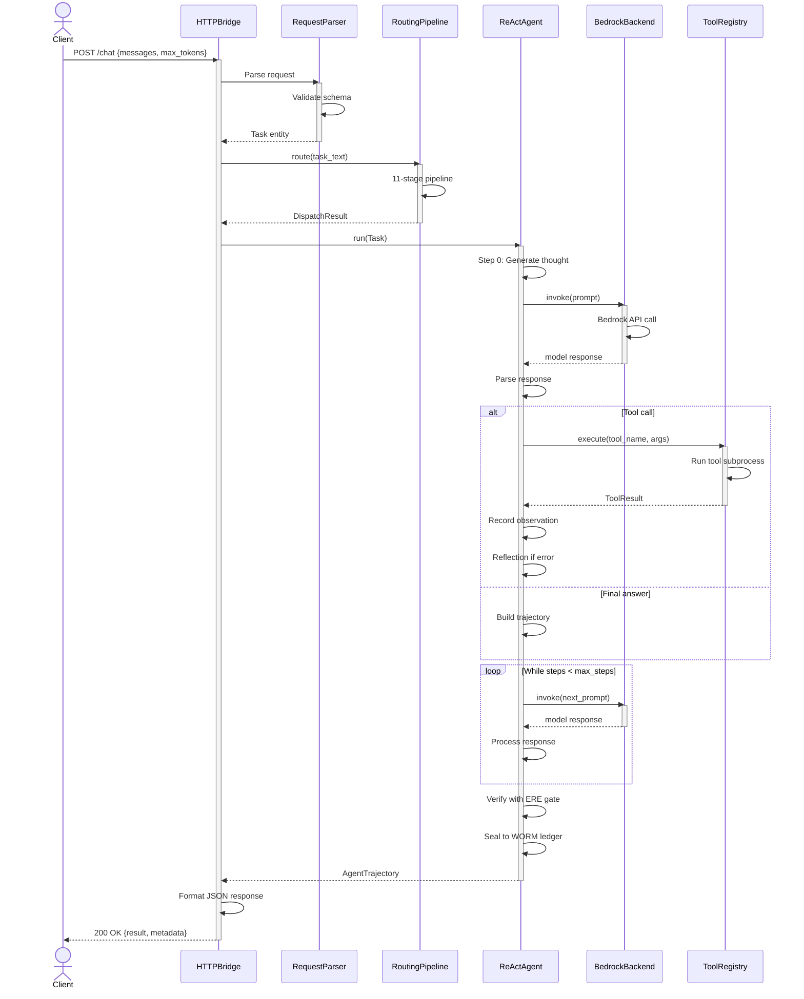
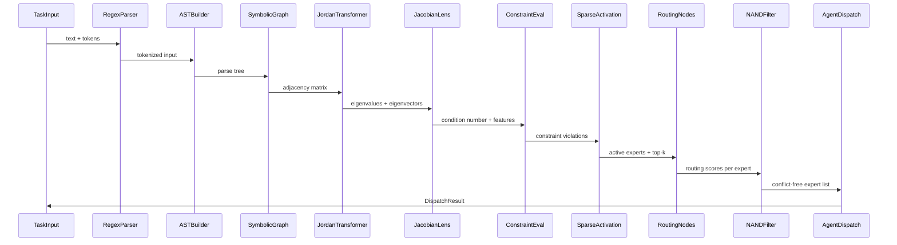
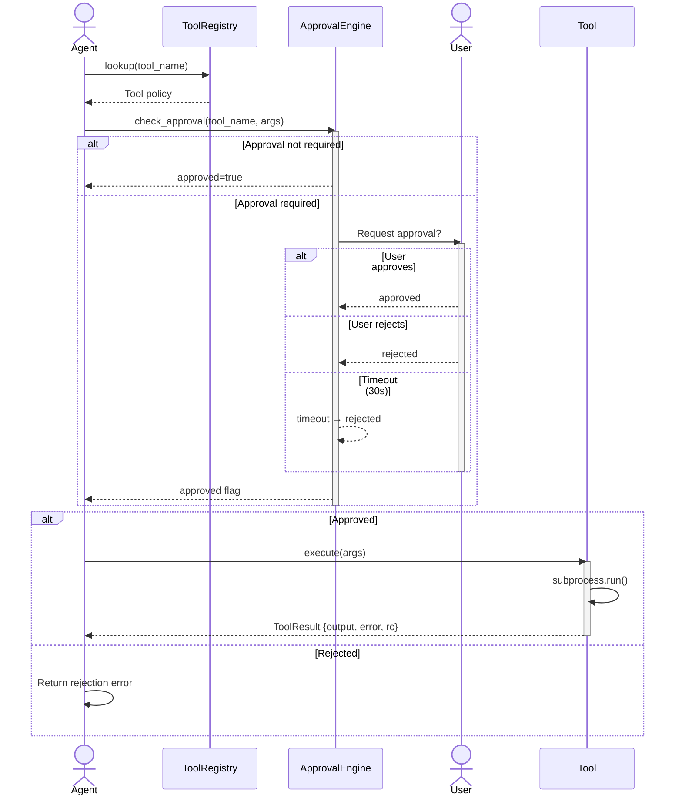
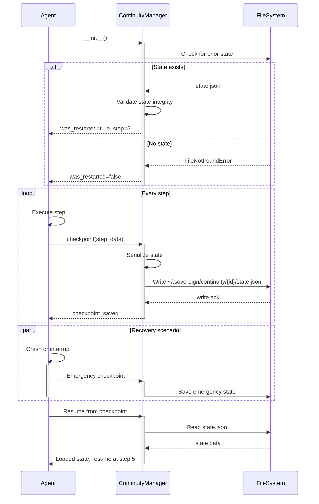
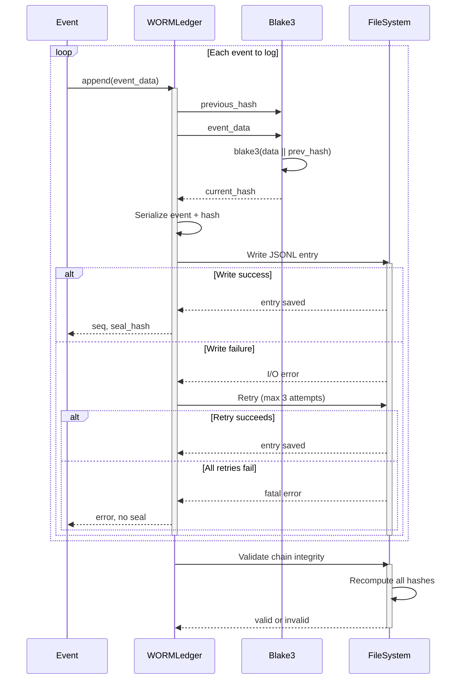
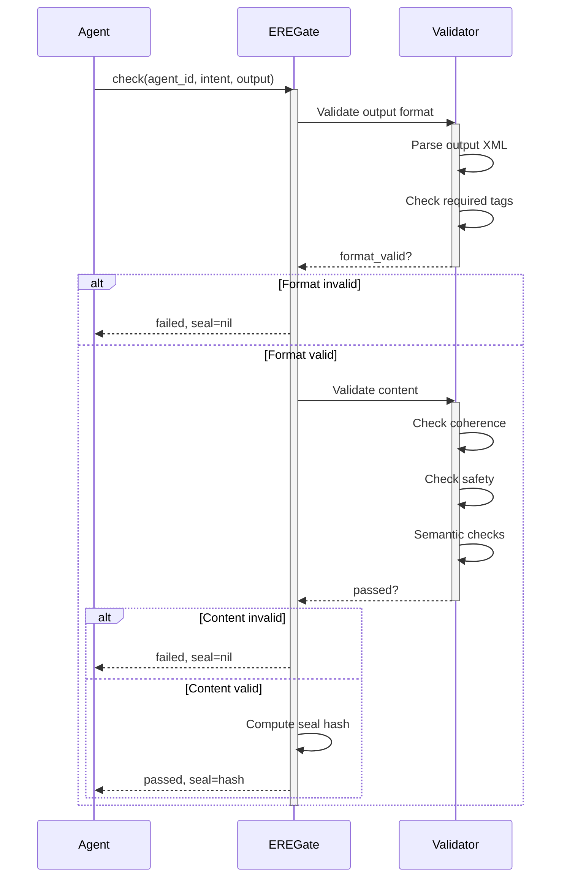

# Sequence Diagrams

Temporal interaction diagrams showing component communication, message ordering, and timing constraints for complex multi-actor flows.

---

## 1. HTTP Request Processing Sequence



**Key timing constraints:**
- Model call: <60s timeout
- Tool call: <30s timeout
- Total request: <5m timeout
- Agent loop: max 10 steps

---

## 2. Routing Pipeline Internal Message Flow



**Pipeline order:**
1. Parse → 2. AST → 3. Graph → 4. Jordan → 5. Jacobian
6. Constraint → 7. Sparse → 8. Nodes → 9. NAND → 10. Dispatch

---

## 3. Tool Execution with Approval



**Timing:**
- Approval request: 30s timeout
- Tool execution: 30s timeout

---

## 4. Continuity Checkpoint & Recovery



**Checkpoint interval:** Every 10 steps by default

---

## 5. WORM Ledger Sealing Chain



**Chain validation:** Verifies all hashes and sequence continuity

---

## 6. Error Recovery with Retry

```mermaid
sequenceDiagram
    participant Caller
    participant Operation
    participant Logger
    
    Caller->>Operation: execute()
    activate Operation
    
    loop Retry with backoff (max 3)
        Operation->>Operation: Attempt operation
        
        alt Success
            Operation-->>Caller: result
            deactivate Operation
        else Failure
            Operation->>Logger: log(attempt N, error)
            Logger->>Logger: Write to log file
            
            alt Final retry
                Operation->>Logger: error(giving up)
                Logger->>Logger: Write error
                Operation-->>Caller: raise Exception
                deactivate Operation
            else Not final
                Operation->>Operation: wait(exponential backoff)
                Operation->>Logger: log(retrying after Ns)
                Logger->>Logger: Write retry
            end
        end
    end
```

**Backoff schedule:**
- Attempt 1: immediate
- Attempt 2: wait 1s, then retry
- Attempt 3: wait 2s, then retry
- Attempt 4: wait 4s, give up

---

## 7. Model Inference with Fallback

```mermaid
sequenceDiagram
    participant Agent
    participant Bedrock as BedrockBackend
    participant Mock as MockBackend
    
    Agent->>Bedrock: invoke(prompt, max_tokens=500)
    activate Bedrock
    
    alt Primary succeeds (fast path)
        Bedrock->>Bedrock: API call
        Bedrock-->>Agent: response
        deactivate Bedrock
    else Timeout
        Bedrock->>Bedrock: wait 60s
        Bedrock->>Agent: TimeoutError
        deactivate Bedrock
        
        Agent->>Mock: invoke(prompt)
        activate Mock
        Mock->>Mock: Generate template response
        Mock-->>Agent: mock response
        deactivate Mock
    else Auth error
        Bedrock->>Bedrock: check credentials
        Bedrock->>Agent: AuthError
        deactivate Bedrock
        
        Agent->>Mock: invoke(prompt)
        activate Mock
        Mock-->>Agent: mock response
        deactivate Mock
    else Rate limit
        Bedrock->>Agent: RateLimitError
        deactivate Bedrock
        
        Agent->>Agent: wait exponential backoff
        Agent->>Bedrock: retry
        activate Bedrock
        Bedrock-->>Agent: response
        deactivate Bedrock
    end
```

**Fallback strategy:** Mock backend always available

---

## 8. ERE Gate Verification



**Validation stages:**
1. Format (XML structure)
2. Content (semantics, safety)
3. Sealing (hash generation)

---

## Summary

**8 key sequence diagrams:**

1. **HTTP Request** — End-to-end task processing
2. **Routing Pipeline** — 11-stage internal flow
3. **Tool Approval** — User interaction for risky tools
4. **Continuity** — State checkpointing and recovery
5. **WORM Sealing** — Immutable ledger chain building
6. **Error Retry** — Exponential backoff recovery
7. **Model Fallback** — Primary → mock fallover
8. **ERE Verification** — Multi-stage result validation

All diagrams show:
- Participant interactions
- Message ordering
- Timing constraints
- Error conditions
- Fallback paths
