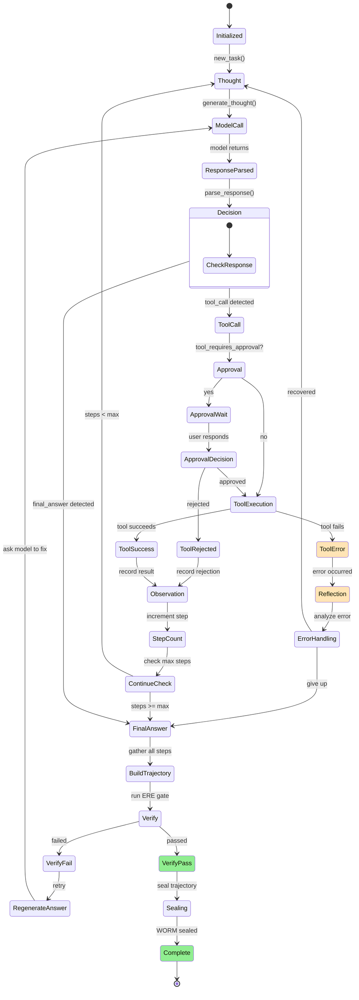
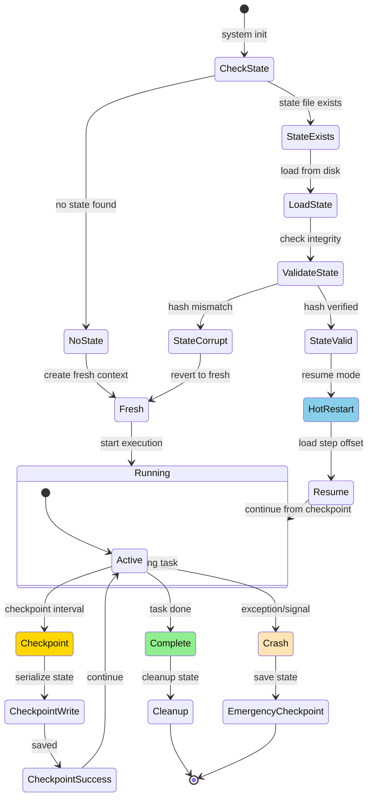
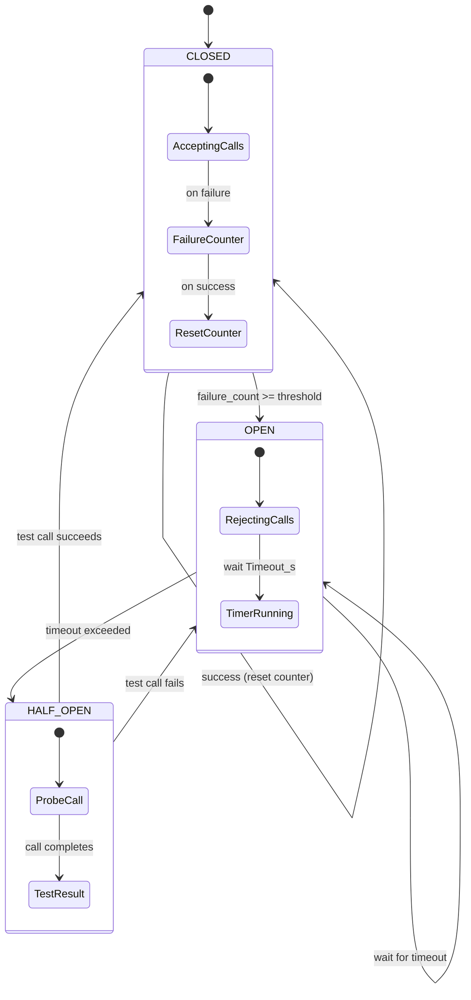
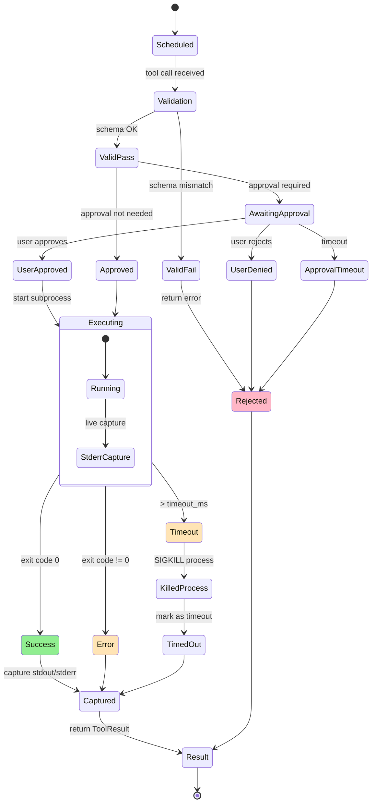
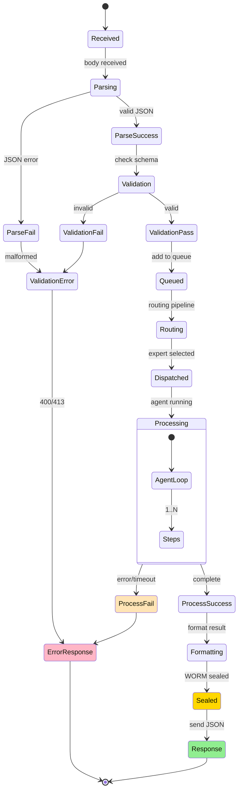
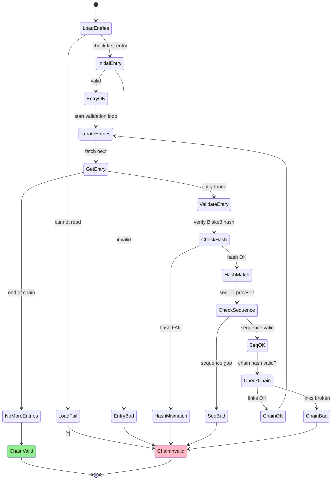
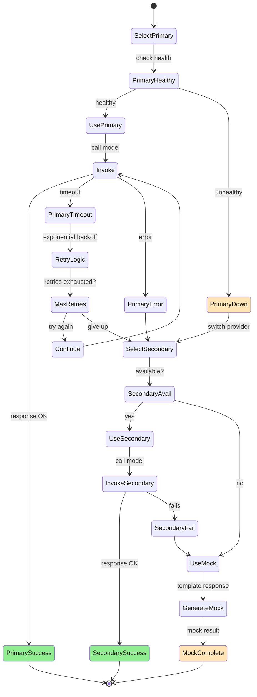
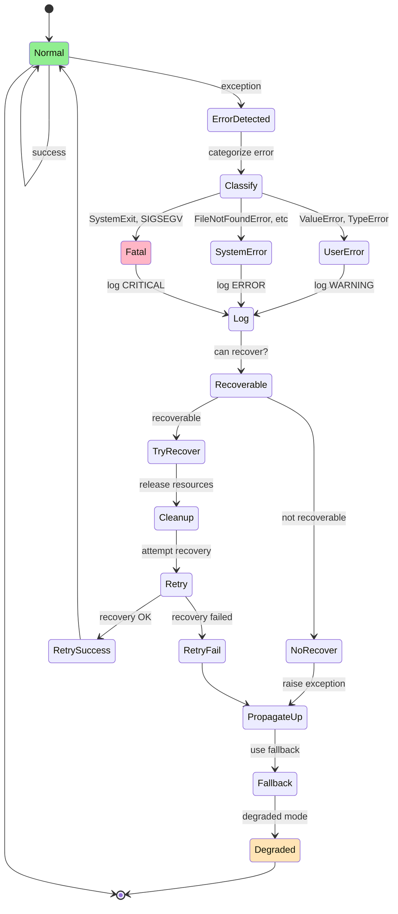

# State Machines Documentation

Formal state machines and state diagrams for complex stateful components in Sovereign Engine.

---

## 1. Agent State Machine

The ReActAgent maintains explicit state throughout task execution.



### State Descriptions

| State | Entry | Exit | Timeout |
|-------|-------|------|---------|
| Thought | Previous step done | Thought generated | 30s |
| ModelCall | Thought ready | Model responds | 60s |
| ToolCall | Tool invoked | Tool completes | 30s |
| ApprovalWait | Approval needed | User responds | 30s |
| Reflection | Error detected | Recovery attempted | 10s |
| Verify | Final answer ready | Verification complete | 5s |
| Sealing | Verification passed | WORM entry complete | 1s |

---

## 2. Continuity Manager State Machine

Hot-restart capability with state persistence.



### Checkpoint Lifecycle

```
NORMAL FLOW:
  Running → [checkpoint every 10 steps] → Save to disk → Continue

CRASH SCENARIO:
  Running → Exception → Emergency checkpoint → Disk write → Exit

RECOVERY:
  Next run → Check for checkpoint → Load state → Resume from step N
```

---

## 3. Router Circuit Breaker

Protects system from cascade failures.



### Parameters

- `failure_threshold` — failures before opening (default: 5)
- `timeout_s` — how long to keep circuit open (default: 60)
- `half_open_max_calls` — calls allowed in half-open state (default: 1)

---

## 4. Tool Execution State Machine

State flow for tool invocation and result handling.



---

## 5. Request Lifecycle State Machine

HTTP request state progression.



---

## 6. WORM Ledger Chain Validation State Machine

Chain integrity verification.



---

## 7. Model Provider Fallback State Machine

Selection and fallover between model providers.



---

## 8. Error Recovery State Machine

Error detection and recovery flow.



---

## Summary

**8 state machines:**

1. **Agent** — Task execution loop (thought → action → observe)
2. **Continuity** — Hot-restart with checkpointing
3. **Circuit Breaker** — Cascade failure protection
4. **Tool Execution** — Tool invocation lifecycle
5. **Request Lifecycle** — HTTP request states
6. **WORM Validation** — Chain integrity verification
7. **Model Fallover** — Provider selection & switching
8. **Error Recovery** — Error handling & recovery

All machines use:
- **Explicit states** — clear state transitions
- **Entry/exit conditions** — guards and timeouts
- **Error paths** — recovery and degradation
- **Immutability** — once in state, no reverse without explicit reset

States track system behavior for debugging, monitoring, and resilience.
